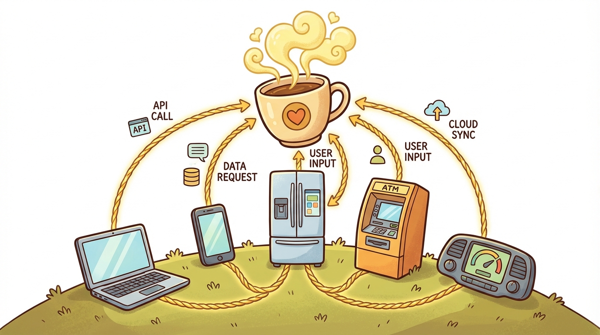
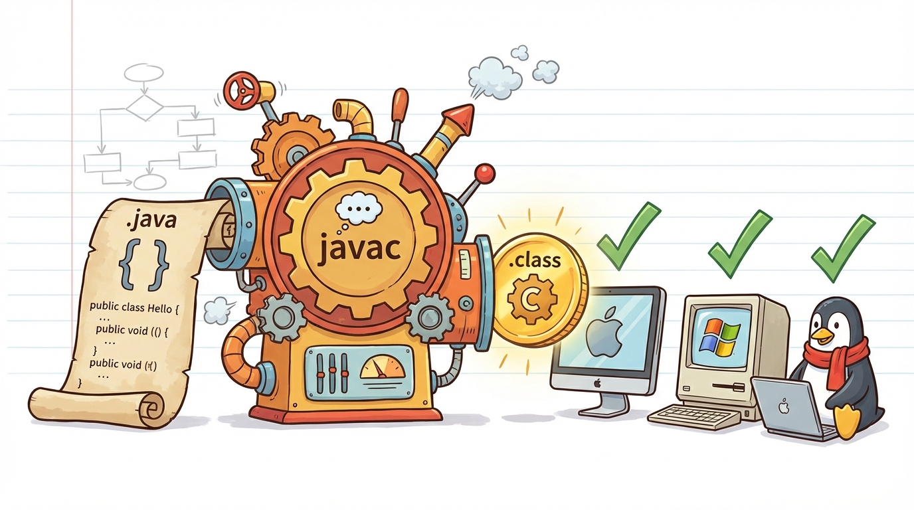
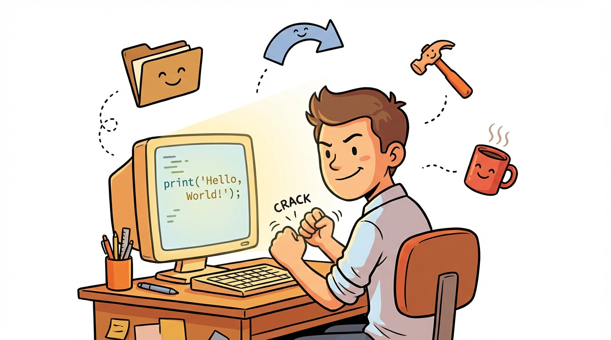
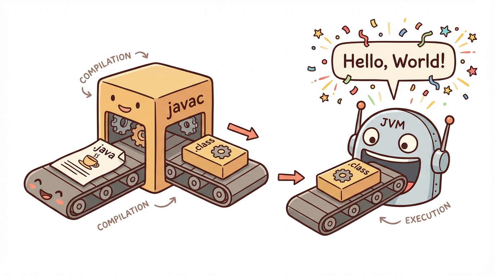

# Module 1: What Is Java?

> 🏷️ Start Here

> 🎯 **Teach:** What Java is, where it came from, and how to compile and run a Java program from the terminal
> **See:** A HelloWorld program compiled with javac and executed with java, plus essential terminal commands
> **Feel:** Confidence that you can set up a workspace, write Java code, and see it run

> 🎙️ Welcome to Day 1 of Java Foundations. Today you are going to find out what Java actually is, where it came from, and why it is still one of the most widely used programming languages in the world. Then you will open a terminal, set up a project folder, and compile and run your very first Java program.

> 🎙️ Before you write any code today, you are going to do some research. Understanding the origins and design goals of Java will make every future lesson click faster -- it is not just trivia, it is context that helps you think like a Java developer.



## Research: What Is Java?

> 🎯 **Teach:** Java is a platform-independent, object-oriented language that compiles to bytecode running on any JVM.
> **See:** The history of Java from James Gosling's original vision to modern enterprise and mobile use.
> **Feel:** Appreciation for why Java remains one of the most in-demand programming languages after 30 years.

### Overview

- **Topic:** What Is Java?
- **Type:** Written Research Assignment
- **Estimated Time:** 2 hours
- **Target Length:** Approximately 3/4 page (300-400 words)

### Instructions

Write a short research essay addressing the following questions:

1. **What is Java?** Describe the Java programming language — what kind of language is it, what are its key features, and what makes it distinct from other programming languages?

2. **What is the history of Java?** Who created it, when, and why? How has the language evolved since its original release?

3. **Where is Java used today?** Give examples of real-world applications, industries, or systems that rely on Java.

### Requirements

- Your response should be approximately **3/4 of a page** (300-400 words).
- Write in your own words. Do not copy and paste from your sources.
- Include at least **3 references** to third-party sources (articles, documentation, books, etc.). List them at the end of your essay in a "References" section.
- Use proper grammar and complete sentences.

> 🎙️ Take your time with this research. When you are writing about what Java is, think about what makes it different from languages like Python or C. The key phrase to understand is "write once, run anywhere" -- that single idea shaped almost every design decision in the language.



### Submission

Save your completed essay as `Response_01_What_Is_Java.md` in this folder.

> 💡 **Remember this one thing:** Java is a platform-independent, object-oriented language — you write code once, compile it to bytecode, and it runs on any system with a Java Virtual Machine.

## Hands-On: Terminal Basics and Running Your First Java Program

> 🎯 **Teach:** Essential terminal commands and the complete Java workflow of writing source code, compiling with javac, and running bytecode with java.
> **See:** A step-by-step walkthrough creating a HelloWorld program, compiling it, and watching it execute in the terminal.
> **Feel:** The thrill of seeing your very first Java program produce real output on screen.

> 🎙️ Now that you know what Java is, it is time to get your hands on the keyboard. You are going to learn essential terminal commands and then use them to create, compile, and run a real Java program.



### Overview

- **Topic:** Terminal Navigation and Compiling Java
- **Type:** Technical / Hands-On
- **Estimated Time:** 1.5 hours

### Part 1: Terminal Command Reference

Before you begin the exercises, familiarize yourself with the following terminal commands. These work on macOS, Linux, and Windows (via WSL or PowerShell).

| # | Command | Description | Example |
|---|---------|-------------|---------|
| 1 | `pwd` | Print the current working directory | `pwd` |
| 2 | `ls` | List files and folders in the current directory | `ls` or `ls -la` |
| 3 | `cd` | Change directory (move into a folder) | `cd my_folder` |
| 4 | `cd ..` | Move up one directory | `cd ..` |
| 5 | `mkdir` | Create a new directory | `mkdir projects` |
| 6 | `rmdir` | Remove an empty directory | `rmdir old_folder` |
| 7 | `rm` | Remove a file | `rm myfile.txt` |
| 8 | `rm -r` | Remove a directory and its contents | `rm -r old_project` |
| 9 | `touch` | Create an empty file | `touch notes.txt` |
| 10 | `nano` | Open a simple text editor in the terminal | `nano HelloWorld.java` |
| 11 | `cat` | Display the contents of a file | `cat HelloWorld.java` |
| 12 | `cp` | Copy a file | `cp file.txt backup.txt` |
| 13 | `mv` | Move or rename a file | `mv file.txt new_location/` |
| 14 | `clear` | Clear the terminal screen | `clear` |
| 15 | `javac` | Compile a Java source file | `javac HelloWorld.java` |
| 16 | `java` | Run a compiled Java program | `java HelloWorld` |

> **Note for Windows users:** If you are on Windows, use WSL (Windows Subsystem for Linux) or Git Bash. These commands work the same way. PowerShell equivalents exist but differ slightly.

> 🎙️ Do not try to memorize this whole table right now. Focus on pwd, ls, cd, mkdir, and nano -- those are the five commands you will use over and over. The rest you can reference as you need them.

---

### Part 2: Guided Exercises

Complete each step below **in order**. After each step, write down the command you used in the **Submission Log** at the end of this assignment.

#### Exercise A: Setting Up Your Workspace

1. Open your terminal.
2. Use `pwd` to confirm your current location.
3. Navigate to your home directory using `cd ~`.
4. Create a new directory called `java_projects`.
5. Move into the `java_projects` directory.
6. Inside `java_projects`, create a subdirectory called `day_01`.
7. Move into the `day_01` directory.
8. Use `pwd` to confirm you are in `~/java_projects/day_01`.

#### Exercise B: Creating Your First Java Program

9. Using `nano`, create a new file called `HelloWorld.java`.
10. Type the following program into nano exactly as shown:

```java
public class HelloWorld {
    public static void main(String[] args) {
        System.out.println("Hello, World!");
        System.out.println("My name is Campbell Reed.");
        System.out.println("I am learning Java!");
    }
}
```

11. Save the file in nano (`Ctrl+O`, then `Enter`) and exit (`Ctrl+X`).
12. Use `cat` to display the contents of `HelloWorld.java` and verify it looks correct.
13. Compile the program using `javac HelloWorld.java`.
14. Use `ls` to confirm that a file called `HelloWorld.class` now exists. This is the compiled bytecode.
15. Run the program using `java HelloWorld`.

> You should see three lines of output printed to the terminal.

> 🎙️ This is the moment it all becomes real. When you see your three lines of output in the terminal, you have just completed the full Java workflow -- write source code, compile it with javac, and run the bytecode with java. Every Java program you ever write follows this same pattern.



#### Exercise C: Moving Files Around

16. Navigate up one directory (back to `java_projects`).
17. Create a new directory called `completed`.
18. Copy `day_01/HelloWorld.java` into the `completed` directory.
19. Navigate into `completed` and use `ls` to confirm the file is there.
20. Use `cat` to display the file contents and verify the copy.

> 🎙️ Moving files and copying files are everyday developer tasks. Pay attention to the difference between cp and mv -- one makes a duplicate, the other relocates. Getting comfortable with these now saves you time every single day going forward.

#### Exercise D: Cleanup

21. Navigate back to `java_projects`.
22. Create a temporary directory called `scratch`.
23. Move into `scratch` and create an empty file called `temp.txt` using `touch`.
24. Navigate back up to `java_projects`.
25. Remove the `scratch` directory and its contents using `rm -r`.
26. Use `ls` to confirm `scratch` is gone.

---

### Part 3: Reflection Questions

Answer these briefly (1-2 sentences each):

1. What is the difference between `javac` and `java`? Why are there two separate commands?
2. What file extension does Java source code use? What file extension does compiled Java bytecode use?
3. Why does the class name (`HelloWorld`) need to match the file name (`HelloWorld.java`)?

> 🎙️ These reflection questions are not busywork. The distinction between javac and java, and the file naming rule, come up on the certification exam. Take a minute to think through each answer in your own words before moving on.

---

### Submission

#### Command Log

Record every command you ran for each numbered step. Use the format below and save this file as `Response_02_Terminal_and_Java.md` in this folder.

```
Step 1:  [your command here]
Step 2:  pwd
Step 3:  cd ~
Step 4:  ...
...
Step 26: ...
```

#### Reflection Answers

Include your answers to the three reflection questions at the bottom of your response file.

> 💡 **Remember this one thing:** `javac` compiles your `.java` source code into `.class` bytecode, and `java` runs that bytecode on the JVM — these are two separate steps that every Java program goes through.

## Grading

> 🎯 **Teach:** How each assignment is evaluated so the student can self-assess before submitting.
> **See:** Detailed rubrics for both the research essay and the hands-on terminal exercises.
> **Feel:** Clarity about expectations and confidence that meeting the criteria is achievable.

> 🔄 **Where this fits:** Day 1 establishes the foundation for everything that follows — understanding what Java is and how to compile and run programs is the prerequisite for every remaining day of the 30-day curriculum.

> 🎙️ Do not stress about getting a perfect score right away. The grading rubric is there so you know exactly what is expected -- use it as a checklist before you submit your work.

### Research Grading

| Criteria | Points |
|----------|--------|
| Accurately describes what Java is and its key features | 25 |
| Covers the history and origin of Java | 25 |
| Provides real-world examples of Java in use today | 20 |
| Writing quality (clarity, grammar, own words) | 15 |
| At least 3 properly cited references | 15 |
| **Total** | **100** |

### Hands-On Grading

| Criteria | Points |
|----------|--------|
| Correct commands logged for all 26 steps | 40 |
| HelloWorld.java compiles and runs successfully | 25 |
| File copy and directory cleanup completed correctly | 15 |
| Reflection questions answered accurately | 20 |
| **Total** | **100** |

> 🎙️ That wraps up Day 1. You now know what Java is, where it came from, and you have compiled and run your very first program. Tomorrow you will look under the hood at the JDK, JRE, and JVM, and start fixing and writing programs on your own.
