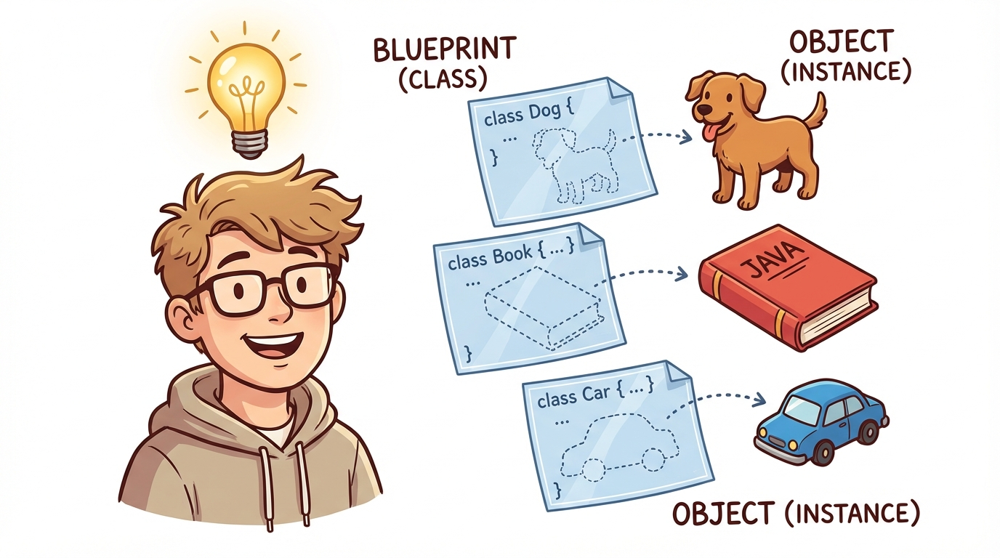
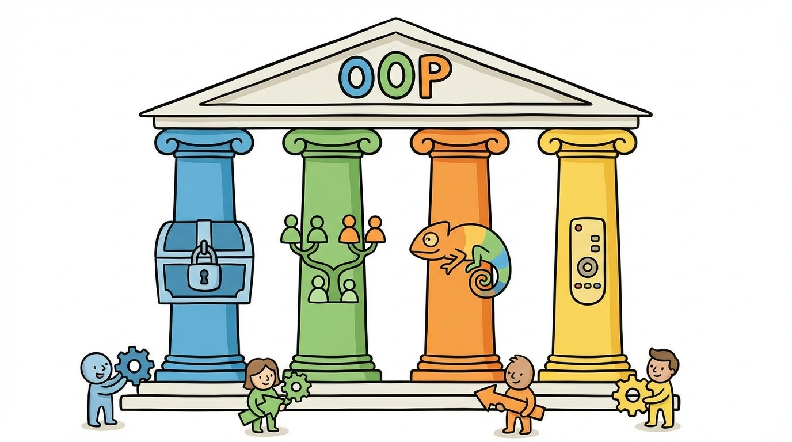
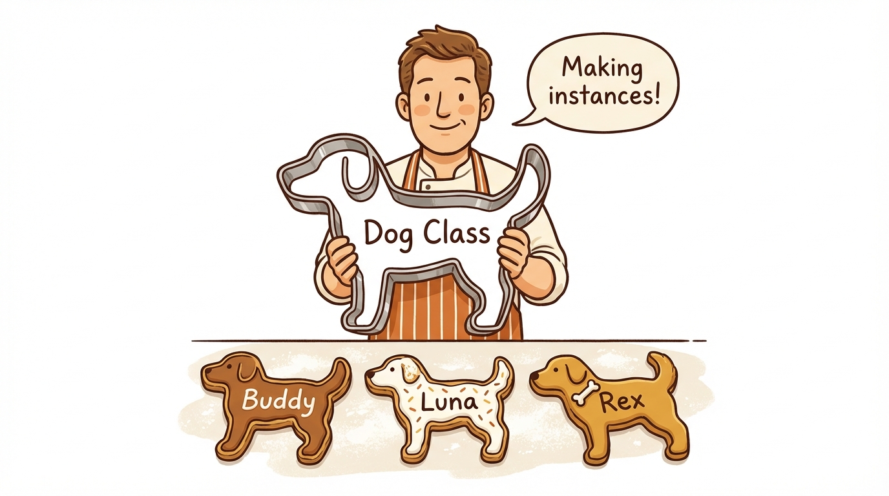
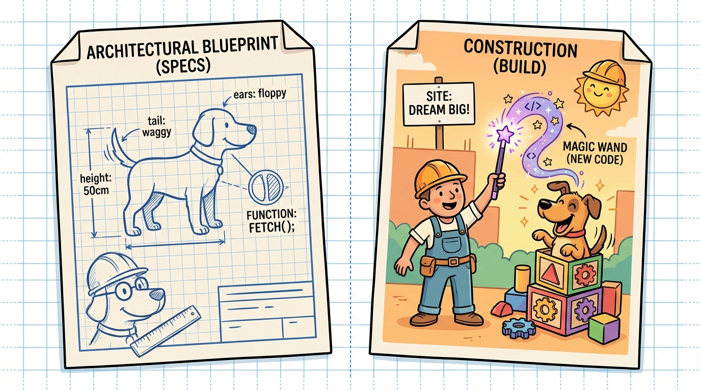

# Module 3: Java Basics Part 2

> 🏷️ Start Here

> 🎯 **Teach:** What object-oriented programming is, including the four pillars, and how to create classes with fields and methods and instantiate objects from them
> **See:** Custom classes like Book, Student, and Vehicle with fields, methods, constructors, and multiple object instances
> **Feel:** The breakthrough moment of understanding that a class is a blueprint and objects are the real things built from it

> 🎙️ Today you are stepping into the heart of Java -- object-oriented programming. You will learn what OOP means, why it matters, and what the four pillars are. Then you will create your own classes, build objects from them, and see firsthand how each object carries its own independent data.

> 🎙️ Object-oriented programming is not just a technique -- it is the way Java thinks about everything. Once you understand classes and objects, every topic from here forward will make more sense. This is one of those days where a lightbulb goes on.



## Research: Object-Oriented Programming Concepts

> 🎯 **Teach:** What object-oriented programming is and the four pillars -- encapsulation, inheritance, polymorphism, and abstraction.
> **See:** Definitions and examples of each OOP pillar and how Java implements them through classes and objects.
> **Feel:** A high-level grasp of why OOP is the dominant programming paradigm and how Java is built around it.

### Overview

- **Topic:** Java Basics — Introduction to Object-Oriented Programming
- **Type:** Written Research Assignment
- **Estimated Time:** 30 minutes
- **Target Length:** Approximately 3/4 page (300-400 words)

### Instructions

Write a short research essay addressing the following:

1. **What is Object-Oriented Programming (OOP)?** Explain what OOP is and why it is a popular approach to software development.

2. **What are the four pillars of OOP?** Define each one in your own words:
   - **Encapsulation**
   - **Inheritance**
   - **Polymorphism**
   - **Abstraction**

3. **How does Java implement OOP?** Give a brief example of how at least one of these concepts shows up in Java (for example, how a class acts as a blueprint for objects).

### Requirements

- Your response should be approximately **3/4 of a page** (300-400 words).
- Write in your own words. Do not copy and paste from your sources.
- Include at least **3 references** to third-party sources (articles, documentation, books, etc.). List them at the end of your essay in a "References" section.
- Use proper grammar and complete sentences.

### Submission

Save your completed essay as `Response_01_OOP_Concepts_Research.md` in this folder.

> 💡 **Remember this one thing:** The four pillars of OOP are encapsulation, inheritance, polymorphism, and abstraction — Java is built around all four, and the 1Z0-811 exam expects you to know what each one means.

> 🎙️ You do not need to master all four pillars today. Right now, focus on understanding what each one means at a high level. You will practice encapsulation and inheritance in depth later in the curriculum. For the exam, being able to define each pillar in your own words is what matters.



## Hands-On: Objects and Classes in Practice

> 🎯 **Teach:** How to create custom classes with fields, methods, and constructors, and how to instantiate multiple independent objects from the same blueprint.
> **See:** Book, Student, and Vehicle classes with separate Main files that create objects and call methods on them.
> **Feel:** The lightbulb moment of understanding that each object holds its own data independently of every other object.

> 🎙️ Now you are going to take those OOP concepts and make them real. You will create your own classes with fields and methods, instantiate multiple objects from them, and prove to yourself that each object holds its own independent data.

### Overview

- **Topic:** Java Basics — Creating Classes, Instantiating Objects, and Using Fields and Methods
- **Type:** Technical / Hands-On
- **Estimated Time:** 1.5 hours

### Background

In Day 2, you learned about the structure of a Java program — classes, the `main` method, and compiling/running code. Now you'll take the next step: creating your own classes that act as **blueprints** for objects.

A class can have:
- **Fields** (also called instance variables) — data that belongs to each object
- **Methods** — actions the object can perform
- **A constructor** — a special method that runs when a new object is created

Here's a quick example:

```java
public class Dog {
    String name;
    String breed;
    int age;

    public void bark() {
        System.out.println(name + " says: Woof!");
    }

    public void describe() {
        System.out.println(name + " is a " + age + "-year-old " + breed + ".");
    }
}
```

You create and use an object like this:

```java
public class DogMain {
    public static void main(String[] args) {
        Dog myDog = new Dog();
        myDog.name = "Buddy";
        myDog.breed = "Golden Retriever";
        myDog.age = 3;

        myDog.bark();
        myDog.describe();
    }
}
```



> 🎙️ Study this Dog example carefully -- it is the pattern you are about to follow for every exercise. Notice the two separate files. The Dog class defines the blueprint with fields and methods. The DogMain class creates an actual Dog object using the new keyword and then calls methods on it. This two-file pattern is standard in Java.



---

### Part 1: Follow the Pattern

#### Program A: `Book.java` and `BookMain.java`

Create a `Book` class with the following fields:
- `String title`
- `String author`
- `int pages`
- `int yearPublished`

Add the following methods:
- `describe()` — prints a sentence like: `"To Kill a Mockingbird by Harper Lee (1960), 281 pages."`
- `isLong()` — prints `"This is a long book."` if pages is greater than 300, otherwise prints `"This is a short read."`

Then create `BookMain.java` with a `main` method that:
1. Creates **two** different `Book` objects with different values
2. Calls `describe()` and `isLong()` on each one

#### Program B: `Student.java` and `StudentMain.java`

Create a `Student` class with the following fields:
- `String name`
- `int age`
- `String major`
- `double gpa`

Add the following methods:
- `introduce()` — prints: `"Hi, I'm [name]. I'm [age] years old and studying [major]."`
- `honorsCheck()` — prints `"[name] is on the honor roll!"` if GPA is 3.5 or higher, otherwise prints `"[name] is in good standing."`

Then create `StudentMain.java` with a `main` method that:
1. Creates **three** different `Student` objects
2. Calls `introduce()` and `honorsCheck()` on each one
3. At least one student should have a GPA of 3.5 or higher and at least one below 3.5

> 🎙️ When you create those three Student objects, make sure at least one has a GPA above 3.5 and at least one below. The point is to prove that your honorsCheck method makes a real decision based on the data each object holds. Same blueprint, different data, different behavior -- that is the power of objects.

---

### Part 2: Design Your Own

#### Program C: `Vehicle.java` and `VehicleMain.java`

Design your own `Vehicle` class from scratch. Requirements:

- At least **4 fields** (you choose what they are — make, model, year, color, mileage, etc.)
- At least **3 methods** that print something meaningful about the vehicle
- At least one method should include an **if/else** decision based on one of the fields

Create `VehicleMain.java` that:
1. Creates at least **2** Vehicle objects
2. Demonstrates all of your methods

---

### Part 3: Connecting Concepts

#### Program D: `OOPDemo.java`

Write a single-file program (everything in one `.java` file is fine for this one) that demonstrates the difference between a **class** and an **object** through printed output. Your program should:

1. Print a header: `"=== OOP Concepts Demo ==="`
2. Create multiple objects from the same class
3. Show that each object holds its **own data** independent of the others
4. Print a summary that explains what's happening, like:
   ```
   Both dog1 and dog2 are Dog objects, but they have different names and ages.
   The Dog class is the blueprint. Each Dog object is a unique instance.
   ```

> The goal is to show that you understand the relationship between a class and its objects.

> 🎙️ This OOPDemo exercise is your chance to prove you get it. The key insight is that every object created from the same class has the same structure -- the same fields and methods -- but each one holds its own independent values. Change one object's name and the other objects are unaffected.

---

### Part 4: Reflection Questions

Answer these briefly (1-2 sentences each):

1. What is the difference between a **class** and an **object**?
2. What is the difference between a **field** and a **method**?
3. In today's written assignment, you learned about the four pillars of OOP. Which pillar is most related to what you did in today's coding exercises? Why?

---

### Submission

Save all `.java` files in this folder, along with a response file named `Response_02_Objects_and_Classes.md` containing:

1. Your answers to the three reflection questions
2. A brief note about which exercise was hardest and why

> 💡 **Remember this one thing:** A class is a blueprint that defines what fields and methods an object will have; an object is a specific instance of that class, created with `new`, that holds its own data.

## Grading

> 🎯 **Teach:** How each assignment is evaluated so the student can self-assess before submitting.
> **See:** Detailed rubrics for the OOP research essay and the four hands-on class-and-object programs.
> **Feel:** Clarity about expectations and motivation to polish work before submission.

> 🔄 **Where this fits:** Day 3 introduces the OOP model that underlies everything in Java — classes and objects are the building blocks you will use for the rest of this curriculum and on the certification exam.

### Research Grading

| Criteria | Points |
|----------|--------|
| Clearly explains what OOP is | 20 |
| Accurately defines all four pillars of OOP | 35 |
| Connects OOP concepts to Java with at least one example | 20 |
| Writing quality and at least 3 properly cited references | 25 |
| **Total** | **100** |

### Hands-On Grading

| Criteria | Points |
|----------|--------|
| `Book` and `BookMain`: Correct fields, methods, and output | 20 |
| `Student` and `StudentMain`: Correct fields, methods, and output | 20 |
| `Vehicle` and `VehicleMain`: Original design meets requirements | 20 |
| `OOPDemo`: Clearly demonstrates class vs. object distinction | 15 |
| Reflection questions answered accurately | 15 |
| All programs compile and run without errors | 10 |
| **Total** | **100** |

> 🎙️ You have just completed one of the most important days in the entire curriculum. Classes and objects are the foundation that everything else in Java builds on. Tomorrow you will shift to the rules of writing clean, professional Java code -- naming conventions, reserved words, and comments.
