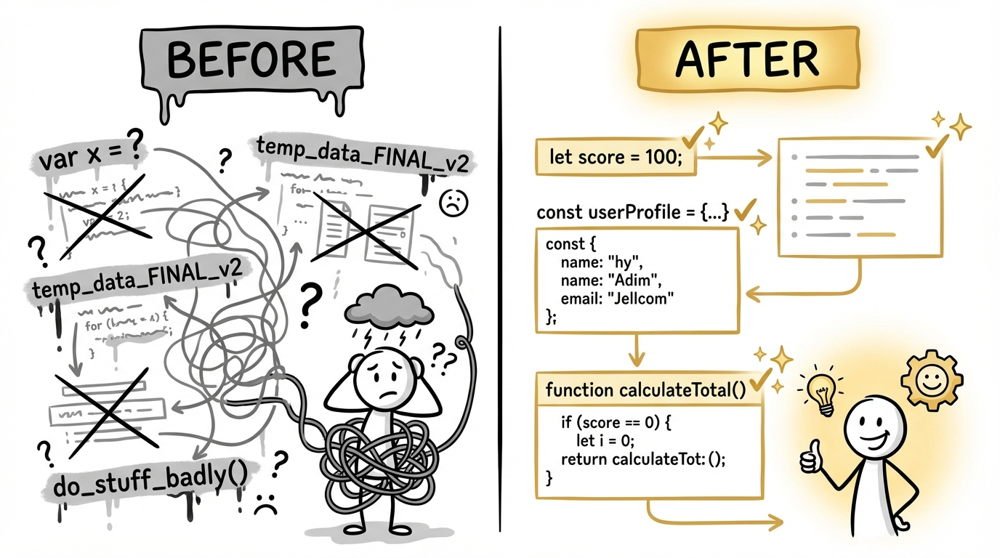
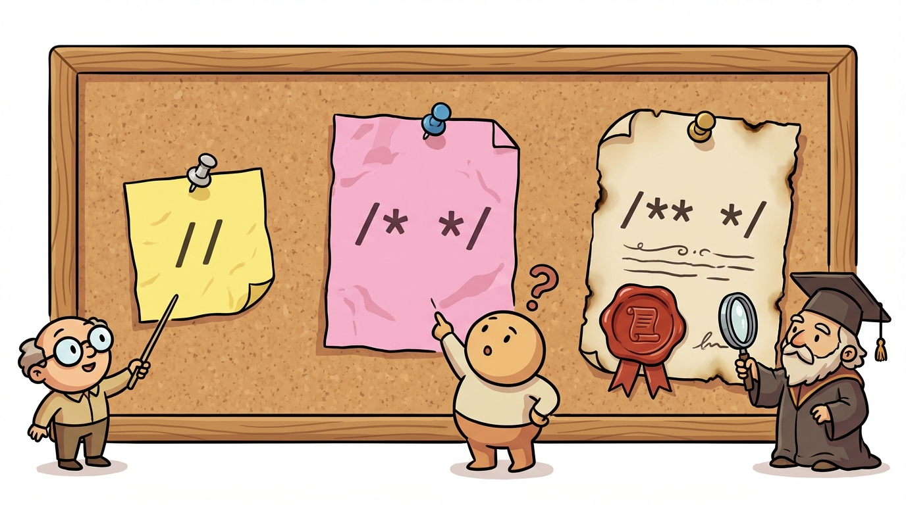

# Module 4: Basic Java Elements Part 1

> 🏷️ Start Here

> 🎯 **Teach:** Java naming conventions for classes, methods, variables, and constants, the role of reserved words, and how to use all three types of comments
> **See:** Code with bad naming conventions that needs fixing, uncommented code that needs documenting, and programs that misuse reserved words
> **Feel:** Appreciation for why conventions exist and confidence writing clean, professional, readable Java code

> 🎙️ Today is about the rules of the road in Java. Every language has conventions -- agreed-upon ways of naming things, structuring code, and communicating with other developers. You will learn Java's naming conventions, its reserved words, and its three types of comments, and then you will practice applying all of them to real code.

> 🎙️ You might be wondering why an entire day is devoted to naming and comments instead of writing more programs. Here is why -- on a real team, other people read your code. If your naming is inconsistent or your code has no comments, nobody can work with it. The exam tests this too, so it is both a professional skill and an exam skill.


## Research: Java Conventions and Reserved Words

> 🎯 **Teach:** Java's naming conventions for classes, methods, variables, and constants, what reserved words are and why they cannot be used as identifiers, and the three types of comments.
> **See:** PascalCase, camelCase, and UPPER_SNAKE_CASE examples alongside a list of reserved words and single-line, multi-line, and Javadoc comment syntax.
> **Feel:** Understanding that conventions are the shared language of every Java team and that learning them now prevents bad habits later.

### Overview

- **Topic:** Basic Java Elements — Naming Conventions, Reserved Words, and Comments
- **Type:** Written Research Assignment
- **Estimated Time:** 30 minutes
- **Target Length:** Approximately 3/4 page (300-400 words)

### Instructions

Write a short research essay addressing the following:

1. **What are Java naming conventions?** Describe the standard naming rules for each of the following and give an example of each:
   - Classes
   - Methods
   - Variables
   - Constants

2. **What are Java reserved words?** What makes a word "reserved," and why can't you use them as variable or class names? Name at least 8 reserved words and briefly explain what 3 of them do.

3. **What are comments in Java and why do they matter?** Describe the three types of comments in Java (single-line, multi-line, and Javadoc). When should a developer use comments, and when is code better left uncommented?

### Requirements

- Your response should be approximately **3/4 of a page** (300-400 words).
- Write in your own words. Do not copy and paste from your sources.
- Include at least **3 references** to third-party sources (articles, documentation, books, etc.). List them at the end of your essay in a "References" section.
- Use proper grammar and complete sentences.

### Submission

Save your completed essay as `Response_01_Conventions_and_Reserved_Words_Research.md` in this folder.

> 💡 **Remember this one thing:** Java uses PascalCase for classes, camelCase for methods and variables, and UPPER_SNAKE_CASE for constants — following these conventions makes your code instantly readable to any Java developer.

> 🎙️ Here is the quick cheat sheet. Class names start with an uppercase letter and each new word is capitalized -- that is PascalCase. Variable and method names start lowercase with each new word capitalized -- that is camelCase. Constants are all uppercase with underscores. Get these three rules locked in and you will never second-guess a name again.



## Hands-On: Conventions, Comments, and Reserved Words in Practice

> 🎯 **Teach:** How to spot and fix naming convention violations, add meaningful comments without over-commenting, and correctly use reserved words in context.
> **See:** A badly-named program to refactor, an uncommented program to document, reserved-word error messages, and a polished RecipeCard showcase program.
> **Feel:** Pride in writing code that is not just correct but clean, readable, and professional.

> 🎙️ Now you are going to apply what you researched. You will fix code that violates naming conventions, add meaningful comments to uncommented code, explore what happens when you misuse reserved words, and build a polished program that showcases everything.

### Overview

- **Topic:** Basic Java Elements — Applying Naming Conventions, Using Comments, and Understanding Reserved Words
- **Type:** Technical / Hands-On
- **Estimated Time:** 1.5 hours

### Background

Java has strong conventions that the community follows to keep code readable and consistent. These aren't enforced by the compiler — your code will still compile if you name a class `my_class` — but following conventions is essential for writing professional code that others can read.

#### Quick Reference: Naming Conventions

| Element | Convention | Example |
|---------|-----------|---------|
| Class | PascalCase (uppercase start) | `StudentRecord` |
| Method | camelCase (lowercase start) | `calculateTotal()` |
| Variable | camelCase (lowercase start) | `firstName` |
| Constant | UPPER_SNAKE_CASE with `final` | `final int MAX_SIZE = 100;` |
| Package | all lowercase | `com.example.utils` |

#### Quick Reference: Comment Types

```java
// This is a single-line comment

/* This is a
   multi-line comment */

/**
 * This is a Javadoc comment.
 * It documents classes and methods.
 * @param name the name to greet
 * @return a greeting string
 */
```

> 🎙️ Notice the three different comment styles. Single-line comments are for quick notes. Multi-line comments are for longer explanations. Javadoc comments are special -- they generate documentation that other developers can browse. You will use all three in today's exercises.



---

### Part 1: Fix the Conventions

The following program compiles and runs, but it **violates Java naming conventions throughout**. Rewrite it with proper naming conventions. Do not change what the program does — only fix the names.

#### `BadConventions.java`

```java
public class bad_conventions {
    public static void main(String[] args) {
        String FIRST_NAME = "Alice";
        String LAST_NAME = "Smith";
        int Age = 25;
        double account_balance = 1500.75;
        final double tax_rate = 0.08;

        System.out.println("Name: " + FIRST_NAME + " " + LAST_NAME);
        System.out.println("Age: " + Age);
        System.out.println("Balance: $" + account_balance);
        System.out.println("Tax rate: " + tax_rate);

        double Tax_Amount = account_balance * tax_rate;
        System.out.println("Tax owed: $" + Tax_Amount);
    }
}
```

> 🎙️ Count the violations carefully in this program -- there are more than you might think at first glance. The class name, the variable names, and the constant all have issues. This is a great exercise for training your eye to spot convention problems instantly.

#### Deliverable

Save the corrected version as `GoodConventions.java`. In your response file, list every naming violation you found and what you changed it to.

---

### Part 2: Add Comments to Existing Code

The following program works but has **zero comments**. Add appropriate comments throughout:

- A **Javadoc comment** above the class describing what the program does
- A **multi-line comment** at the top explaining the purpose and author
- **Single-line comments** explaining at least 5 key lines of code
- Do **not** over-comment obvious lines (e.g., don't comment `int x = 5;` with `// set x to 5`)

#### `GradeCalculator.java`

```java
public class GradeCalculator {
    public static void main(String[] args) {
        int exam1 = 88;
        int exam2 = 92;
        int exam3 = 76;
        int homework = 95;

        double examWeight = 0.70;
        double homeworkWeight = 0.30;

        double examAverage = (exam1 + exam2 + exam3) / 3.0;
        double finalGrade = (examAverage * examWeight) + (homework * homeworkWeight);

        System.out.println("Exam Average: " + examAverage);
        System.out.println("Final Grade: " + finalGrade);

        if (finalGrade >= 90) {
            System.out.println("Letter Grade: A");
        } else if (finalGrade >= 80) {
            System.out.println("Letter Grade: B");
        } else if (finalGrade >= 70) {
            System.out.println("Letter Grade: C");
        } else {
            System.out.println("Letter Grade: F");
        }
    }
}
```

#### Deliverable

Save your commented version as `GradeCalculatorCommented.java` in this folder.

> 🎙️ The trick with commenting is restraint. Do not comment obvious lines like "set x to 5" -- that adds clutter, not clarity. Instead, comment the why behind a calculation or a decision. Ask yourself: if someone reads this line six months from now, what would they need to know?

---


### Part 3: Reserved Words Exploration

#### Program A: `ReservedWordErrors.java`

Try to compile the following program. It uses **Java reserved words as identifiers** in several places. The compiler will reject it.

```java
public class ReservedWordErrors {
    public static void main(String[] args) {
        int class = 10;
        String return = "hello";
        double static = 3.14;
        boolean if = true;
    }
}
```

1. Attempt to compile it and record the error messages.
2. Fix the program by replacing each reserved word with a valid variable name that describes what the variable might represent.
3. Save the fixed version as `ReservedWordFixed.java`.

#### Program B: `ReservedWordReference.java`

Write a program that demonstrates the correct use of **at least 10 different reserved words**. The program should compile and run, and each reserved word should be used appropriately in context.

Use comments to label each reserved word as you use it. For example:

```java
// "public" - access modifier making this class accessible everywhere
public class ReservedWordReference {
    // "static" - belongs to the class, not an instance
    // "final" - value cannot be changed after assignment
    static final int MAX_VALUE = 100;

    // ...continue demonstrating more reserved words...
}
```

#### Deliverable

Save as `ReservedWordReference.java`. Aim for at least **10 reserved words** clearly labeled with comments.

> 🎙️ You have already been using many reserved words without thinking about it -- public, static, void, class, int, double, boolean. This exercise makes that knowledge explicit. After writing this program, you will have a personal reference card of reserved words you can come back to anytime.

---

### Part 4: Bring It All Together

#### `RecipeCard.java`

Write a complete, well-structured program that models a recipe card. This program should be a **showcase of everything you learned today**:

- **Proper naming conventions** for the class, all variables, and any constants
- **All three comment types** used appropriately (Javadoc, multi-line, single-line)
- **At least one constant** using `final`
- **Clean, readable formatting**

The program should:
1. Store a recipe name, number of servings, prep time in minutes, and at least 4 ingredients
2. Print a formatted recipe card to the terminal, for example:

```
=============================
  Recipe: Chocolate Chip Cookies
  Servings: 24
  Prep Time: 45 minutes
=============================
  Ingredients:
  - Flour
  - Sugar
  - Butter
  - Chocolate Chips
=============================
```

3. Calculate and print the **prep time per serving** (prep time divided by servings)
4. Print whether the recipe is "Quick" (under 30 minutes) or "Takes some time" (30 minutes or more)

---

### Part 5: Reflection Questions

Answer these briefly (1-2 sentences each):

1. Why do naming conventions matter if the compiler doesn't enforce them?
2. What's the difference between a useful comment and a useless comment? Give an example of each.
3. Were there any reserved words you found surprising — words you might have wanted to use as variable names?

---

### Submission

Save all `.java` files in this folder, along with a response file named `Response_02_Conventions_in_Practice.md` containing:

1. Your list of naming violations from Part 1
2. The compiler errors from Part 3A
3. Your answers to the reflection questions

> 💡 **Remember this one thing:** Conventions are not enforced by the compiler, but they are enforced by every team you will ever work on — writing clean, consistently named code is a professional skill, not just a style preference.

## Grading

> 🎯 **Teach:** How each assignment is evaluated so the student can self-assess before submitting.
> **See:** Detailed rubrics for the conventions research essay and the five hands-on coding exercises.
> **Feel:** Clarity about what "professional-quality" Java code looks like and confidence in meeting the bar.

> 🔄 **Where this fits:** Day 4 teaches the coding standards and vocabulary that make Java code professional and readable, skills you will apply every single day for the rest of the curriculum and your career.

### Research Grading

| Criteria | Points |
|----------|--------|
| Accurately describes naming conventions with correct examples | 30 |
| Explains reserved words and identifies at least 8 with 3 described | 30 |
| Describes all three comment types and when to use them | 20 |
| Writing quality and at least 3 properly cited references | 20 |
| **Total** | **100** |

### Hands-On Grading

| Criteria | Points |
|----------|--------|
| `GoodConventions.java`: All naming violations identified and fixed | 15 |
| `GradeCalculatorCommented.java`: Appropriate use of all three comment types | 15 |
| `ReservedWordFixed.java`: Errors recorded and program corrected | 10 |
| `ReservedWordReference.java`: At least 10 reserved words correctly demonstrated | 15 |
| `RecipeCard.java`: Meets all requirements with proper conventions and comments | 25 |
| Reflection questions answered accurately | 10 |
| All programs compile and run without errors | 10 |
| **Total** | **100** |

> 🎙️ You now know how to write Java code that is not just correct but professional. Naming conventions, comments, and reserved words are the vocabulary of clean code. Tomorrow you will learn how Java organizes code into packages and how import statements bring in tools from the standard library.
