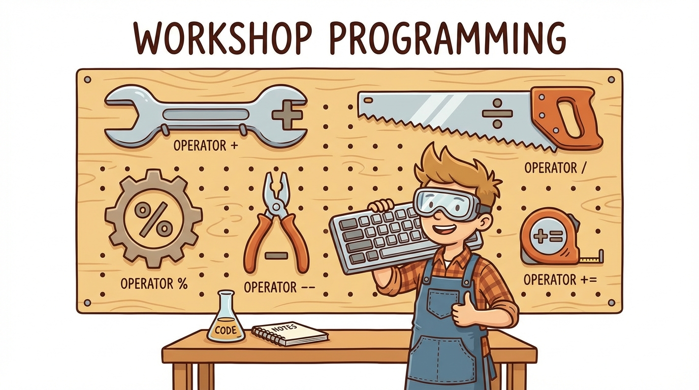
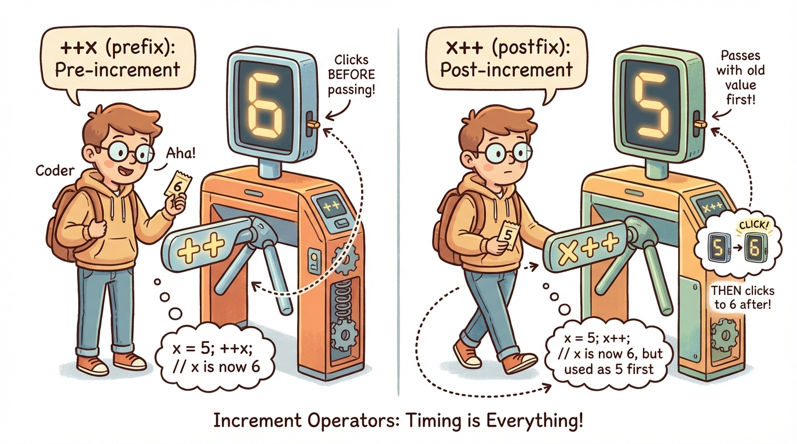
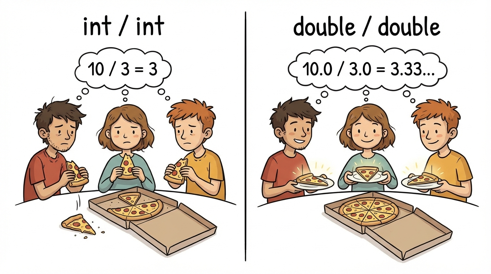
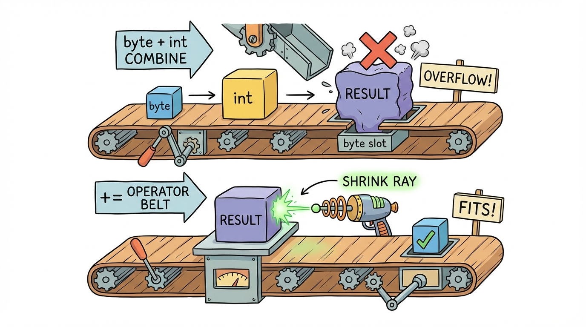

# Module 9: Java Operators Part 1

> 🏷️ Useful Soon

> 🎯 **Teach:** Java's arithmetic operators including integer versus floating-point division, the modulo operator and its practical uses, the critical difference between prefix and postfix increment/decrement, and compound assignment operators with their implicit cast behavior
> **See:** Arithmetic edge cases like division by zero, practical modulo applications like making change and clock arithmetic, tricky prefix vs postfix expressions, and a game score tracker using every operator type
> **Feel:** Readiness to handle the operator questions on the exam, especially the prefix/postfix trick questions that catch many students

> 🎙️ You are now entering the operators block. Operators are how you do math, make comparisons, and combine conditions in Java. Today covers arithmetic operators, increment and decrement, and compound assignment. These seem simple on the surface, but the exam digs into subtle behaviors like integer division, prefix versus postfix in expressions, and the implicit cast in compound assignment.

> 🎙️ You might think arithmetic in Java is just basic math. And for addition and multiplication, it is. But integer division, prefix versus postfix, and the implicit cast in compound assignment are all behaviors that trip up experienced programmers, not just beginners. The exam knows this and tests it hard.



## Research: Arithmetic and Assignment Operators

> 🎯 **Teach:** The five arithmetic operators with special attention to integer vs floating-point division, the critical prefix vs postfix distinction for increment/decrement, and compound assignment operators with their hidden implicit cast.
> **See:** Division behavior differences, the prefix/postfix mental model of "increment first vs use first," and the += implicit cast that lets byte arithmetic compile.
> **Feel:** Awareness that these seemingly simple operators have subtle exam-tested behaviors that reward careful study.

### Overview

- **Topic:** Working with Java Operators — Arithmetic, Increment/Decrement, and Assignment Operators
- **Type:** Written Research Assignment
- **Estimated Time:** 30 minutes
- **Target Length:** Approximately 3/4 page (300-400 words)

### Instructions

Write a short research essay addressing the following:

1. **What are the basic arithmetic operators in Java?** List the five arithmetic operators (`+`, `-`, `*`, `/`, `%`), explain what each does, and give special attention to how `/` behaves differently with integers versus floating-point numbers. What is the modulo operator (`%`) and when is it useful?

2. **What are the increment and decrement operators?** Explain `++` and `--`, and describe the critical difference between **prefix** (`++x`) and **postfix** (`x++`) usage. Why does this distinction matter when these operators appear inside expressions?

3. **What are arithmetic assignment operators?** Explain the compound assignment operators (`+=`, `-=`, `*=`, `/=`, `%=`). How does `x += 5` differ from `x = x + 5` in terms of type casting behavior? (Hint: compound assignment operators include an implicit cast.)

### Requirements

- Your response should be approximately **3/4 of a page** (300-400 words).
- Write in your own words. Do not copy and paste from your sources.
- Include at least **3 references** to third-party sources (articles, documentation, books, etc.). List them at the end of your essay in a "References" section.
- Use proper grammar and complete sentences.

### Submission

Save your completed essay as `Response_01_Arithmetic_and_Assignment_Operators_Research.md` in this folder.

> 💡 **Remember this one thing:** The difference between prefix (++x) and postfix (x++) only matters when the expression is used inside another expression — prefix increments before the value is used, postfix uses the value first then increments.

> 🎙️ Here is the one-sentence version of prefix versus postfix that you should commit to memory. Prefix says "increment first, then give me the value." Postfix says "give me the value first, then increment." On their own line, they do the same thing. Inside an expression, they give different results.

## Hands-On: Arithmetic and Assignment Operators in Practice

> 🎯 **Teach:** How to apply arithmetic operators including edge cases like division by zero, use modulo for practical problems like making change, trace prefix vs postfix in complex expressions, and leverage compound assignment's implicit cast.
> **See:** Arithmetic edge cases, four modulo applications, tricky increment/decrement puzzles with step-by-step traces, and a game score tracker using every operator type.
> **Feel:** Readiness to mentally evaluate any arithmetic or increment/decrement expression the exam throws at you.

> 🎙️ Time to work through every operator from today's research, paying special attention to the tricky behaviors the exam loves to test. You will predict outputs before running your code, which is exactly the skill the certification exam requires.

### Overview

- **Topic:** Working with Java Operators — Arithmetic, Increment/Decrement, and Compound Assignment
- **Type:** Technical / Hands-On
- **Estimated Time:** 1.5 hours

### Background

#### Arithmetic Operators

| Operator | Name | Example | Result |
|----------|------|---------|--------|
| `+` | Addition | `10 + 3` | `13` |
| `-` | Subtraction | `10 - 3` | `7` |
| `*` | Multiplication | `10 * 3` | `30` |
| `/` | Division | `10 / 3` | `3` (integer!) |
| `%` | Modulo (remainder) | `10 % 3` | `1` |

#### Increment / Decrement

| Expression | Name | Behavior |
|------------|------|----------|
| `++x` | Pre-increment | Increments **before** the value is used |
| `x++` | Post-increment | Uses the value **then** increments |
| `--x` | Pre-decrement | Decrements **before** the value is used |
| `x--` | Post-decrement | Uses the value **then** decrements |



#### Compound Assignment

| Operator | Equivalent | Bonus |
|----------|-----------|-------|
| `x += 5` | `x = x + 5` | Includes implicit cast |
| `x -= 5` | `x = x - 5` | Includes implicit cast |
| `x *= 5` | `x = x * 5` | Includes implicit cast |
| `x /= 5` | `x = x / 5` | Includes implicit cast |
| `x %= 5` | `x = x % 5` | Includes implicit cast |

> 🎙️ Look at the integer division row in that arithmetic table. Ten divided by three gives you three, not three point three. Java drops the decimal entirely when both operands are integers. This is not rounding -- it is truncation. To get the decimal result, at least one operand must be a floating-point type.



---

### Part 1: Arithmetic Fundamentals

#### Program A: `ArithmeticDemo.java`

Write a program that demonstrates every arithmetic operator with clear output:

1. **Addition, Subtraction, Multiplication** — straightforward, one example each
2. **Integer Division** — demonstrate that `10 / 3` yields `3`, not `3.333...`
3. **Floating-point Division** — demonstrate that `10.0 / 3.0` yields `3.333...`
4. **Mixed Division** — show what happens with `10 / 3.0` and `10.0 / 3`
5. **Division by zero:**
   - What happens with `10 / 0`? (Wrap in try/catch and print the exception)
   - What happens with `10.0 / 0.0`? (This does NOT crash — print the result and explain)
6. **Modulo:** Show examples for each:
   - `10 % 3` → remainder is 1
   - `15 % 5` → remainder is 0
   - `7 % 2` → remainder is 1 (odd number check)
   - A negative number: `-7 % 3` — what is the result?

> 🎙️ Pay special attention to what happens with integer division by zero versus floating-point division by zero. Integer division by zero crashes your program with an ArithmeticException. But floating-point division by zero gives you Infinity -- no crash. The exam loves to test this difference.

---

### Part 2: Modulo in Action

#### Program B: `ModuloApplications.java`

The modulo operator is more useful than it first appears. Write a program that demonstrates these practical uses:

1. **Even/Odd checker:** Given an array of integers `{12, 7, 24, 3, 18, 9, 42}`, loop through and print whether each is even or odd. (Use `number % 2 == 0`)

2. **Clock arithmetic:** Given a value of `250` total minutes, calculate the hours and remaining minutes:
   ```
   250 minutes = 4 hours and 10 minutes
   ```

3. **Making change:** Given an amount in cents (e.g., `487`), break it down into quarters, dimes, nickels, and pennies using `/` and `%`:
   ```
   487 cents = 19 quarters, 1 dime, 0 nickels, 2 pennies
   ```

4. **Cycle detection:** Given a counter that goes from 0 to 20, print "BUZZ" every 5th number using `%`:
   ```
   0: BUZZ
   1:
   2:
   3:
   4:
   5: BUZZ
   ...
   ```

> 🎙️ The modulo operator seems simple, but it shows up everywhere in real programming. Checking if a number is even or odd, converting minutes to hours and minutes, making change -- all of these use the remainder. Once you internalize modulo, you will spot opportunities to use it constantly.

---

### Part 3: Increment and Decrement

#### Program C: `IncrementDecrement.java`

This is a **heavy exam topic**. Write a program that explores prefix vs. postfix behavior:

1. **Simple standalone usage** — show that on their own line, `x++` and `++x` have the same effect:
   ```java
   int a = 5;
   a++;
   System.out.println("After a++: " + a);  // 6

   int b = 5;
   ++b;
   System.out.println("After ++b: " + b);  // 6
   ```

2. **Inside an expression** — this is where they differ. Predict the output FIRST (write your prediction as a comment), then run:
   ```java
   int x = 10;
   int y = x++;
   System.out.println("x = " + x + ", y = " + y);

   int m = 10;
   int n = ++m;
   System.out.println("m = " + m + ", n = " + n);
   ```

3. **Inside a print statement:**
   ```java
   int counter = 5;
   System.out.println(counter++);  // What prints?
   System.out.println(counter);    // What prints now?

   int counter2 = 5;
   System.out.println(++counter2); // What prints?
   System.out.println(counter2);   // What prints now?
   ```

4. **Tricky exam-style questions** — predict the output before running:
   ```java
   int a = 3;
   int result = a++ + ++a;
   System.out.println("a = " + a + ", result = " + result);

   int b = 5;
   int result2 = --b + b-- + b;
   System.out.println("b = " + b + ", result2 = " + result2);
   ```

For each tricky question, write a **step-by-step explanation** as comments showing how you worked out the answer.

> 🎙️ Those tricky exam-style questions at the end of Part 3 are the real test. Work through each one step by step on paper before running the code. The exam gives you expressions like these and expects you to evaluate them mentally. If you can trace through a plus plus a plus plus plus a, you are ready.

---

### Part 4: Compound Assignment Operators

#### Program D: `CompoundAssignment.java`

Write a program that demonstrates all five compound assignment operators:

1. **Basic usage:** Start with `int score = 100;` and apply each operator:
   ```
   score += 10  → 110
   score -= 25  → 85
   score *= 2   → 170
   score /= 5   → 34
   score %= 10  → 4
   ```
   Print the value after each step.

2. **The implicit cast trick** (important for the exam):
   ```java
   byte b = 10;
   // b = b + 5;    // ERROR! b + 5 is an int
   b += 5;          // WORKS! Compound assignment includes implicit cast
   ```
   Demonstrate this with `byte`, `short`, and `char`. Comment out the failing line and explain the error, then show the compound assignment working.



3. **String concatenation with `+=`:**
   ```java
   String message = "Hello";
   message += " ";
   message += "World";
   message += "!";
   System.out.println(message);  // "Hello World!"
   ```
   Build a sentence word by word using `+=`.

---

### Part 5: Practical Application

#### Program E: `ScoreTracker.java`

Write a program that simulates tracking a player's score in a game. This should use all the operator types from today:

1. Start with a `score` of `0` and a `lives` of `3`
2. Simulate a series of game events using print statements and operators:
   - Player collects a coin: `score += 10`
   - Player defeats an enemy: `score += 25`
   - Player gets hit: `lives--` (use post-decrement and print the value change)
   - Player finds a multiplier: `score *= 2`
   - Player pays for a power-up: `score -= 15`
   - Player splits score with a teammate: `score /= 2`
   - Calculate bonus coins: `score % 100` (remainder becomes bonus)
3. After each event, print the current state:
   ```
   Event: Collected a coin
   Score: 10 | Lives: 3
   ---
   Event: Defeated an enemy
   Score: 35 | Lives: 3
   ---
   Event: Got hit!
   Lives were 3, now 2
   Score: 35 | Lives: 2
   ---
   ```
4. At the end, determine if the player survived (`lives > 0`) and print a final summary

---

### Part 6: Reflection Questions

Answer these briefly (1-2 sentences each):

1. What is the result of `7 / 2` in Java? How do you get `3.5` instead?
2. In the expression `int y = x++;`, why does `y` get the OLD value of `x`?
3. Why does `b += 5` compile for a `byte` variable but `b = b + 5` does not?

---

### Submission

Save all `.java` files in this folder, along with a response file named `Response_02_Arithmetic_and_Assignment_Operators_in_Practice.md` containing:

1. Your predictions vs. actual results from Part 3
2. Your step-by-step explanations of the tricky increment/decrement questions
3. Your answers to the reflection questions

> 💡 **Remember this one thing:** Compound assignment operators like `+=` include an implicit cast, so `b += 5` works for a byte even though `b = b + 5` does not — this is a favorite exam trick.

## Grading

> 🎯 **Teach:** How each assignment is evaluated so the student can self-assess before submitting.
> **See:** Detailed rubrics for the arithmetic operators research essay and the five hands-on operator exercises.
> **Feel:** Clarity about expectations and momentum heading into the comparison and logic operators on Day 10.

> 🔄 **Where this fits:** Day 9 begins the operators block — arithmetic, increment/decrement, and compound assignment are fundamental to every calculation you will write and are tested directly on the 1Z0-811 exam.

### Research Grading

| Criteria | Points |
|----------|--------|
| Accurately describes all 5 arithmetic operators, including integer vs. float division | 30 |
| Explains increment/decrement with clear prefix vs. postfix distinction | 30 |
| Describes compound assignment operators and the implicit cast behavior | 20 |
| Writing quality and at least 3 properly cited references | 20 |
| **Total** | **100** |

### Hands-On Grading

| Criteria | Points |
|----------|--------|
| `ArithmeticDemo.java`: All operators demonstrated including division edge cases | 15 |
| `ModuloApplications.java`: All 4 practical applications correct | 15 |
| `IncrementDecrement.java`: All scenarios with predictions and explanations | 20 |
| `CompoundAssignment.java`: All operators shown, implicit cast demonstrated | 15 |
| `ScoreTracker.java`: Complete game simulation using all operator types | 15 |
| Reflection questions answered accurately | 10 |
| All programs compile and run without errors | 10 |
| **Total** | **100** |

> 🎙️ You are halfway through the operators block. Tomorrow you will tackle the comparison and logic side -- relational operators, logical AND and OR, short-circuit evaluation, the ternary operator, and operator precedence. Together, Days 9 and 10 give you the complete operator toolkit you need for the exam and for writing real programs.
