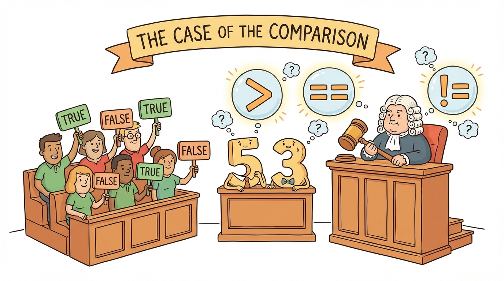
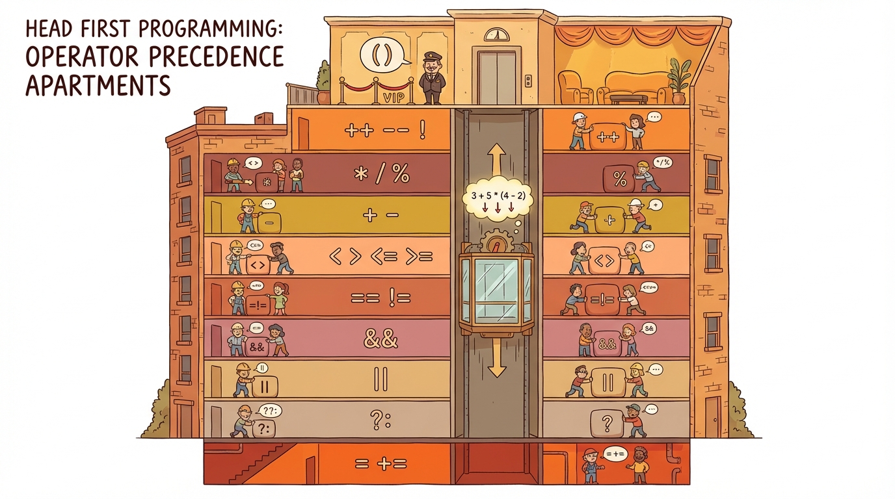
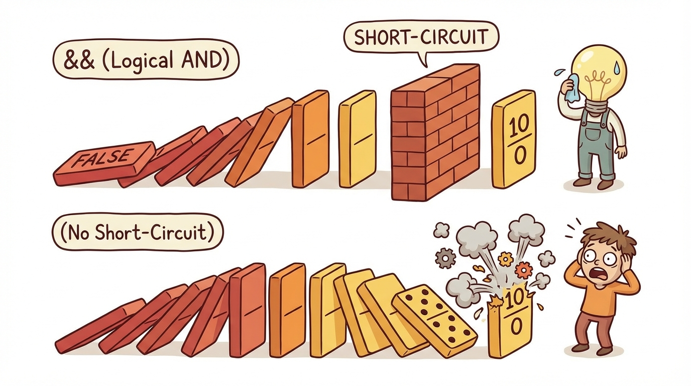
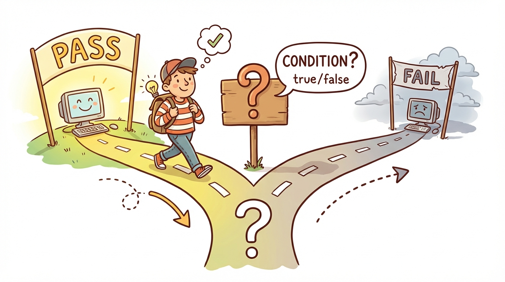

# Module 10: Java Operators Part 2

> 🏷️ Useful Soon

> 🎯 **Teach:** Java's relational operators including the == versus = distinction, logical operators with short-circuit evaluation, the ternary operator as a compact conditional, and operator precedence rules
> **See:** Truth tables for AND and OR, short-circuit evaluation preventing crashes, ternary expressions replacing if/else blocks, precedence puzzles with and without parentheses, and an eligibility checker capstone using every operator type
> **Feel:** Mastery of the full operator toolkit and readiness to write and read complex boolean expressions confidently

> 🎙️ Today you are completing the operators block with the comparison and logic side. You will learn how to compare values, combine conditions, and control precedence. Short-circuit evaluation and operator precedence are favorite exam topics, so by the end of today you will have practiced exactly the kinds of questions you will face on test day.

> 🎙️ After yesterday's arithmetic operators, today you learn how to ask questions in code. Is this value greater than that one? Are both conditions true? Should I pick option A or option B? These operators are the building blocks of every decision your program will ever make.



## Research: Relational, Conditional, and Ternary Operators

> 🎯 **Teach:** All six relational operators with the == vs = distinction, logical AND/OR/NOT with short-circuit evaluation, the ternary operator syntax, and why operator precedence determines expression outcomes.
> **See:** The difference between == and = in context, a short-circuit scenario that prevents a crash, ternary syntax as a compact if/else, and a precedence example that changes meaning with parentheses.
> **Feel:** Confidence that you can read and write compound boolean expressions without ambiguity.

### Overview

- **Topic:** Working with Java Operators — Relational Operators, Conditional Operators, and Operator Precedence
- **Type:** Written Research Assignment
- **Estimated Time:** 30 minutes
- **Target Length:** Approximately 3/4 page (300-400 words)

### Instructions

Write a short research essay addressing the following:

1. **What are Java's relational operators?** List all six (`==`, `!=`, `>`, `>=`, `<`, `<=`), explain what each returns, and note the important distinction between `==` (comparison) and `=` (assignment) — a common source of bugs. Also mention how `==` behaves differently for primitives versus objects (connecting back to what you learned about strings on Day 8).

2. **What are Java's conditional (logical) operators?** Explain `&&` (logical AND), `||` (logical OR), and `!` (logical NOT). What is **short-circuit evaluation**, and why does it matter? Describe a scenario where short-circuit evaluation prevents an error.

3. **What is the ternary operator?** Explain the syntax of `condition ? valueIfTrue : valueIfFalse`. When is it a good substitute for a simple if/else, and when should you avoid it?

4. **What is operator precedence?** Why does it matter, and how can parentheses be used to make expressions clearer? Give an example of an expression that produces a different result with and without parentheses.

### Requirements

- Your response should be approximately **3/4 of a page** (300-400 words).
- Write in your own words. Do not copy and paste from your sources.
- Include at least **3 references** to third-party sources (articles, documentation, books, etc.). List them at the end of your essay in a "References" section.
- Use proper grammar and complete sentences.

### Submission

Save your completed essay as `Response_01_Relational_Conditional_Precedence_Research.md` in this folder.

> 💡 **Remember this one thing:** Short-circuit evaluation means Java stops evaluating a boolean expression as soon as the result is determined — with &&, if the left side is false, the right side is never evaluated, which can prevent runtime errors.

> 🎙️ Short-circuit evaluation is not just an exam topic -- it is a practical tool you will use all the time. For example, you can safely write "if the array is not null AND the array length is greater than zero" because if the array is null, Java never checks the length, so you avoid a crash. That pattern shows up everywhere in real Java code.

## Hands-On: Relational, Conditional, and Precedence in Practice

> 🎯 **Teach:** How to use all six relational operators including the floating-point comparison trap, build and verify truth tables for AND/OR, observe short-circuit evaluation preventing crashes, convert if/else to ternary, and untangle operator precedence puzzles.
> **See:** Truth tables, short-circuit demos with side effects, five if/else-to-ternary conversions, precedence puzzles with and without parentheses, and an eligibility checker capstone using every operator type.
> **Feel:** Mastery of the complete operator toolkit and readiness to tackle any operator question on the exam.

> 🎙️ Now you are going to build truth tables, watch short-circuit evaluation prevent a crash in real time, convert if/else blocks into ternary expressions, and untangle precedence puzzles. This is the kind of hands-on practice that turns exam concepts into second nature.

### Overview

- **Topic:** Working with Java Operators — Relational, Logical, Ternary, and Operator Precedence
- **Type:** Technical / Hands-On
- **Estimated Time:** 1.5 hours

### Background

#### Relational Operators (return `boolean`)

| Operator | Meaning | Example | Result |
|----------|---------|---------|--------|
| `==` | Equal to | `5 == 5` | `true` |
| `!=` | Not equal to | `5 != 3` | `true` |
| `>` | Greater than | `5 > 3` | `true` |
| `>=` | Greater than or equal | `5 >= 5` | `true` |
| `<` | Less than | `3 < 5` | `true` |
| `<=` | Less than or equal | `5 <= 5` | `true` |

#### Conditional (Logical) Operators

| Operator | Meaning | Behavior |
|----------|---------|----------|
| `&&` | AND | `true` only if BOTH sides are `true` |
| `\|\|` | OR | `true` if EITHER side is `true` |
| `!` | NOT | Flips `true` to `false` and vice versa |

#### The Ternary Operator

```java
String result = (score >= 60) ? "Pass" : "Fail";
// Equivalent to:
// if (score >= 60) { result = "Pass"; } else { result = "Fail"; }
```

#### Operator Precedence (highest to lowest, simplified)

```
1. () — parentheses (highest)
2. ++ -- ! — unary operators
3. * / % — multiplication, division, modulo
4. + - — addition, subtraction
5. < > <= >= — relational
6. == != — equality
7. && — logical AND
8. || — logical OR
9. ? : — ternary
10. = += -= *= /= %= — assignment (lowest)
```

> 🎙️ You do not need to memorize every level of that precedence table. The key takeaways are that multiplication and division happen before addition and subtraction, that relational operators happen before logical operators, and that AND has higher precedence than OR. When in doubt, use parentheses to make your intent clear.



---

### Part 1: Relational Operators

#### Program A: `RelationalDemo.java`

Write a program that demonstrates all six relational operators:

1. **Numeric comparisons:** Declare two `int` variables and print the result of every relational operator between them:
   ```
   a = 10, b = 20
   a == b: false
   a != b: true
   a > b:  false
   a >= b: false
   a < b:  true
   a <= b: true
   ```

2. **Comparing equal values:** Repeat with `a = 15, b = 15` — note which operators return `true` now.

3. **Double comparison trap:** Demonstrate why comparing `double` values with `==` can be unreliable:
   ```java
   double x = 0.1 + 0.2;
   double y = 0.3;
   System.out.println(x == y);  // What does this print? Why?
   System.out.println(Math.abs(x - y) < 0.0001);  // Better approach
   ```
   Add a comment explaining floating-point precision.

4. **char comparisons:** Characters can be compared because they have numeric Unicode values:
   ```java
   char a = 'A';  // Unicode 65
   char b = 'Z';  // Unicode 90
   System.out.println(a < b);   // true
   System.out.println(a == 65); // true
   ```
   Compare a few characters and explain the results.

> 🎙️ The double comparison trap with floating-point numbers is a classic gotcha. Because of how computers store decimal numbers, 0.1 plus 0.2 does not exactly equal 0.3. Instead of using double equals to compare doubles, compare whether the difference between them is smaller than a tiny threshold. This is standard practice in any language, not just Java.

---

### Part 2: Conditional (Logical) Operators

#### Program B: `LogicalOperators.java`

Write a program that demonstrates `&&`, `||`, and `!`:

1. **Truth table for AND:** Print all four combinations:
   ```
   true  && true  = true
   true  && false = false
   false && true  = false
   false && false = false
   ```

2. **Truth table for OR:** Print all four combinations.

3. **NOT:** Demonstrate `!true` and `!false`.

4. **Practical examples using variables:**
   ```java
   int age = 20;
   boolean hasLicense = true;
   boolean hasInsurance = false;

   // Can they drive?
   boolean canDrive = (age >= 16) && hasLicense && hasInsurance;
   System.out.println("Can drive: " + canDrive);  // false — no insurance
   ```

5. **Short-circuit evaluation:** This is important for the exam. Demonstrate that Java stops evaluating as soon as the result is known:
   ```java
   int x = 0;

   // With &&: if the left side is false, the right side is NEVER evaluated
   boolean result1 = (x != 0) && (10 / x > 2);
   System.out.println("result1: " + result1);  // false — no crash!

   // Without short-circuit, 10 / 0 would crash. Prove it:
   // boolean crash = (10 / x > 2);  // Uncomment to see ArithmeticException
   ```

   ```java
   // With ||: if the left side is true, the right side is NEVER evaluated
   boolean result2 = (x == 0) || (10 / x > 2);
   System.out.println("result2: " + result2);  // true — right side skipped
   ```

6. **Side effects with short-circuit:** Predict the output before running:
   ```java
   int a = 5;
   boolean test = (a > 10) && (++a > 5);
   System.out.println("a = " + a);  // Is a still 5 or 6?

   int b = 5;
   boolean test2 = (b < 10) || (++b > 5);
   System.out.println("b = " + b);  // Is b still 5 or 6?
   ```
   Add comments explaining why the increment did or didn't happen.

> 🎙️ The side effects exercise in Part 2 is a favorite exam trick. When short-circuit evaluation skips the right side of an expression, any increment or method call on that side never executes. So if you write a greater than 10 AND plus plus a greater than 5, and a is not greater than 10, the plus plus never happens. The variable does not change. Trace through it carefully.



---

### Part 3: The Ternary Operator

#### Program C: `TernaryDemo.java`

Write a program that demonstrates the ternary operator in various situations:

1. **Basic usage:**
   ```java
   int score = 75;
   String result = (score >= 60) ? "Pass" : "Fail";
   System.out.println(result);
   ```

2. **Assigning a number:**
   ```java
   int a = 10, b = 20;
   int max = (a > b) ? a : b;
   System.out.println("Max: " + max);
   ```

3. **Inside a print statement:**
   ```java
   int temperature = 35;
   System.out.println("It is " + ((temperature > 30) ? "hot" : "not hot") + " today.");
   ```

4. **Nested ternary** (for awareness — show that it works but can be hard to read):
   ```java
   int grade = 85;
   String letter = (grade >= 90) ? "A"
                 : (grade >= 80) ? "B"
                 : (grade >= 70) ? "C"
                 : "F";
   ```
   Add a comment that nested ternaries are generally discouraged in favor of if/else chains for readability.

5. **Converting 5 simple if/else blocks to ternary:** Write 5 different scenarios as if/else first, then convert each to a ternary expression. Examples:
   - Determine if a number is positive or negative
   - Determine if a year is a leap year (divisible by 4)
   - Set a discount rate based on membership status
   - Choose singular vs. plural wording (e.g., "1 item" vs. "3 items")
   - Determine AM or PM from a 24-hour value

> 🎙️ The ternary operator is a compact way to write a simple if/else, but do not overuse it. A single ternary expression is clean and readable. Nested ternaries quickly become hard to follow. The rule of thumb is -- if you need more than one level of nesting, switch back to an if/else chain.



---

### Part 4: Operator Precedence

#### Program D: `PrecedenceExplorer.java`

Write a program that demonstrates why precedence matters. For each expression below:
- Write your **prediction** as a comment
- Print the actual result
- Add the expression **with parentheses** showing the order Java evaluates it

1. **Arithmetic precedence:**
   ```java
   int a = 2 + 3 * 4;        // Is this 20 or 14?
   int b = (2 + 3) * 4;      // What about now?
   ```

2. **Mixed arithmetic and relational:**
   ```java
   boolean c = 10 > 5 + 3;   // Is 5 + 3 evaluated first?
   boolean d = 10 > (5 + 3); // Same or different?
   ```

3. **Logical operator precedence — && before ||:**
   ```java
   boolean e = true || false && false;
   // Is this (true || false) && false → false?
   // Or true || (false && false) → true?
   ```

4. **Complex expression:**
   ```java
   int x = 5;
   boolean f = x > 3 && x < 10 || x == 20;
   // Add parentheses to show the actual evaluation order
   ```

5. **Assignment is last:**
   ```java
   int g = 2;
   g += 3 * 2;  // Is this (g + 3) * 2 or g + (3 * 2)?
   ```

6. **The parentheses fix:** Rewrite each expression above with explicit parentheses, and add a comment: *"When in doubt, use parentheses to make your intent clear."*

> 🎙️ Expression 3 in the precedence exercise is the one to really think about. Because AND has higher precedence than OR, the expression true OR false AND false evaluates as true OR (false AND false), which gives you true. Many students expect it to be (true OR false) AND false, which gives false. Parentheses make your intent unambiguous.

---

### Part 5: Operators Capstone

#### Program E: `EligibilityChecker.java`

Build a program that determines eligibility for various programs using **every operator type** from Days 9 and 10. Use `Scanner` to read input from the user.

Collect the following information:
- Name (`String`)
- Age (`int`)
- Annual income (`double`)
- Years of experience (`int`)
- Has a degree (`boolean` — accept `true` or `false`)
- Credit score (`int`)

Determine eligibility for each of the following using compound boolean expressions:

1. **Voting:** Age >= 18
2. **Car rental:** Age >= 21 AND has a degree OR age >= 25
3. **Loan approval:** Credit score >= 700 AND income >= 30000 AND age >= 18
4. **Senior discount:** Age >= 65 OR (age >= 60 AND income < 25000)
5. **Job posting:** (Has degree AND experience >= 2) OR (experience >= 5)
6. **Premium membership:** Income >= 50000 AND credit score >= 750 AND age >= 21

For each check:
- Use the ternary operator to assign "Eligible" or "Not Eligible"
- Print the result with the criteria shown
- Use `&&`, `||`, and `!` appropriately
- Use parentheses to make the logic clear

Print a final summary:
```
=== Eligibility Report for Campbell Reed ===
Voting:             Eligible
Car Rental:         Eligible
Loan Approval:      Not Eligible
Senior Discount:    Not Eligible
Job Posting:        Eligible
Premium Membership: Not Eligible
---
Eligible for 3 out of 6 programs.
```

Use a counter variable with `++` to count how many programs the user is eligible for, and use `%` to determine if that count is odd or even (just for practice).

---

### Part 6: Reflection Questions

Answer these briefly (1-2 sentences each):

1. What is short-circuit evaluation, and how could it prevent a runtime error?
2. Why does `&&` have higher precedence than `||`? Can you think of a real-world analogy?
3. When is a ternary operator better than an if/else, and when is it worse?
4. Looking back at Days 9 and 10 together — which operator concept do you think will appear most on the exam, and why?

---

### Submission

Save all `.java` files in this folder, along with a response file named `Response_02_Relational_Conditional_Precedence_in_Practice.md` containing:

1. Your predictions vs. actual results from Parts 2 and 4
2. Your short-circuit evaluation explanations
3. Your answers to the reflection questions

> 💡 **Remember this one thing:** Logical AND (&&) has higher precedence than logical OR (||), so `true || false && false` evaluates as `true || (false && false)` which is `true` — always use parentheses to make complex boolean expressions unambiguous.

## Grading

> 🎯 **Teach:** How each assignment is evaluated so the student can self-assess before submitting.
> **See:** Detailed rubrics for the relational/conditional research essay and the five hands-on operator exercises including the capstone.
> **Feel:** Satisfaction at completing the entire operators block and readiness for control flow statements starting on Day 11.

> 🔄 **Where this fits:** Day 10 completes the operators block — together with Day 9, you now have the full toolkit of arithmetic, comparison, and logical operators that you will use in control flow statements starting on Day 11.

### Research Grading

| Criteria | Points |
|----------|--------|
| Accurately describes all 6 relational operators with `==` vs `=` distinction | 25 |
| Explains `&&`, `||`, `!` and short-circuit evaluation with an example | 25 |
| Covers the ternary operator syntax and appropriate usage | 20 |
| Explains operator precedence with a parentheses example | 15 |
| Writing quality and at least 3 properly cited references | 15 |
| **Total** | **100** |

### Hands-On Grading

| Criteria | Points |
|----------|--------|
| `RelationalDemo.java`: All 6 operators demonstrated, double comparison trap shown | 10 |
| `LogicalOperators.java`: Truth tables, short-circuit demonstrated and explained | 20 |
| `TernaryDemo.java`: All scenarios shown, 5 if/else conversions completed | 15 |
| `PrecedenceExplorer.java`: All expressions with predictions and parenthesized versions | 15 |
| `EligibilityChecker.java`: All operator types used, user input, correct logic | 20 |
| Reflection questions answered accurately | 10 |
| All programs compile and run without errors | 10 |
| **Total** | **100** |

> 🎙️ You have now completed the entire operators block. Between Days 9 and 10, you covered arithmetic, modulo, increment and decrement, compound assignment, relational operators, logical operators, the ternary operator, and operator precedence. That is the complete toolkit. Starting with Day 11, you will use all of these operators inside control flow statements like if, else, switch, and loops.
