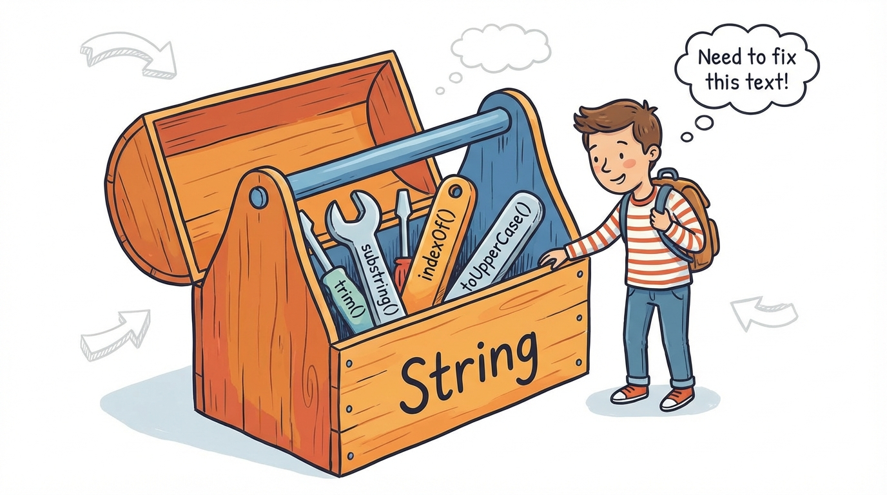
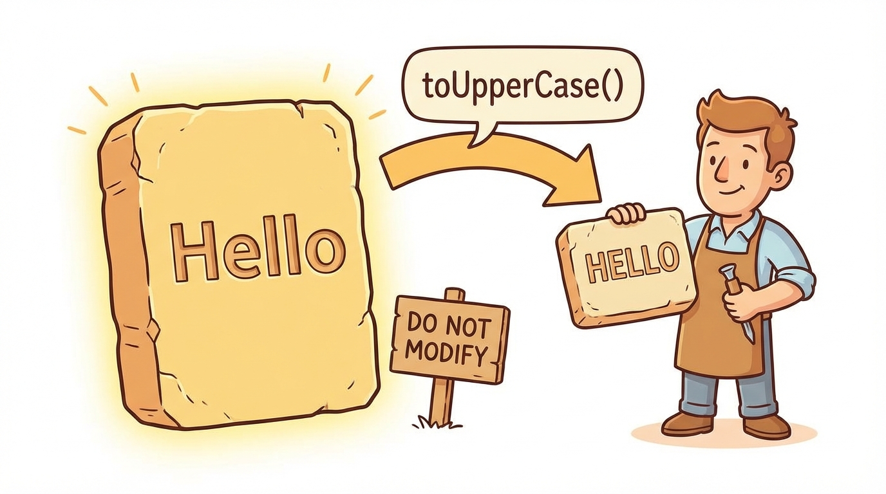
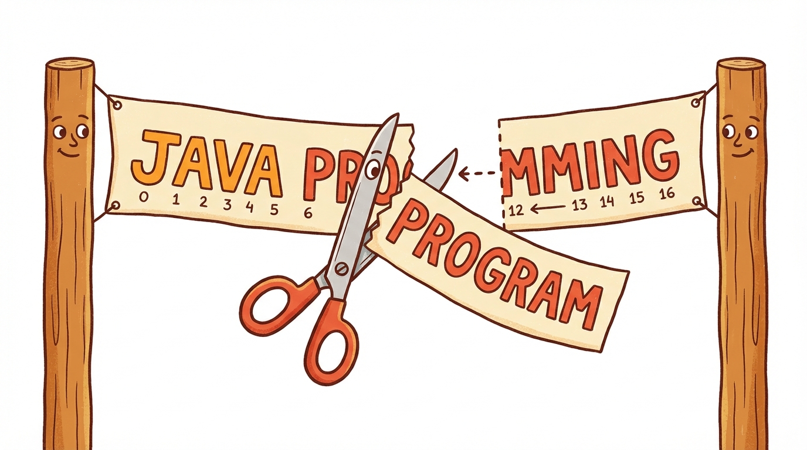
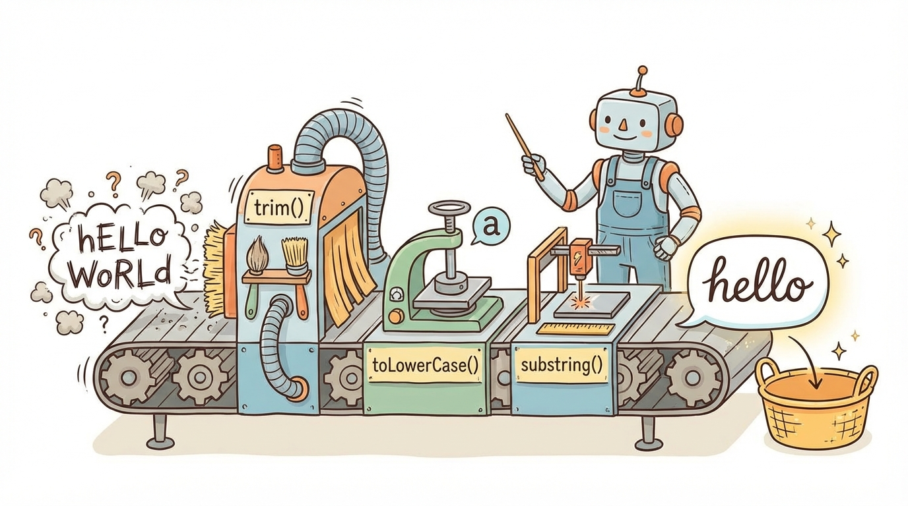

# Module 11: String Class Part 1

> 🏷️ Useful Soon

> 🎯 **Teach:** How to use core String methods to examine, transform, and chain operations on text in Java
> **See:** Methods like length(), charAt(), indexOf(), substring(), toUpperCase(), trim(), and replace() applied to real strings
> **Feel:** Confident that you can manipulate any text data using the String class's built-in toolkit

> 🎙️ Today we begin working with one of the most important classes in all of Java, the String class. Strings are everywhere in real programs, from user input to file paths to database queries, so knowing how to inspect, transform, and chain String methods is essential. You will learn at least ten core methods, connect their behavior back to immutability, and practice method chaining to write clean, expressive code.

> 🎙️ Strings might seem simple at first -- they are just text, right? But the String class has more methods than almost any other class you will encounter. Once you master them, you will find yourself reaching for these tools in every single program you write.



## Research: String Methods in Java

> 🎯 **Teach:** What the most commonly used String methods are, why they return new strings, and how method chaining works.
> **See:** A research assignment exploring at least 10 String methods grouped by function, immutability, and chaining.
> **Feel:** Prepared with solid conceptual knowledge before diving into hands-on String method practice.

### Overview

- **Topic:** Working with the String Class — Core String Methods
- **Type:** Written Research Assignment
- **Estimated Time:** 30 minutes
- **Target Length:** Approximately 3/4 page (300-400 words)

### Instructions

Write a short research essay addressing the following:

1. **What are the most commonly used String methods in Java?** Describe at least 10 methods from the `String` class, grouped by what they do. For each method, give its return type and a one-line description. Consider grouping them as:
   - Methods that examine a string (`length()`, `charAt()`, `indexOf()`, `contains()`, `isEmpty()`)
   - Methods that produce a new string (`toUpperCase()`, `toLowerCase()`, `trim()`, `substring()`, `replace()`, `concat()`)

2. **Why do String methods return new strings instead of modifying the original?** Connect this back to string immutability (Day 8). Why is this design choice important for how Java handles strings?



3. **What is method chaining with strings?** Show how multiple String methods can be called in sequence (e.g., `str.trim().toUpperCase().substring(0, 5)`) and explain why this works.

### Requirements

- Your response should be approximately **3/4 of a page** (300-400 words).
- Write in your own words. Do not copy and paste from your sources.
- Include at least **3 references** to third-party sources (articles, documentation, books, etc.). List them at the end of your essay in a "References" section.
- Use proper grammar and complete sentences.

### Submission

Save your completed essay as `Response_01_String_Methods_Research.md` in this folder.

### Grading Criteria

| Criteria | Points |
|----------|--------|
| Describes at least 10 String methods with return types and descriptions | 35 |
| Connects method behavior to string immutability | 25 |
| Explains method chaining and why it works | 20 |
| Writing quality and at least 3 properly cited references | 20 |
| **Total** | **100** |

> 🎙️ Take your time with this research -- really dig into what each method does and what it returns. When you get to the hands-on section, you will be using all ten of these methods in real programs, so the better you understand them now, the faster you will move later.

> 💡 **Remember this one thing:** String methods never modify the original string because strings are immutable. Every method that appears to change a string actually returns a brand-new String object.

## Hands-On: String Methods in Practice

> 🎯 **Teach:** How to use charAt, substring, indexOf, equals, and other essential String methods in real programs.
> **See:** Multiple Java programs that process, search, and transform strings using method chaining and edge cases.
> **Feel:** Confidence that you can manipulate text data in any Java program.

> 🎙️ Now that you understand what String methods are available, it is time to use every single one of them in real programs. You will build a method explorer, drill substring edge cases, practice method chaining, and create practical text processing tools.

### Overview

- **Topic:** Working with the String Class — Using Core String Methods
- **Type:** Technical / Hands-On
- **Estimated Time:** 1.5 hours

### Background

The `String` class has dozens of useful methods. Here are the ones most likely to appear on the exam:

| Method | Returns | Description |
|--------|---------|-------------|
| `length()` | `int` | Number of characters |
| `charAt(int index)` | `char` | Character at the given index (0-based) |
| `indexOf(String s)` | `int` | Position of first occurrence, or -1 if not found |
| `lastIndexOf(String s)` | `int` | Position of last occurrence, or -1 |
| `substring(int begin)` | `String` | From begin index to end |
| `substring(int begin, int end)` | `String` | From begin (inclusive) to end (exclusive) |
| `toUpperCase()` | `String` | All characters uppercase |
| `toLowerCase()` | `String` | All characters lowercase |
| `trim()` | `String` | Removes leading and trailing whitespace |
| `replace(char old, char new)` | `String` | Replaces all occurrences of a character |
| `replace(String old, String new)` | `String` | Replaces all occurrences of a substring |
| `contains(String s)` | `boolean` | True if the string contains the substring |
| `startsWith(String s)` | `boolean` | True if string starts with the prefix |
| `endsWith(String s)` | `boolean` | True if string ends with the suffix |
| `isEmpty()` | `boolean` | True if length is 0 |
| `equals(String s)` | `boolean` | True if content is identical (case-sensitive) |
| `equalsIgnoreCase(String s)` | `boolean` | True if content matches ignoring case |
| `concat(String s)` | `String` | Appends the given string |

**Important:** `substring(begin, end)` — the `end` index is **exclusive**. This is a very common exam question.

> 🎙️ That table is your reference for the rest of today and honestly for the rest of this entire course. Do not try to memorize it all at once -- instead, use it as a cheat sheet while you work through the exercises. By the time you finish, you will know most of these from muscle memory.

---

### Part 1: Method Explorer

#### Program A: `StringMethodExplorer.java`

Write a program that demonstrates **every method** from the table above. Use the string `"  Hello, World!  "` as your starting value and show each method's input and output clearly.

Format your output like this:
```
Original: "  Hello, World!  "

=== Examining ===
length():              17
charAt(7):             'W'
indexOf("World"):      9
lastIndexOf("l"):      12
contains("World"):     true
startsWith("  He"):    true
endsWith("!  "):       true
isEmpty():             false

=== Transforming ===
toUpperCase():         "  HELLO, WORLD!  "
toLowerCase():         "  hello, world!  "
trim():                "Hello, World!"
substring(9):          "World!  "
substring(2, 7):       "Hello"
replace('l', 'L'):     "  HeLLo, WorLd!  "
replace("World", "Java"): "  Hello, Java!  "
concat(" Goodbye!"):   "  Hello, World!   Goodbye!"
```

**Important details to highlight in comments:**
- `charAt()` uses 0-based indexing
- `substring(begin, end)` — end is exclusive
- `indexOf()` returns -1 if not found — demonstrate this
- `trim()` only removes whitespace at the start and end, not in the middle

> 🎙️ Notice how every method that seems to change the string actually returns a brand new one. The original stays untouched. This is immutability in action -- the concept you learned on Day 8. If you forget to capture the return value, nothing happens, and that is a classic beginner mistake.

---

### Part 2: Substring Deep Dive



#### Program B: `SubstringPractice.java`

`substring()` is heavily tested on the exam. Write a program that drills this method:

1. **Visualize indexing:** For the string `"JAVA PROGRAMMING"`, print a character index map:
   ```
   Index: 0  1  2  3  4  5  6  7  8  9  10 11 12 13 14 15 16
   Char:  J  A  V  A     P  R  O  G  R  A  M  M  I  N  G
   ```
   (Use a loop to build this automatically)

2. **Extract substrings:** From `"JAVA PROGRAMMING"`, extract and print:
   - `"JAVA"` — using `substring(0, 4)`
   - `"PROGRAMMING"` — using `substring(5)`
   - `"PROGRAM"` — using `substring(5, 12)`
   - `"GRAM"` — using `substring(8, 12)`
   - The last character — using `substring(length - 1)`
   - The first character — using `substring(0, 1)` and compare with `charAt(0)`

3. **Common exam trap:** What does `substring(5, 5)` return? What about `substring(5, 4)`? Try both and record what happens.

4. **StringIndexOutOfBoundsException:** What happens with `substring(0, 100)` on a short string? Try it in a try/catch and print the error.

> 🎙️ Pay close attention to the edge cases here -- what substring returns when begin equals end, and what happens when you go out of bounds. The exam loves these tricky scenarios, and if you have already experimented with them yourself, you will spot the trap immediately.

---

### Part 3: Method Chaining



#### Program C: `MethodChaining.java`

Write a program that demonstrates chaining multiple String methods together:

1. **Clean up user input:** Given messy input strings, clean them up in a single chained expression:
   ```java
   String messy1 = "   hELLo WoRLd   ";
   String clean1 = messy1.trim().toLowerCase();
   // Result: "hello world"

   String messy2 = "###REMOVE-DASHES###";
   String clean2 = messy2.replace("#", "").replace("-", " ").toLowerCase();
   // Result: "remove dashes"
   ```

2. **Extract and transform in one line:** From `"  John Smith, Age: 25  "`:
   - Extract just the name and convert to uppercase: chain `trim()`, `substring()`, and `toUpperCase()`
   - Extract just the age number: chain `trim()`, `substring()`, and `trim()` again if needed

3. **Build 5 of your own chaining examples** using at least 3 methods each. Each one should solve a realistic text processing task, such as:
   - Extracting a file extension from a filename
   - Getting the domain from an email address
   - Cleaning and formatting a phone number
   - Capitalizing the first letter of a string
   - Checking if a trimmed, lowercased string matches a target

> 🎙️ Method chaining is where String methods start to feel really powerful. Because each method returns a new String, you can call the next method directly on that result. Think of it like a pipeline -- data flows through one transformation after another, and you end up with exactly the string you need in a single line.

---

### Part 4: Practical Application

#### Program D: `TextAnalyzer.java`

Write a program that analyzes a paragraph of text. Hardcode the following paragraph as a `String`:

```java
String text = "Java is a popular programming language. Java was created by James Gosling "
            + "at Sun Microsystems. Java is used for building web applications, mobile apps, "
            + "and enterprise software. Many developers choose Java because it is platform "
            + "independent. Java runs on the Java Virtual Machine.";
```

Use String methods to determine and print:

1. **Total character count** (including spaces)
2. **Total character count** (excluding spaces — use `replace(" ", "").length()`)
3. **Number of sentences** (count the periods)
4. **Number of times "Java" appears** (write a loop using `indexOf()` to count occurrences)
5. **The first sentence** (use `indexOf(".")` and `substring()`)
6. **The last sentence** (use `lastIndexOf(".")` and the previous period)
7. **Does it contain the word "Python"?**
8. **The text in all uppercase**
9. **The text with "Java" replaced by "Python"** (just for fun)
10. **The first 50 characters followed by "..."**

#### Program E: `UsernameValidator.java`

Write a program that validates usernames using String methods. Use `Scanner` for input. A valid username must:

1. Be between 3 and 20 characters long (`length()`)
2. Not start or end with a space (compare original with `trim()` version)
3. Not contain the word "admin" in any case (`toLowerCase().contains()`)
4. Start with a letter, not a number (`charAt(0)` compared with `Character.isLetter()`)
5. Not be empty (`isEmpty()`)

For each rule, print whether the username passed or failed:
```
Username: "  admin123  "

Rule 1 - Length (3-20):     PASS (12 characters)
Rule 2 - No leading/trailing spaces: FAIL
Rule 3 - No "admin":       FAIL
Rule 4 - Starts with letter: FAIL (starts with space)
Rule 5 - Not empty:         PASS

Result: INVALID - 2 rules failed
```

Test with at least 5 different usernames including edge cases (empty string, just spaces, a valid one, one that's too long, one with "Admin" in mixed case).

> 🎙️ These two programs are where everything comes together. The TextAnalyzer shows you how to use String methods to pull real information out of text, and the UsernameValidator shows you how to use them to enforce rules. These are exactly the kinds of things you will do in real-world Java applications.

---

### Part 5: Reflection Questions

Answer these briefly (1-2 sentences each):

1. Why is the end index in `substring(begin, end)` exclusive rather than inclusive? Can you think of a benefit to this design?
2. What is the difference between `indexOf()` returning `-1` and throwing an exception? Why did Java's designers choose to return `-1`?
3. How does method chaining work — what makes it possible to call `.trim().toUpperCase().substring(0, 5)` in one line?

---

### Submission

Save all `.java` files in this folder, along with a response file named `Response_02_String_Methods_in_Practice.md` containing:

1. Your substring edge case findings from Part 2
2. Your answers to the reflection questions

> 💡 **Remember this one thing:** The substring method's end index is exclusive, meaning substring(2, 5) gives you characters at indices 2, 3, and 4 but not 5. This is one of the most frequently tested details on the 1Z0-811 exam.

> 🎙️ You covered a lot of ground today -- at least seventeen String methods, the substring edge cases, method chaining, and two practical applications. Tomorrow you will add formatting and escape sequences to your toolkit, so you can make your output look professional. The String class is the foundation for almost everything you will build from here on out.

## Grading

> 🎯 **Teach:** How your research and hands-on work will be evaluated for completeness and correctness.
> **See:** Rubrics for both the research essay and the five hands-on Java programs.
> **Feel:** Clear on expectations so you can self-assess your work before submitting.

> 🔄 **Where this fits:** Day 11 introduces the String class methods you will use constantly throughout the rest of this course and on the 1Z0-811 exam, building on the immutability concepts from Day 8.

### Research Grading

| Criteria | Points |
|----------|--------|
| Describes at least 10 String methods with return types and descriptions | 35 |
| Connects method behavior to string immutability | 25 |
| Explains method chaining and why it works | 20 |
| Writing quality and at least 3 properly cited references | 20 |
| **Total** | **100** |

### Hands-On Grading

| Criteria | Points |
|----------|--------|
| `StringMethodExplorer.java`: All methods from the table demonstrated correctly | 15 |
| `SubstringPractice.java`: Index map, extractions, and edge cases explored | 20 |
| `MethodChaining.java`: Chain examples correct, 5 original examples included | 15 |
| `TextAnalyzer.java`: All 10 analysis tasks completed correctly | 20 |
| `UsernameValidator.java`: All 5 rules implemented, 5 test cases shown | 15 |
| Reflection questions answered accurately | 5 |
| All programs compile and run without errors | 10 |
| **Total** | **100** |
