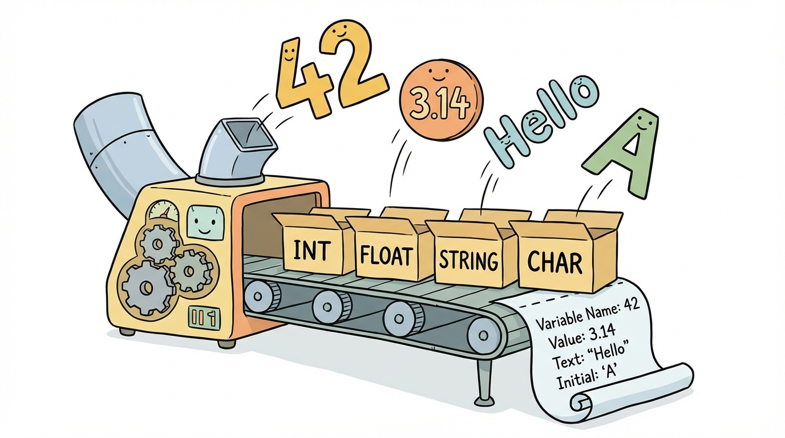

# Module 12: String Class Part 2

> 🏷️ Useful Soon

> 🎯 **Teach:** How to format output using printf, String.format(), and escape sequences for professional-looking console output
> **See:** Format specifiers controlling alignment, precision, and padding in tables, reports, and formatted text
> **Feel:** Equipped to produce clean, aligned, readable output instead of messy string concatenation

> 🎙️ Today you level up from simply printing text to formatting it precisely. The printf method and String.format give you control over column widths, decimal places, and alignment, which is how professional programs produce clean output. You will also learn escape sequences, the special character codes that let you include tabs, newlines, and quotation marks inside strings.

> 🎙️ Think about the difference between scribbling a number on a napkin and presenting it in a polished spreadsheet. That is the difference between println and printf. Formatting is what separates quick debugging output from professional, readable programs.


## Research: String Formatting and Escape Sequences

> 🎯 **Teach:** How printf and String.format() use format specifiers, and how escape sequences embed special characters in strings.
> **See:** A research assignment covering %d, %f, %s, width/precision modifiers, and common escape sequences.
> **Feel:** Ready to explain formatted output before building it in practice.

### Overview

- **Topic:** Working with the String Class — Formatting Output with printf, format(), and Escape Sequences
- **Type:** Written Research Assignment
- **Estimated Time:** 30 minutes
- **Target Length:** Approximately 3/4 page (300-400 words)

### Instructions

Write a short research essay addressing the following:

1. **What is `System.out.printf()` and how does it differ from `println()`?** Explain formatted output in Java — how `printf` uses format specifiers to control how values are displayed. Why would you use `printf` over simple string concatenation?

2. **What are the most common format specifiers?** Describe each of the following and give an example of when you would use it:
   - `%d` — integer
   - `%f` — floating-point
   - `%s` — string
   - `%n` — platform-independent newline
   - `%c` — character
   - `%b` — boolean
   - Width and precision modifiers (e.g., `%10d`, `%.2f`, `%-15s`)

3. **What are escape sequences?** Explain what escape sequences are and describe the most common ones (`\n`, `\t`, `\\`, `\"`, `\'`). Why are they necessary — what problem do they solve?

### Requirements

- Your response should be approximately **3/4 of a page** (300-400 words).
- Write in your own words. Do not copy and paste from your sources.
- Include at least **3 references** to third-party sources (articles, documentation, books, etc.). List them at the end of your essay in a "References" section.
- Use proper grammar and complete sentences.

### Submission

Save your completed essay as `Response_01_String_Formatting_Research.md` in this folder.

### Grading Criteria

| Criteria | Points |
|----------|--------|
| Explains printf and how it differs from println | 25 |
| Accurately describes format specifiers including width/precision | 30 |
| Describes escape sequences and why they are needed | 25 |
| Writing quality and at least 3 properly cited references | 20 |
| **Total** | **100** |

> 🎙️ The research section is setting the stage for the hands-on work. Focus on understanding the difference between printf and println, and make sure you know the main format specifiers -- percent-d for integers, percent-f for decimals, and percent-s for strings. You will use all of these constantly.

> 💡 **Remember this one thing:** printf uses format specifiers like %d, %f, and %s as placeholders that get replaced by values, giving you precise control over how numbers, strings, and other data appear in your output.

## Hands-On: String Formatting and Escape Sequences in Practice

> 🎯 **Teach:** How to produce clean, aligned console output using printf, String.format(), and escape sequences.
> **See:** Formatted tables, format specifier comparisons, escape sequence demos, and a full report card generator.
> **Feel:** Equipped to make any program's output look polished and professional.

> 🎙️ Time to put formatting to work. You will build formatted tables, compare different output approaches, and create a report card generator that combines everything from Day 11 and Day 12.

### Overview

- **Topic:** Working with the String Class — printf, String.format(), and Escape Sequences
- **Type:** Technical / Hands-On
- **Estimated Time:** 1.5 hours

### Background

#### printf Format Specifiers

`System.out.printf()` uses format strings with specifiers that are replaced by values:

```java
String name = "Campbell";
int age = 20;
double gpa = 3.75;
System.out.printf("Name: %s, Age: %d, GPA: %.2f%n", name, age, gpa);
// Output: Name: Campbell, Age: 20, GPA: 3.75
```

| Specifier | Type | Example | Output |
|-----------|------|---------|--------|
| `%d` | Integer | `printf("%d", 42)` | `42` |
| `%f` | Float/Double | `printf("%f", 3.14)` | `3.140000` |
| `%.2f` | Float with precision | `printf("%.2f", 3.14159)` | `3.14` |
| `%s` | String | `printf("%s", "Hi")` | `Hi` |
| `%c` | Character | `printf("%c", 'A')` | `A` |
| `%b` | Boolean | `printf("%b", true)` | `true` |
| `%n` | Newline | `printf("line1%nline2")` | line1\nline2 |
| `%10d` | Right-aligned, width 10 | `printf("%10d", 42)` | `        42` |
| `%-10s` | Left-aligned, width 10 | `printf("%-10s!", "Hi")` | `Hi        !` |
| `%05d` | Zero-padded, width 5 | `printf("%05d", 42)` | `00042` |

#### String.format()

Works exactly like `printf` but **returns a String** instead of printing:

```java
String formatted = String.format("Hello, %s!", name);
```

#### Escape Sequences

| Sequence | Meaning |
|----------|---------|
| `\n` | Newline |
| `\t` | Tab |
| `\\` | Literal backslash |
| `\"` | Literal double quote |
| `\'` | Literal single quote |

> 🎙️ Look at that format specifier table carefully. The width and alignment modifiers are where the real power lives. A plain percent-d just prints a number, but percent-ten-d right-aligns it in a ten-character-wide column. That is how you build clean tables where everything lines up perfectly.



---

### Part 1: Format Specifier Basics

#### Program A: `FormatSpecifiers.java`

Write a program that demonstrates every format specifier from the table above:

1. **Basic specifiers:** Print each type with its specifier:
   ```
   Integer (%d):    42
   Float (%f):      3.141593
   Precise (%.2f):  3.14
   String (%s):     Hello
   Char (%c):       A
   Boolean (%b):    true
   ```

2. **Width and alignment:** Print the same value with different widths:
   ```
   Right-aligned: [        42]
   Left-aligned:  [42        ]
   Zero-padded:   [0000000042]
   ```
   Use `[` and `]` to make the padding visible.

3. **Multiple values in one format string:**
   ```java
   System.out.printf("%-15s %3d %8.2f%n", "Alice", 95, 92.50);
   System.out.printf("%-15s %3d %8.2f%n", "Bob", 87, 88.75);
   System.out.printf("%-15s %3d %8.2f%n", "Campbell", 91, 95.25);
   ```

4. **printf vs. String.format():** Show the same output produced both ways and explain in a comment when you would use each.

> 🎙️ When you run your format specifier program, pay attention to the difference between right-aligned and left-aligned output. The minus sign in front of the width number is what flips the alignment. This small detail makes a big difference when you start building tables.

---

### Part 2: Escape Sequences


#### Program B: `EscapeSequences.java`

Write a program that demonstrates every common escape sequence:

1. **Newline (`\n`):** Print three lines using a single `println` statement:
   ```
   Line 1
   Line 2
   Line 3
   ```

2. **Tab (`\t`):** Print a simple table using tabs:
   ```
   Name		Age	City
   Alice		25	Seattle
   Bob		30	Portland
   Campbell	20	Denver
   ```

3. **Backslash (`\\`):** Print a Windows-style file path:
   ```
   C:\Users\Campbell\Documents\Java
   ```

4. **Double quote (`\"`):** Print a sentence with quoted words:
   ```
   She said "Hello, World!" to the class.
   ```

5. **Single quote (`\'`):** Print:
   ```
   It's a beautiful day.
   ```

6. **Combining escapes:** Print a formatted block that uses multiple escape sequences together:
   ```
   File: "report.txt"
   Path: C:\Users\Documents\
   Status:	Complete
   Notes:	Line 1
   	Line 2
   	Line 3
   ```

> 🎙️ Escape sequences solve a fundamental problem -- how do you put special characters inside a string? You cannot just type a double quote inside a string that is already surrounded by double quotes, because the compiler would think the string ended. The backslash is your escape hatch, and that is exactly why they are called escape sequences.

---

### Part 3: Formatted Tables

#### Program C: `FormattedReport.java`

Write a program that prints a well-formatted product inventory report using `printf`. This is where formatting becomes genuinely useful.

Hardcode data for at least 6 products with:
- Product name (`String`)
- Quantity in stock (`int`)
- Price per unit (`double`)
- Total value (quantity * price, calculated)

Print a formatted table:
```
================================================================
                    INVENTORY REPORT
================================================================
Product              Qty    Price/Unit     Total Value
----------------------------------------------------------------
Laptop               15      $999.99      $14,999.85
Mouse                142       $24.99       $3,548.58
Keyboard              87       $49.99       $4,349.13
Monitor               23      $349.99       $8,049.77
USB Cable            350        $9.99       $3,496.50
Headphones            64       $79.99       $5,119.36
----------------------------------------------------------------
TOTAL                681                   $39,563.19
================================================================
```

Requirements:
- Use `printf` with width specifiers to align columns
- Left-align product names with `%-20s`
- Right-align numbers with `%6d` and `%12.2f`
- Calculate and print the totals at the bottom
- Use `String.format()` for at least one value (e.g., formatting the currency)

> 🎙️ This is where formatting really shines. Try building that inventory table with plain string concatenation and you will see how painful it is to get columns to line up. With printf width specifiers, everything aligns automatically. This is the kind of output that looks professional.

---

### Part 4: printf vs. Concatenation

#### Program D: `FormatComparison.java`

Write a program that shows the same output produced three different ways, so Campbell can see when each approach is best:

**Scenario 1: Simple student record**
```
Name: Campbell Reed | Age: 20 | GPA: 3.75
```
- Version A: String concatenation with `+`
- Version B: `System.out.printf()`
- Version C: `String.format()` stored in a variable, then printed

**Scenario 2: A table row**
```
  42    Campbell         3.75    true
```
- Version A: Concatenation (show how awkward the spacing is)
- Version B: `printf` with width specifiers (show how clean it is)

**Scenario 3: Currency display**
```
$1,234.56
```
- Version A: Manual formatting with concatenation
- Version B: `printf` with `%,.2f`

Add comments explaining which approach is clearest and most maintainable for each scenario.

> 🎙️ This comparison exercise is one of the most valuable on the page. Seeing the same output produced three different ways will make it crystal clear when printf is the right tool and when simple concatenation is fine. Spoiler -- for anything with columns or decimal places, printf wins every time.

---

### Part 5: String Class Capstone


#### Program E: `ReportCardGenerator.java`

Build a complete report card generator that combines String methods from Day 11 with formatting from Day 12. Use `Scanner` for input.

The program should:

1. **Collect student information:**
   - Full name (clean it with `trim()` and proper capitalization)
   - Student ID (validate it's exactly 8 characters using `length()`)
   - 5 course names and their grades (as doubles)

2. **Process the data using String methods:**
   - Capitalize the first letter of each word in the name
   - Ensure the student ID is uppercase
   - Determine letter grades from numeric grades

3. **Print a formatted report card using printf:**

```
╔══════════════════════════════════════════════╗
║              REPORT CARD                     ║
╠══════════════════════════════════════════════╣
║  Student: CAMPBELL REED                      ║
║  ID:      STU12345                           ║
╠══════════════════════════════════════════════╣
║  Course               Grade    Letter        ║
║  ──────────────────────────────────────      ║
║  Mathematics           92.50   A             ║
║  English               88.00   B             ║
║  Computer Science      95.75   A             ║
║  History               78.30   C             ║
║  Physics               84.60   B             ║
║  ──────────────────────────────────────      ║
║  GPA:                  87.83                  ║
║  Status:               PASS                  ║
╠══════════════════════════════════════════════╣
║  Honors:    No                               ║
║  Dean's List: No                             ║
╚══════════════════════════════════════════════╝
```

4. **Use these String methods from Day 11:**
   - `trim()`, `toUpperCase()`, `substring()`, `length()`, `charAt()`
   - Use `contains()` or `equals()` for comparisons

5. **Use these formatting techniques from Day 12:**
   - `printf` with `%-20s`, `%8.2f`, `%-6s` for aligned columns
   - `String.format()` for building at least one computed string
   - `%n` for newlines within format strings

6. **Use the ternary operator** (Day 10) for Honors and Dean's List determination

> 🎙️ The report card generator is your capstone for the entire String class section. It pulls together trim, toUpperCase, substring, charAt, printf, and String.format into one program. If you can build this, you have solid command of everything from Day 11 and Day 12.

---

### Part 6: Reflection Questions

Answer these briefly (1-2 sentences each):

1. When would you choose `printf` over string concatenation? Give a specific example.
2. What is the difference between `\n` and `%n` in a format string? When does the distinction matter?
3. What does `String.format()` return, and why is it sometimes more useful than `printf`?
4. Looking at Days 11 and 12 together — how do String methods and String formatting complement each other in real programs?

---

### Submission

Save all `.java` files in this folder, along with a response file named `Response_02_String_Formatting_in_Practice.md` containing:

1. Your comparison notes from Part 4
2. Your answers to the reflection questions

> 💡 **Remember this one thing:** String.format() works exactly like printf but returns a String instead of printing it, which means you can store formatted text in a variable for later use, logging, or passing to other methods.

> 🎙️ Great work getting through both String class days. You now have a complete toolkit for working with text -- inspecting it, transforming it, chaining methods, and formatting output. Starting tomorrow with the Math and Random classes, you will add computational power on top of this foundation.

## Grading

> 🎯 **Teach:** How your research and hands-on work will be evaluated across formatting and escape sequence tasks.
> **See:** Rubrics for the research essay and the five hands-on programs including the report card capstone.
> **Feel:** Clear on what constitutes complete, high-quality work for this module.

> 🔄 **Where this fits:** Day 12 completes the String class coverage by adding formatting and escape sequences, giving you the tools to produce polished output that you will use in every remaining project in this course.

### Research Grading

| Criteria | Points |
|----------|--------|
| Explains printf and how it differs from println | 25 |
| Accurately describes format specifiers including width/precision | 30 |
| Describes escape sequences and why they are needed | 25 |
| Writing quality and at least 3 properly cited references | 20 |
| **Total** | **100** |

### Hands-On Grading

| Criteria | Points |
|----------|--------|
| `FormatSpecifiers.java`: All specifiers demonstrated with width/alignment | 10 |
| `EscapeSequences.java`: All escape sequences demonstrated correctly | 10 |
| `FormattedReport.java`: Clean aligned table with calculated totals | 20 |
| `FormatComparison.java`: All 3 scenarios shown 3 ways with clear commentary | 15 |
| `ReportCardGenerator.java`: Full capstone using Day 11 + Day 12 skills | 25 |
| Reflection questions answered accurately | 10 |
| All programs compile and run without errors | 10 |
| **Total** | **100** |
