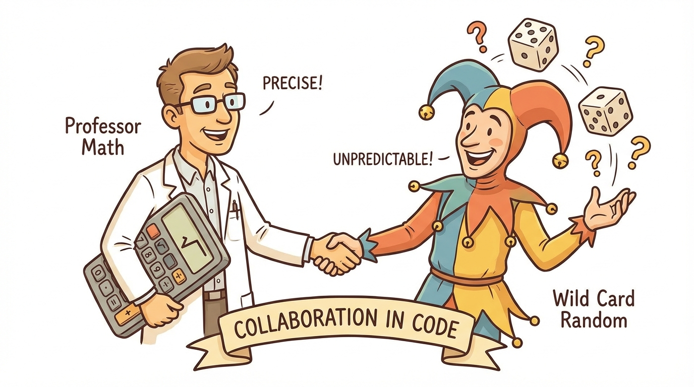
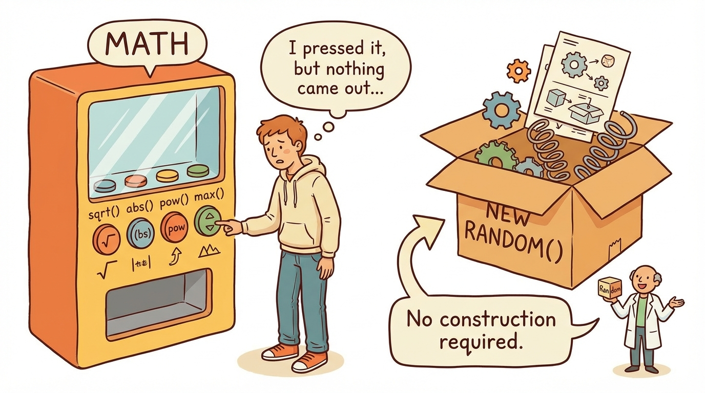
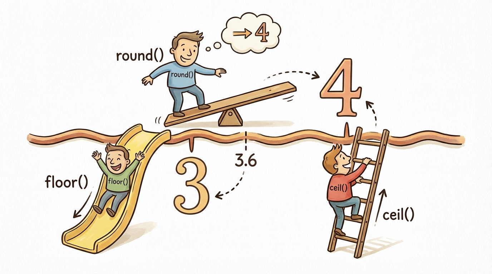
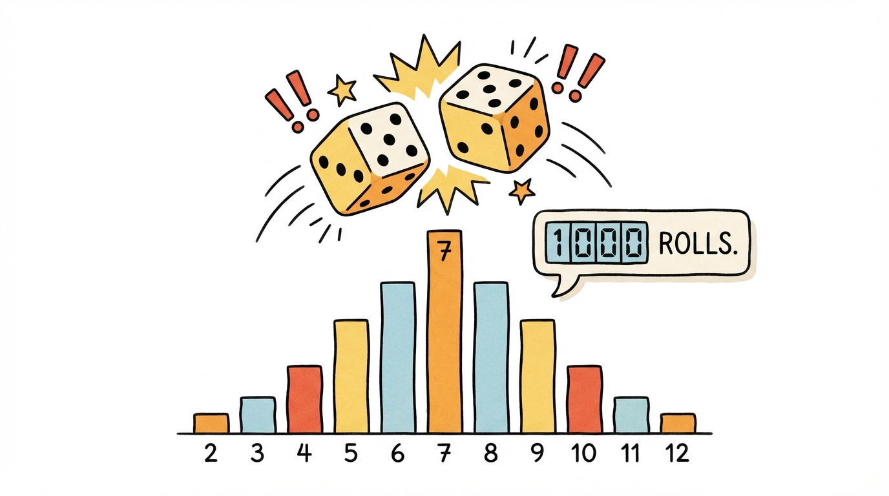

# Module 13: Random and Math Classes

> 🏷️ Useful Soon

> 🎯 **Teach:** How to use the Math class for calculations and the Random class for generating random numbers in Java
> **See:** Math methods like abs, pow, sqrt, round, floor, and ceil alongside Random methods for dice rolls, games, and simulations
> **Feel:** Empowered to add real computation and unpredictability to your programs using Java's built-in math and random tools

> 🎙️ Today you meet two classes that give your programs real computational power. The Math class provides everything from absolute values and square roots to rounding and trigonometry, while the Random class lets you generate unpredictable numbers for games, simulations, and testing. By the end of today, you will have built a dice simulator, a geometry calculator, and a number guessing game.

> 🎙️ Until now your programs have only worked with data you typed in or hardcoded. The Math and Random classes change that -- they let your programs calculate and surprise. After today, your programs will be able to compute square roots, round numbers, and generate values that even you cannot predict.



## Research: The Random and Math Classes

> 🎯 **Teach:** What the Math and Random classes provide, why Math methods are static, and how seeds create reproducible sequences.
> **See:** A research assignment covering Math methods, Random methods, Math.random() vs Random, and seeded generation.
> **Feel:** Grounded in the concepts before applying them in calculators, simulations, and games.

### Overview

- **Topic:** Working with the Random and Math Classes
- **Type:** Written Research Assignment
- **Estimated Time:** 30 minutes
- **Target Length:** Approximately 3/4 page (300-400 words)

### Instructions

Write a short research essay addressing the following:

1. **What is the `Math` class?** Describe what the `Math` class provides, what package it belongs to (and whether you need to import it), and why all of its methods are `static`. What does it mean to call a method on a class rather than on an object? Describe at least 8 commonly used `Math` methods (e.g., `abs()`, `max()`, `min()`, `pow()`, `sqrt()`, `round()`, `floor()`, `ceil()`, `random()`).

2. **What is the `Random` class?** Describe what the `Random` class provides, what package it belongs to (and whether you need to import it), and how it differs from `Math.random()`. Why would you create a `Random` object instead of just using `Math.random()`? What methods does `Random` provide (e.g., `nextInt()`, `nextDouble()`, `nextBoolean()`)?

3. **What is a seed in random number generation?** Explain what it means to seed a random number generator and why using the same seed produces the same sequence of numbers. When is this useful?

### Requirements

- Your response should be approximately **3/4 of a page** (300-400 words).
- Write in your own words. Do not copy and paste from your sources.
- Include at least **3 references** to third-party sources (articles, documentation, books, etc.). List them at the end of your essay in a "References" section.
- Use proper grammar and complete sentences.

### Submission

Save your completed essay as `Response_01_Random_and_Math_Research.md` in this folder.

### Grading Criteria

| Criteria | Points |
|----------|--------|
| Describes the Math class, its static nature, and at least 8 methods | 30 |
| Describes the Random class, its import, and how it differs from Math.random() | 30 |
| Explains seeds and reproducible random sequences | 20 |
| Writing quality and at least 3 properly cited references | 20 |
| **Total** | **100** |

> 🎙️ Here is a key distinction to nail in your research -- the Math class does not need to be imported because it lives in java.lang, but the Random class does need an import because it lives in java.util. The exam will test whether you know which classes require an import statement.



> 💡 **Remember this one thing:** All Math methods are static because the Math class is a utility, not a blueprint for objects. You call Math.sqrt(25) on the class itself, never on an instance.

## Hands-On: Random and Math Classes in Practice

> 🎯 **Teach:** How to use Math methods for calculations and Random for generating numbers in custom ranges.
> **See:** A Math explorer, dice simulator, geometry calculator, and a number guessing game.
> **Feel:** Empowered to add real computation and unpredictability to your programs.

> 🎙️ Now you will put Math and Random to work in real programs. You will explore every Math method, generate random numbers in custom ranges, simulate a thousand dice rolls, and build a number guessing game.

### Overview

- **Topic:** Working with the Random and Math Classes
- **Type:** Technical / Hands-On
- **Estimated Time:** 1.5 hours

### Background

#### The Math Class (java.lang — no import needed)

All methods are `static` — you call them on the class itself, not on an object:

```java
double result = Math.sqrt(25);   // 5.0
int bigger = Math.max(10, 20);   // 20
```

| Method | Returns | Description | Example |
|--------|---------|-------------|---------|
| `Math.abs(x)` | same type | Absolute value | `Math.abs(-7)` → `7` |
| `Math.max(a, b)` | same type | Larger of two values | `Math.max(3, 9)` → `9` |
| `Math.min(a, b)` | same type | Smaller of two values | `Math.min(3, 9)` → `3` |
| `Math.pow(base, exp)` | `double` | Exponentiation | `Math.pow(2, 8)` → `256.0` |
| `Math.sqrt(x)` | `double` | Square root | `Math.sqrt(144)` → `12.0` |
| `Math.round(x)` | `long`/`int` | Round to nearest integer | `Math.round(3.6)` → `4` |
| `Math.floor(x)` | `double` | Round down | `Math.floor(3.9)` → `3.0` |
| `Math.ceil(x)` | `double` | Round up | `Math.ceil(3.1)` → `4.0` |
| `Math.random()` | `double` | Random value [0.0, 1.0) | `Math.random()` → `0.7362...` |
| `Math.PI` | `double` | Constant: 3.14159... | `Math.PI` → `3.141592653...` |
| `Math.E` | `double` | Constant: 2.71828... | `Math.E` → `2.718281828...` |

#### The Random Class (java.util — must import)

```java
import java.util.Random;
Random rand = new Random();
int n = rand.nextInt(10);   // 0 through 9
```

| Method | Returns | Description |
|--------|---------|-------------|
| `nextInt()` | `int` | Any random integer |
| `nextInt(bound)` | `int` | 0 (inclusive) to bound (exclusive) |
| `nextDouble()` | `double` | 0.0 (inclusive) to 1.0 (exclusive) |
| `nextBoolean()` | `boolean` | `true` or `false` randomly |
| `nextLong()` | `long` | Any random long |

#### Generating a random number in a range

```java
// Random int between min and max (inclusive)
int result = rand.nextInt(max - min + 1) + min;

// Example: random number between 5 and 15
int roll = rand.nextInt(11) + 5;
```

> 🎙️ That random range formula is worth memorizing -- nextInt of max minus min plus one, then add min. The plus one is needed because nextInt's bound is exclusive. This pattern comes up all the time in games, simulations, and testing.

---

### Part 1: Math Method Explorer

#### Program A: `MathExplorer.java`

Write a program that demonstrates every `Math` method and constant from the table above:

1. **Absolute value:** Show `Math.abs()` with a positive number, a negative number, and zero. Show it with both `int` and `double`.

2. **Max and Min:** Compare pairs of numbers using `Math.max()` and `Math.min()`. Include a three-way maximum using nested calls:
   ```java
   int biggest = Math.max(Math.max(a, b), c);
   ```

3. **Power and Square Root:**
   - Calculate 2^10 (1024)
   - Calculate the square root of 225 (15)
   - Show that `Math.sqrt(Math.pow(x, 2))` gives back `x`

4. **Rounding — round vs. floor vs. ceil:** For each of these values, show all three results: `3.2`, `3.5`, `3.8`, `-3.2`, `-3.5`, `-3.8`
   ```
   Value    round()  floor()  ceil()
   3.2      3        3.0      4.0
   3.5      4        3.0      4.0
   3.8      4        3.0      4.0
   -3.2     -3       -4.0     -3.0
   -3.5     -3       -4.0     -3.0
   -3.8     -4       -4.0     -3.0
   ```
   Use `printf` to format this as a clean table. Add a comment noting the surprising behavior of `round()` with negative numbers.



5. **Constants:** Use `Math.PI` and `Math.E` in calculations:
   - Area and circumference of a circle with radius 7
   - Volume of a sphere with radius 5: `(4.0/3.0) * Math.PI * Math.pow(r, 3)`

> 🎙️ The rounding table is especially important. Watch how round, floor, and ceil behave differently with negative numbers -- it trips up a lot of people. Math.round of negative 3.5 returns negative 3, not negative 4, which is the opposite of what most students expect.

---

### Part 2: Random Number Generation

#### Program B: `RandomExplorer.java`

Write a program that demonstrates the `Random` class:

1. **Basic generation:** Create a `Random` object and generate and print:
   - 5 random integers (any range)
   - 5 random integers between 0 and 99
   - 5 random doubles between 0.0 and 1.0
   - 5 random booleans

2. **Custom ranges:** Generate random numbers in specific ranges:
   - A random number between 1 and 6 (dice roll)
   - A random number between 1 and 100
   - A random number between -50 and 50
   - A random number between 10 and 20

3. **Math.random() comparison:** Show how to accomplish the same ranges using `Math.random()` instead of the `Random` class:
   ```java
   // Dice roll with Math.random()
   int roll = (int)(Math.random() * 6) + 1;
   ```

4. **Seeds and reproducibility:** Create two `Random` objects with the same seed and show they produce the same sequence:
   ```java
   Random rand1 = new Random(12345);
   Random rand2 = new Random(12345);
   // Print 5 numbers from each — they should match
   ```

> 🎙️ The seeds section in Part 2 is fascinating -- two Random objects with the same seed will produce the exact same sequence of numbers every time. This sounds useless at first, but it is incredibly valuable for testing. You can reproduce the exact same random behavior to debug a problem.

---

### Part 3: Practical Applications



#### Program C: `DiceSimulator.java`

Write a program that simulates rolling two six-sided dice 1,000 times and tracks the results:

1. Roll two dice and sum them for each roll
2. Track how many times each sum (2 through 12) appears using an array of counters
3. After all rolls, print a frequency table:
   ```
   Sum   Count   Percentage   Bar
   2     28      2.8%         ***
   3     54      5.4%         *****
   4     85      8.5%         *********
   5     112     11.2%        ***********
   6     138     13.8%        **************
   7     167     16.7%        *****************
   8     142     14.2%        **************
   9     109     10.9%        ***********
   10    82      8.2%         ********
   11    55      5.5%         ******
   12    28      2.8%         ***
   ```
4. Use `printf` for clean column alignment
5. Print which sum occurred most and least often using `Math.max()` logic
6. Add a comment: does the distribution roughly match what probability theory predicts? (7 should be the most common)

#### Program D: `GeometryCalculator.java`

Write a program that uses the `Math` class to perform geometry calculations. Use `Scanner` for input and `printf` for output.

Implement a menu-driven calculator:
```
=== Geometry Calculator ===
1. Circle (area, circumference)
2. Triangle (area, hypotenuse)
3. Rectangle (area, diagonal)
4. Sphere (volume, surface area)
5. Distance between two points
Choose an option:
```

For each option:
1. **Circle:** Given radius, calculate area (`PI * r^2`) and circumference (`2 * PI * r`)
2. **Triangle:** Given two sides, calculate area (`0.5 * base * height`) and hypotenuse (`sqrt(a^2 + b^2)`)
3. **Rectangle:** Given width and height, calculate area and diagonal (`sqrt(w^2 + h^2)`)
4. **Sphere:** Given radius, calculate volume (`(4/3) * PI * r^3`) and surface area (`4 * PI * r^2`)
5. **Distance:** Given (x1, y1) and (x2, y2), calculate distance (`sqrt((x2-x1)^2 + (y2-y1)^2)`)

Format all output to 2 decimal places using `printf`.

> 🎙️ The dice simulator is your first taste of combining randomness with data analysis. After a thousand rolls, the distribution should roughly follow the probability curve -- seven should appear most often because there are six ways to roll a seven but only one way to roll a two. If your results do not follow this pattern, you probably have a bug in your range formula.

---

### Part 4: Mini-Game

#### Program E: `NumberGuessingGame.java`

Build a number guessing game that combines `Random`, `Math`, `Scanner`, String methods, and `printf`:

1. Generate a random number between 1 and 100
2. Give the player 7 attempts to guess it
3. After each guess, tell them if they are too high, too low, or correct
4. Track the number of guesses used
5. After a correct guess, calculate how far off their first guess was using `Math.abs()`
6. Print a formatted summary:
   ```
   ╔══════════════════════════════════╗
   ║      NUMBER GUESSING GAME       ║
   ╠══════════════════════════════════╣
   ║  The number was: 42             ║
   ║  You guessed it in: 4 attempts  ║
   ║  First guess was off by: 23     ║
   ║  Rating: Good!                  ║
   ╚══════════════════════════════════╝
   ```
7. Assign a rating using the ternary operator:
   - 1 guess: "Incredible!"
   - 2-3 guesses: "Excellent!"
   - 4-5 guesses: "Good!"
   - 6-7 guesses: "Keep practicing!"
   - Ran out of guesses: "Better luck next time!"

8. After the game, ask if they want to play again (use `Scanner` and `String` methods to accept "yes", "YES", "y", etc.)

> 🎙️ The number guessing game is your most interactive program yet. It combines Random for generating the target, Math.abs for measuring how far off a guess was, Scanner for input, and printf for formatted output. This is the kind of program that makes learning to code genuinely fun.

---

### Part 5: Reflection Questions

Answer these briefly (1-2 sentences each):

1. Why are all `Math` methods `static`? What would it mean if they weren't?
2. What is the difference between `Math.round()`, `Math.floor()`, and `Math.ceil()`? When would you use each?
3. Why does `rand.nextInt(6)` give you 0-5 instead of 1-6? How do you shift the range?
4. When would you use a seeded `Random` instead of an unseeded one?

---

### Submission

Save all `.java` files in this folder, along with a response file named `Response_02_Random_and_Math_in_Practice.md` containing:

1. Your observations about the dice distribution from Part 3
2. Your answers to the reflection questions

> 💡 **Remember this one thing:** To generate a random integer in a custom range from min to max inclusive, use rand.nextInt(max - min + 1) + min. The nextInt bound is exclusive, so you add 1 to include the maximum, then add min to shift the range.

> 🎙️ You now have computation and randomness in your toolkit alongside strings and formatting. Tomorrow is a big day -- you start learning decision statements, which let your programs choose different paths based on conditions. That means your programs will finally be able to think, not just calculate.

## Grading

> 🎯 **Teach:** How your research and hands-on work will be evaluated for the Math and Random module.
> **See:** Rubrics for the research essay and the five hands-on programs including the number guessing game.
> **Feel:** Confident you know what complete, quality work looks like before submitting.

> 🔄 **Where this fits:** Day 13 adds computational tools that you will combine with decision statements starting tomorrow, enabling your programs to make calculations and respond to unpredictable input.

### Research Grading

| Criteria | Points |
|----------|--------|
| Describes the Math class, its static nature, and at least 8 methods | 30 |
| Describes the Random class, its import, and how it differs from Math.random() | 30 |
| Explains seeds and reproducible random sequences | 20 |
| Writing quality and at least 3 properly cited references | 20 |
| **Total** | **100** |

### Hands-On Grading

| Criteria | Points |
|----------|--------|
| `MathExplorer.java`: All methods demonstrated, rounding table formatted | 15 |
| `RandomExplorer.java`: All generation types shown, seeds demonstrated | 15 |
| `DiceSimulator.java`: 1000 rolls, frequency table, distribution analysis | 20 |
| `GeometryCalculator.java`: All 5 options working with formatted output | 20 |
| `NumberGuessingGame.java`: Full game with all features working | 15 |
| Reflection questions answered accurately | 5 |
| All programs compile and run without errors | 10 |
| **Total** | **100** |
