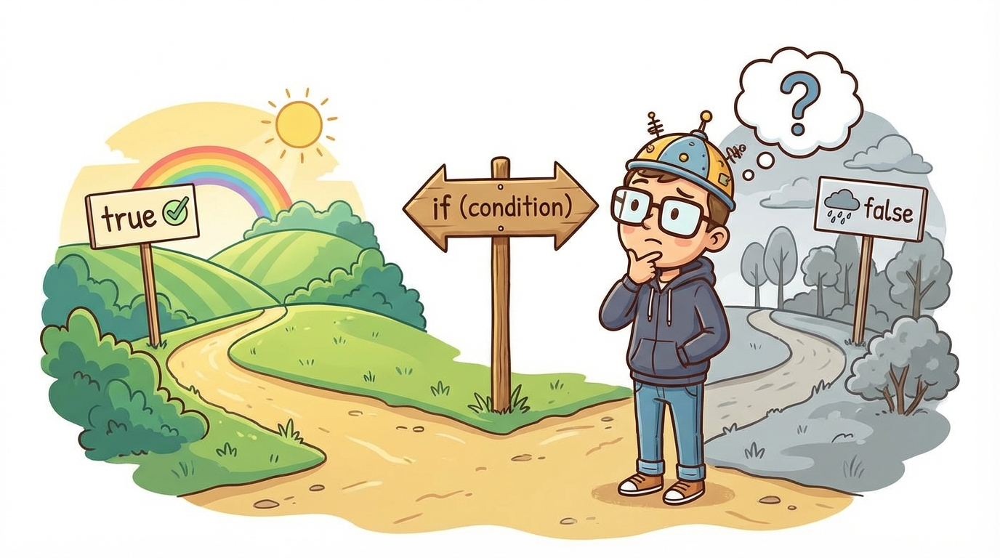
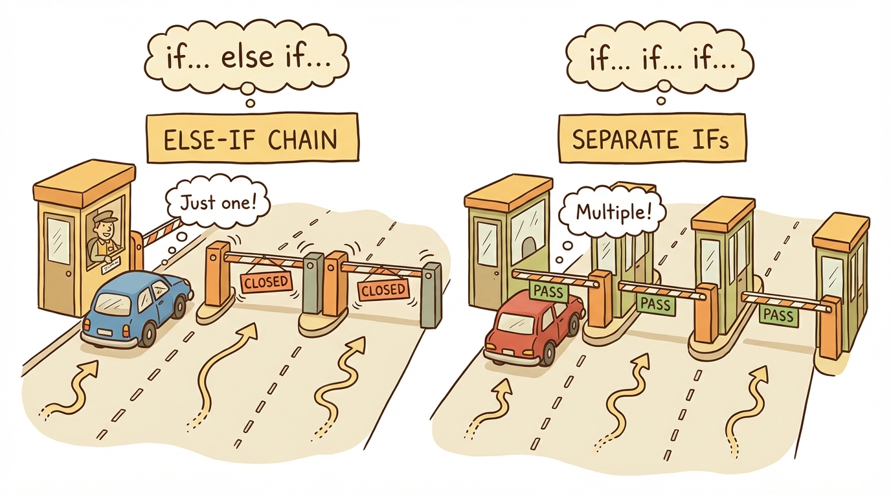
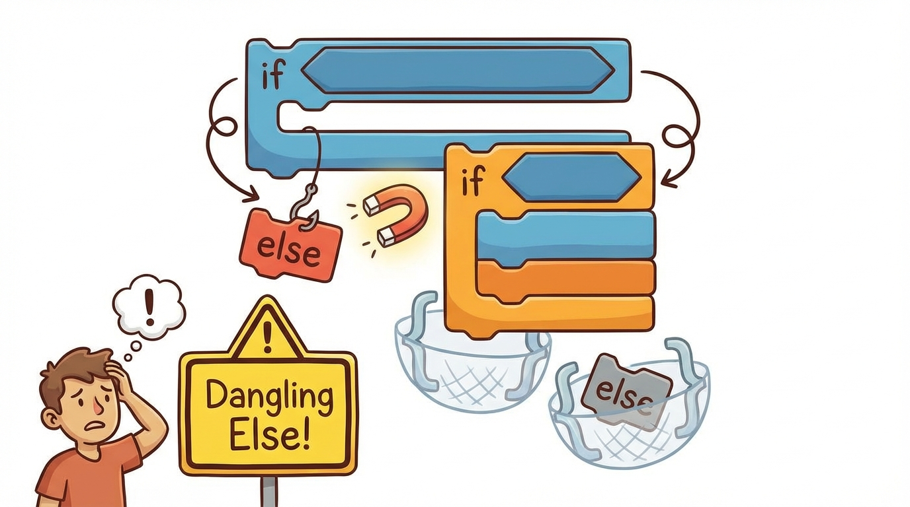
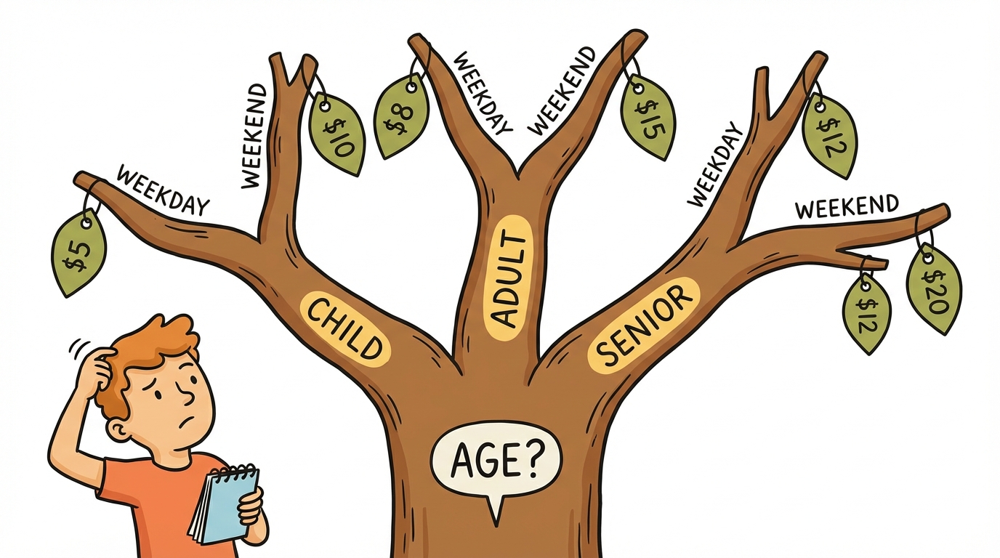

# Module 14: Decision Statements Part 1

> 🏷️ Useful Soon

> 🎯 **Teach:** How to use if-then, if-then-else, else-if chains, and nested if statements to control program flow based on conditions
> **See:** Programs that make decisions about grades, taxes, seasons, and activities based on user input
> **Feel:** Confident that you can make your programs respond intelligently to any condition using the right decision structure

> 🎙️ Today your programs learn to think. Up until now, every line of code ran in order from top to bottom. Decision statements change that by letting your program choose different paths based on conditions. You will learn if-then, if-else, else-if chains, and nested ifs, and you will build programs that make real decisions like calculating taxes and recommending activities.

> 🎙️ This is a turning point in the course. Every program you have written so far has executed every line from top to bottom. After today, your programs will be able to take different paths depending on conditions -- and that is what separates a calculator from a truly intelligent application.



## Research: If-Then and If-Then-Else Statements

> 🎯 **Teach:** How if-then, if-then-else, else-if chains, and nested if statements control which code runs based on conditions.
> **See:** A research assignment exploring boolean evaluation, branching syntax, and when nesting vs. logical operators is appropriate.
> **Feel:** Prepared to explain decision-making structures before building programs that use them.

### Overview

- **Topic:** Using Decision Statements — if-then and if-then-else
- **Type:** Written Research Assignment
- **Estimated Time:** 30 minutes
- **Target Length:** Approximately 3/4 page (300-400 words)

### Instructions

Write a short research essay addressing the following:

1. **What is an if-then statement in Java?** Explain its syntax, how Java evaluates the boolean expression, and what happens when the condition is `true` versus `false`. What is the role of curly braces, and what happens if you omit them (single-statement body)?

2. **What is an if-then-else statement?** Explain how the `else` branch works, and then extend to `else if` chains. How does Java decide which block to execute when there are multiple conditions? Does Java evaluate all conditions or stop at the first match?

3. **What are nested if statements?** Explain what it means to nest one if inside another, and discuss when nesting is appropriate versus when `else if` chains or logical operators (`&&`, `||`) are cleaner alternatives. What are the readability risks of deeply nested ifs?

### Requirements

- Your response should be approximately **3/4 of a page** (300-400 words).
- Write in your own words. Do not copy and paste from your sources.
- Include at least **3 references** to third-party sources (articles, documentation, books, etc.). List them at the end of your essay in a "References" section.
- Use proper grammar and complete sentences.

### Submission

Save your completed essay as `Response_01_If_Then_Else_Research.md` in this folder.

### Grading Criteria

| Criteria | Points |
|----------|--------|
| Clearly explains if-then syntax and boolean evaluation | 30 |
| Accurately describes if-then-else and else-if chains | 30 |
| Explains nested ifs and when to use alternatives | 20 |
| Writing quality and at least 3 properly cited references | 20 |
| **Total** | **100** |

> 🎙️ In your research, focus on understanding the difference between else-if chains and separate if statements. In an else-if chain, only one block runs. With separate if statements, multiple blocks can run. This distinction matters more than most students realize.

> 💡 **Remember this one thing:** In an else-if chain, Java stops at the first condition that evaluates to true and skips all remaining branches, so the order of your conditions matters.

## Hands-On: If-Then and If-Then-Else in Practice

> 🎯 **Teach:** How to apply if-else, else-if chains, and nested ifs to real problems like grading, tax calculation, and activity recommendation.
> **See:** Programs handling grades, the dangling-else trap, ticket pricing, a tax calculator, and a season-based activity recommender.
> **Feel:** Confident that you can make your programs respond intelligently to any condition.

> 🎙️ Time to make your programs make decisions. You will start with basic if-else patterns, explore dangerous pitfalls like the dangling else, build nested decision trees, and create a tax calculator and activity recommender.

### Overview

- **Topic:** Using Decision Statements — if, if-else, else-if chains, and nested ifs
- **Type:** Technical / Hands-On
- **Estimated Time:** 1.5 hours

### Background

#### Basic if-then

```java
if (condition) {
    // runs only when condition is true
}
```

#### if-then-else

```java
if (condition) {
    // runs when true
} else {
    // runs when false
}
```

#### else-if chain

```java
if (condition1) {
    // first match wins
} else if (condition2) {
    // checked only if condition1 was false
} else if (condition3) {
    // checked only if condition1 and condition2 were false
} else {
    // default — none of the above matched
}
```

#### Nested if

```java
if (outerCondition) {
    if (innerCondition) {
        // both conditions are true
    }
}
// Often equivalent to: if (outerCondition && innerCondition)
```

#### Common Pitfall — the "dangling else"

```java
// Without braces, the else belongs to the NEAREST if
if (x > 0)
    if (x > 100)
        System.out.println("Big");
else
    System.out.println("This else belongs to the INNER if, not the outer!");
```

**Rule of thumb:** Always use braces, even for single-statement bodies.

> 🎙️ Do not skip past the dangling else example in the background section. This is one of the sneakiest bugs in Java -- without braces, the else attaches to the nearest if, not the one you intended. The exam tests this, and you will explore it hands-on in Part 2.

---

### Part 1: Basic If-Else

#### Program A: `BasicDecisions.java`

Write a program that demonstrates the fundamental forms of if statements. Use `Scanner` for input.

1. **Simple if:** Ask for a temperature. If it's above 100, print a heat warning.

2. **if-else:** Ask for a number. Print whether it's positive or negative. (Consider: what about zero?)

3. **if-else-if chain:** Ask for a test score (0-100) and assign a letter grade:
   - 90-100: A
   - 80-89: B
   - 70-79: C
   - 60-69: D
   - Below 60: F
   Print the score and letter grade.

4. **Multiple independent ifs:** Ask for a person's age and print ALL that apply (not just the first match):
   - Under 13: "Child"
   - 13-17: "Teenager"
   - 18 or older: "Can vote"
   - 21 or older: "Can rent a car"
   - 65 or older: "Senior citizen"

   Add a comment explaining why these must be separate `if` statements (not else-if) since a 65-year-old should see "Can vote", "Can rent a car", AND "Senior citizen".



> 🎙️ The multiple independent ifs exercise in item four is critical to understand. A sixty-five-year-old should see can vote, can rent a car, and senior citizen -- all three. If you used else-if instead of separate ifs, they would only see the first match. Know when you need separate ifs versus a chain.

---

### Part 2: The Braces Trap



#### Program B: `BracesDemo.java`

Write a program that demonstrates why omitting braces is dangerous:

1. **The dangling else problem:** Write this exact code and predict what it prints for `x = 5`:
   ```java
   int x = 5;
   if (x > 10)
       if (x > 20)
           System.out.println("Greater than 20");
   else
       System.out.println("What does this print?");
   ```
   Add a comment explaining which `if` the `else` actually belongs to, and why the output might surprise you.

2. **The accidental semicolon:** Predict what this prints:
   ```java
   int score = 85;
   if (score > 90);  // Notice the semicolon!
   {
       System.out.println("Excellent!");
   }
   ```
   Add a comment explaining why "Excellent!" prints even though 85 is not greater than 90.

3. **The multi-statement trap:** Predict the output:
   ```java
   int age = 15;
   if (age >= 18)
       System.out.println("You can vote.");
       System.out.println("Welcome to adulthood.");  // Is this inside the if?
   ```
   Add a comment explaining why the second line always prints.

4. **Rewrite all three** with proper braces so they behave as the programmer likely intended.

> 🎙️ These traps are not just academic tricks -- they are real bugs that show up in production code written by experienced programmers. The accidental semicolon after an if statement is especially nasty because the code looks fine at first glance. Always use braces, and you will never fall into any of these traps.

---

### Part 3: Nested Decisions



#### Program C: `NestedDecisions.java`

Write a program that uses nested if statements for multi-level decision making. Use `Scanner` for input.

1. **Login simulator:** Ask for a username and password.
   - First check if the username is "admin"
     - If yes, check if the password is "secret123"
       - If yes: "Login successful! Welcome, administrator."
       - If no: "Incorrect password."
     - Else check if the username is "guest"
       - If yes: "Welcome, guest! Limited access granted."
     - Else: "Unknown user."

2. **Ticket pricing:** Ask for age and whether it's a weekday or weekend.
   - Children (under 12):
     - Weekday: $5
     - Weekend: $8
   - Adults (12-64):
     - Weekday: $10
     - Weekend: $15
   - Seniors (65+):
     - Weekday: $7
     - Weekend: $10
   Print the ticket price using `printf`.

3. **Refactored version:** Rewrite the ticket pricing using `&&` in else-if chains instead of nesting. Add a comment discussing which version is more readable.

> 🎙️ Nested ifs are powerful but they can get messy fast. When you rewrite the ticket pricing using logical AND operators instead of nesting, you will see that flattened code is often easier to read. The rule of thumb is to avoid nesting more than two levels deep whenever you can.

---

### Part 4: Practical Application

#### Program D: `TaxCalculator.java`

Write a simplified US tax bracket calculator using else-if chains. Use `Scanner` to get the filing status and income.

Filing statuses:
- Single
- Married

Tax brackets for Single:
| Income Range | Tax Rate |
|-------------|----------|
| $0 - $10,275 | 10% |
| $10,276 - $41,775 | 12% |
| $41,776 - $89,075 | 22% |
| $89,076 - $170,050 | 24% |
| Over $170,050 | 32% |

Tax brackets for Married:
| Income Range | Tax Rate |
|-------------|----------|
| $0 - $20,550 | 10% |
| $20,551 - $83,550 | 12% |
| $83,551 - $178,150 | 22% |
| $178,151 - $340,100 | 24% |
| Over $340,100 | 32% |

**Note:** This is a simplified version — real taxes use marginal rates. For this exercise, just apply the single rate for the bracket.

The program should:
1. Ask for filing status (validate using `equalsIgnoreCase()`)
2. Ask for annual income
3. Use nested logic: outer if for filing status, inner else-if chain for brackets
4. Calculate the tax amount
5. Print a formatted summary:
   ```
   === Tax Calculation ===
   Filing Status: Single
   Annual Income:  $75,000.00
   Tax Bracket:    22%
   Tax Owed:       $16,500.00
   After Tax:      $58,500.00
   ```

#### Program E: `SeasonAndActivity.java`

Write a program that recommends activities based on multiple conditions. Use `Scanner` for input.

Collect:
- Month (1-12)
- Temperature (as an integer)
- Is it raining? (boolean)

Determine the season from the month:
- 12, 1, 2: Winter
- 3, 4, 5: Spring
- 6, 7, 8: Summer
- 9, 10, 11: Fall

Then use nested decisions to recommend an activity:
- **Winter:**
  - Below 32°F and not raining: "Go skiing!"
  - Below 32°F and raining/sleeting: "Stay inside with hot cocoa."
  - 32°F or above: "Take a winter walk."
- **Spring:**
  - Raining: "Visit a museum."
  - Not raining and above 60°F: "Go for a hike!"
  - Not raining and 60°F or below: "Explore a local coffee shop."
- **Summer:**
  - Above 90°F: "Go swimming!"
  - 70-90°F and not raining: "Have a picnic in the park."
  - Raining: "Catch a movie."
  - Below 70°F: "Perfect weather for a bike ride."
- **Fall:**
  - Not raining and above 50°F: "Go apple picking!"
  - Not raining and 50°F or below: "Visit a pumpkin patch."
  - Raining: "Cozy up with a good book."

Print the season, conditions, and recommendation using `printf`.

> 🎙️ The tax calculator and activity recommender are real-world applications of everything you have learned today. Notice how the tax calculator uses nested logic -- the outer if handles filing status, and the inner else-if chain handles tax brackets. This kind of multi-level decision-making is exactly what if statements were designed for.

---

### Part 5: Reflection Questions

Answer these briefly (1-2 sentences each):

1. What is the difference between an `else if` chain and multiple separate `if` statements? When would you use each?
2. Why is it considered best practice to always use curly braces with if statements, even for single-line bodies?
3. When is nesting if statements better than using `&&` to combine conditions, and vice versa?

---

### Submission

Save all `.java` files in this folder, along with a response file named `Response_02_If_Then_Else_in_Practice.md` containing:

1. Your predictions and explanations for the braces traps in Part 2
2. Your comparison of nested vs. flattened ticket pricing in Part 3
3. Your answers to the reflection questions

> 💡 **Remember this one thing:** Always use curly braces with if statements, even for single-line bodies. Omitting braces leads to the dangling else problem, accidental semicolons, and multi-statement traps that are among the most common bugs in Java.

> 🎙️ You now have the core decision-making tools that every Java program uses. Tomorrow you will learn the switch statement, which gives you a cleaner way to handle situations where you are matching one value against many options. Think menus, day-of-week lookups, and command processors.

## Grading

> 🎯 **Teach:** How your research and hands-on work will be evaluated for the if-then and if-then-else module.
> **See:** Rubrics for the research essay and the five hands-on programs including the tax calculator.
> **Feel:** Clear on grading expectations so you can check your own work before submitting.

> 🔄 **Where this fits:** Day 14 introduces the foundational decision-making structures that every Java program uses, preparing you for switch statements tomorrow and the decision statements capstone on Day 16.

### Research Grading

| Criteria | Points |
|----------|--------|
| Clearly explains if-then syntax and boolean evaluation | 30 |
| Accurately describes if-then-else and else-if chains | 30 |
| Explains nested ifs and when to use alternatives | 20 |
| Writing quality and at least 3 properly cited references | 20 |
| **Total** | **100** |

### Hands-On Grading

| Criteria | Points |
|----------|--------|
| `BasicDecisions.java`: All 4 scenarios working with proper logic | 15 |
| `BracesDemo.java`: All 3 traps identified with rewrites | 15 |
| `NestedDecisions.java`: Login, ticket pricing, and refactored version | 20 |
| `TaxCalculator.java`: Correct brackets, formatted output | 20 |
| `SeasonAndActivity.java`: All seasons and conditions handled | 15 |
| Reflection questions answered accurately | 5 |
| All programs compile and run without errors | 10 |
| **Total** | **100** |
