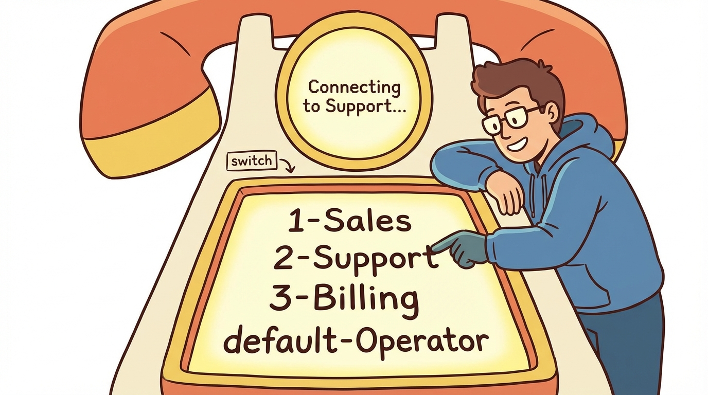
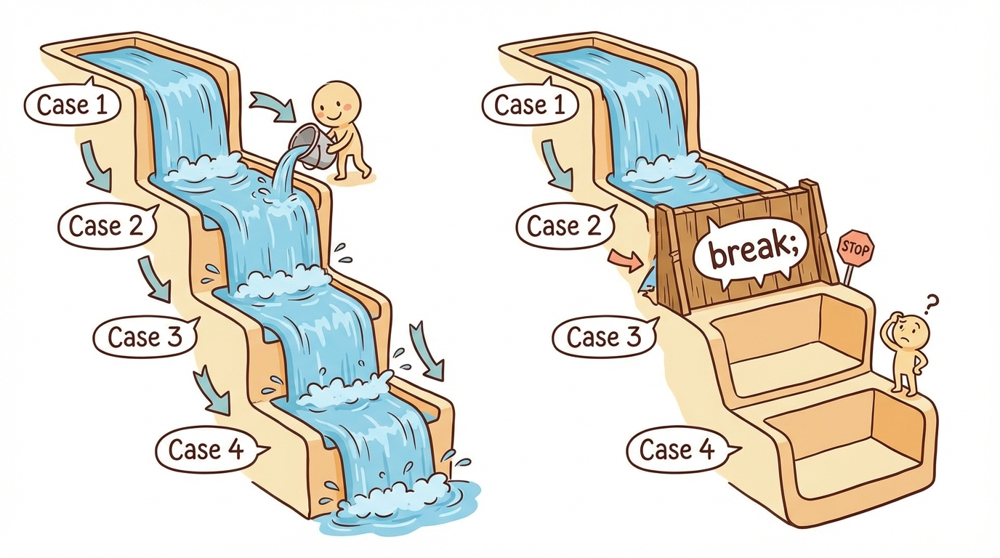
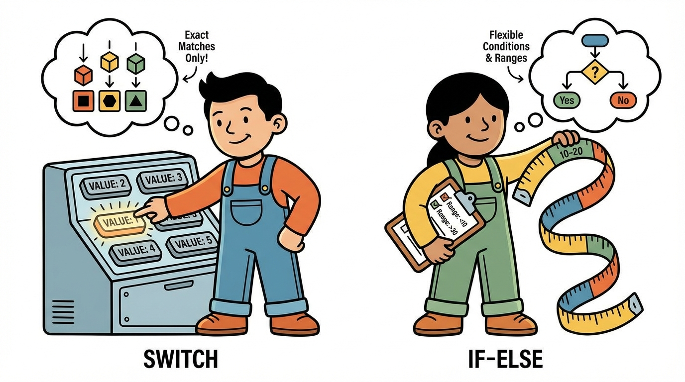
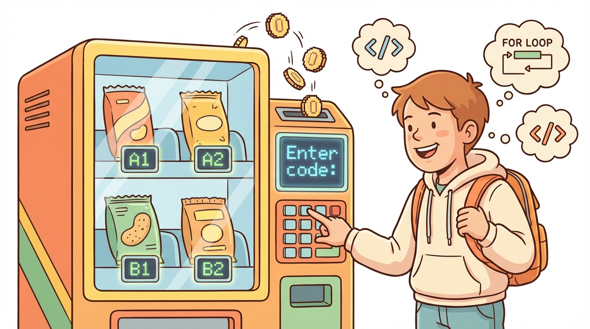

# Module 15: Decision Statements Part 2

> 🏷️ Useful Soon

> 🎯 **Teach:** How to use switch statements with case, break, default, and fall-through behavior for clean multi-way branching
> **See:** Switch statements handling day names, grade feedback, vending machines, and exam-style tricky questions
> **Feel:** Clear on when switch is the right tool and confident you can avoid fall-through bugs on the exam

> 🎙️ Today you learn the switch statement, Java's other major decision structure. While if-else chains work for any condition, switch is purpose-built for matching a single value against a list of options, making it perfect for menus, day-of-week lookups, and command processing. You will also learn about fall-through behavior, one of the most commonly tested topics on the 1Z0-811 exam.

> 🎙️ If-else chains are great for ranges and complex conditions, but when you are matching a single value against a list of exact options, switch is the cleaner tool. Think of it like a phone menu -- press one for sales, press two for support. That is exactly what switch was designed for.



## Research: The Switch Statement

> 🎯 **Teach:** How switch statements work with case, break, default, and fall-through, and when to choose switch over if-else.
> **See:** A research assignment exploring switch syntax, supported types, fall-through behavior, and switch vs. if-else trade-offs.
> **Feel:** Ready to explain switch mechanics and fall-through before encountering them in code.

### Overview

- **Topic:** Using Decision Statements — The switch Statement
- **Type:** Written Research Assignment
- **Estimated Time:** 30 minutes
- **Target Length:** Approximately 3/4 page (300-400 words)

### Instructions

Write a short research essay addressing the following:

1. **What is a switch statement and when should you use it?** Explain the syntax of a switch statement in Java — the `switch`, `case`, `break`, and `default` keywords. When is a switch statement preferred over an if-else-if chain? What types of values can a switch expression evaluate (int, char, String, enum)?

2. **What is fall-through behavior?** Explain what happens when you omit a `break` statement in a case. Why did Java's designers make fall-through the default behavior? When might fall-through be intentional and useful, and when is it a bug?

3. **How does switch compare to if-else-if?** Discuss the trade-offs — when is switch clearer, when is if-else-if necessary (e.g., range comparisons, complex boolean expressions)? Are there conditions that switch cannot handle?

### Requirements

- Your response should be approximately **3/4 of a page** (300-400 words).
- Write in your own words. Do not copy and paste from your sources.
- Include at least **3 references** to third-party sources (articles, documentation, books, etc.). List them at the end of your essay in a "References" section.
- Use proper grammar and complete sentences.

### Submission

Save your completed essay as `Response_01_Switch_Statement_Research.md` in this folder.

### Grading Criteria

| Criteria | Points |
|----------|--------|
| Clearly explains switch syntax including all keywords | 30 |
| Accurately describes fall-through behavior with intentional vs. accidental | 30 |
| Compares switch vs. if-else-if with trade-offs and limitations | 20 |
| Writing quality and at least 3 properly cited references | 20 |
| **Total** | **100** |

> 🎙️ The fall-through behavior is the single most important thing to understand about switch statements. Without a break, Java does not stop at the end of a case -- it keeps running into the next case and the next one after that. This is tested heavily on the exam, so make sure you understand it before moving on.

> 💡 **Remember this one thing:** Without a break statement, execution falls through from one case into the next. This is intentional in Java's design and can be useful for grouping cases, but forgetting break is one of the most common bugs.

## Hands-On: The Switch Statement in Practice

> 🎯 **Teach:** How to build switch statements for int, char, and String, handle fall-through correctly, and compare switch vs. if-else.
> **See:** Switch demos, fall-through experiments, a vending machine simulator, and exam-style tricky switch questions.
> **Feel:** Clear on when switch is the right tool and confident you can avoid fall-through bugs on the exam.

> 🎙️ Now you will build switch statements for every supported type, explore fall-through both as a bug and a feature, compare switch against if-else side by side, and build a vending machine simulator.

### Overview

- **Topic:** Using Decision Statements — switch, case, break, default, and fall-through
- **Type:** Technical / Hands-On
- **Estimated Time:** 1.5 hours

### Background

#### Basic switch syntax

```java
switch (expression) {
    case value1:
        // code for value1
        break;
    case value2:
        // code for value2
        break;
    default:
        // code if no case matches
        break;
}
```

#### Supported types for switch expression
- `int`, `byte`, `short`, `char`
- `String` (since Java 7)
- `enum` types
- **NOT** supported: `long`, `float`, `double`, `boolean`

> 🎙️ Memorize that list of unsupported types -- long, float, double, and boolean cannot be used in a switch. The exam will show you code with a double in a switch statement and ask whether it compiles. The answer is no, and now you know why.

#### Fall-through

```java
switch (day) {
    case 1:
    case 2:
    case 3:
    case 4:
    case 5:
        System.out.println("Weekday");
        break;  // Without this break, execution falls into case 6
    case 6:
    case 7:
        System.out.println("Weekend");
        break;
}
```

---

### Part 1: Switch Basics

#### Program A: `SwitchBasics.java`

Write a program that demonstrates the basic forms of switch statements:

1. **Switch on int — Day of the week:** Use `Scanner` to read a number 1-7 and print the day name:
   ```
   Enter day number (1-7): 3
   Wednesday
   ```
   Include a `default` case for invalid numbers.

2. **Switch on char — Grade feedback:** Read a character (A-F) and print feedback:
   - A: "Excellent work!"
   - B: "Good job!"
   - C: "Satisfactory."
   - D: "Needs improvement."
   - F: "Please see the instructor."
   - default: "Invalid grade."

3. **Switch on String — Month to season:** Read a month name and print the season:
   - "December", "January", "February" → "Winter"
   - "March", "April", "May" → "Spring"
   - "June", "July", "August" → "Summer"
   - "September", "October", "November" → "Fall"

   Use `.toLowerCase()` on the input so that "MARCH", "March", and "march" all work. Use fall-through to group months that share a season.

> 🎙️ Notice that the month-to-season example uses fall-through intentionally -- December, January, and February all fall through to the same code that prints Winter. This is the clean use of fall-through, where you group multiple cases that share the same behavior.

---

### Part 2: Fall-Through Behavior



#### Program B: `FallThroughDemo.java`

Write a program that demonstrates fall-through — both accidental and intentional:

1. **Accidental fall-through (the bug):** Write a switch that is MISSING break statements. Predict the output before running:
   ```java
   int choice = 2;
   switch (choice) {
       case 1:
           System.out.println("One");
       case 2:
           System.out.println("Two");
       case 3:
           System.out.println("Three");
       case 4:
           System.out.println("Four");
       default:
           System.out.println("Default");
   }
   ```
   Add a comment explaining why multiple lines printed.

2. **Fixed version:** Add break statements and show the corrected output.

3. **Intentional fall-through — grouping cases:** Write a switch that tells you how many days are in a month:
   ```java
   switch (month) {
       case 4: case 6: case 9: case 11:
           days = 30;
           break;
       case 2:
           days = 28; // simplified, ignoring leap years
           break;
       default:
           days = 31;
           break;
   }
   ```
   Read the month number from input and print the number of days. Add a comment explaining why fall-through is useful here.

4. **Intentional fall-through — cumulative behavior:** Write a switch that prints preparation steps. Entry at any step includes all steps below it:
   ```java
   int startStep = 2; // Start from step 2
   switch (startStep) {
       case 1:
           System.out.println("Step 1: Preheat oven");
       case 2:
           System.out.println("Step 2: Mix ingredients");
       case 3:
           System.out.println("Step 3: Pour into pan");
       case 4:
           System.out.println("Step 4: Bake for 30 minutes");
       case 5:
           System.out.println("Step 5: Let cool and serve");
   }
   ```
   Run it with `startStep = 1`, then `startStep = 3`. Add a comment explaining why no breaks are needed here.

> 🎙️ The cumulative fall-through example with cooking steps is brilliant for building intuition. When you start at step two, you get steps two through five because there are no breaks. When you start at step one, you get all five. This is the one scenario where missing breaks is actually the right design.

---

### Part 3: Switch vs. If-Else-If



#### Program C: `SwitchVsIfElse.java`

Write a program that solves the same problems using both switch and if-else-if, so Campbell can see when each is better:

1. **Calculator — good for switch:** Read two numbers and an operator (`+`, `-`, `*`, `/`). Implement once with switch, once with if-else-if:
   ```
   Enter first number: 10
   Enter operator (+, -, *, /): *
   Enter second number: 5
   Result: 10 * 5 = 50
   ```
   Add a comment: which version is cleaner for this problem?

2. **Range classification — bad for switch:** Classify a score into a grade (0-59: F, 60-69: D, 70-79: C, 80-89: B, 90-100: A). Implement with if-else-if. Add a comment explaining why switch can't easily handle ranges.

3. **Menu selection — good for switch:** Display a menu with 5 options and execute the chosen one. Add a comment explaining why switch is natural for menus.

4. **Complex conditions — bad for switch:** Determine if a person can board a flight (has ticket AND valid ID AND arrives 30+ minutes early). Add a comment explaining why switch can't handle compound boolean logic.

> 🎙️ This comparison exercise is essential. Switch is great for exact value matching like calculators and menus, but it cannot handle ranges or complex boolean conditions. If someone asks whether a score is between 80 and 89, you need if-else. Knowing which tool fits which problem is a skill the exam expects you to have.

---

### Part 4: Practical Application



#### Program D: `VendingMachine.java`

Build a vending machine simulator using switch statements, Scanner, and printf:

1. Display a product menu:
   ```
   ╔═══════════════════════════════════╗
   ║       VENDING MACHINE            ║
   ╠═══════════════════════════════════╣
   ║  A1 - Cola           $1.50      ║
   ║  A2 - Diet Cola      $1.50      ║
   ║  A3 - Lemon-Lime     $1.50      ║
   ║  B1 - Water          $1.00      ║
   ║  B2 - Orange Juice   $2.00      ║
   ║  B3 - Iced Tea       $1.75      ║
   ║  C1 - Chips          $1.25      ║
   ║  C2 - Candy Bar      $1.50      ║
   ║  C3 - Trail Mix      $2.25      ║
   ╚═══════════════════════════════════╝
   ```

2. Ask the user to enter a product code (use `String` switch).

3. Use a switch to look up the product name and price. Use `default` for invalid codes.

4. Ask the user how much money they are inserting.

5. Use if-else to determine:
   - If the money is enough: print the product, the change, and "Enjoy!"
   - If the money is not enough: print how much more is needed

6. Format all currency with `printf` to 2 decimal places.

7. Handle the input case-insensitively (`toUpperCase()`) so "a1", "A1", and "a1" all work.

> 🎙️ The vending machine is a perfect switch use case -- the user enters a product code, and you match it to a product. Handle the input case-insensitively with toUpperCase so that a1, A1, and a1 all work. This is the kind of practical input handling you will use in every real program.

---

### Part 5: Exam-Style Tricky Questions

#### Program E: `SwitchExamPrep.java`

These patterns appear frequently on the 1Z0-811 exam. For each one, **predict the output** as a comment before running:

1. **What prints?**
   ```java
   String color = "RED";
   switch (color) {
       case "red":
           System.out.println("Lowercase red");
           break;
       case "RED":
           System.out.println("Uppercase RED");
           break;
       case "Red":
           System.out.println("Mixed case Red");
           break;
   }
   ```
   Add a comment: is String switch case-sensitive?

2. **What prints?**
   ```java
   int x = 3;
   switch (x) {
       case 1:
           System.out.println("A");
       case 2:
           System.out.println("B");
       case 3:
           System.out.println("C");
       case 4:
           System.out.println("D");
           break;
       case 5:
           System.out.println("E");
   }
   ```

3. **What prints?**
   ```java
   int num = 10;
   switch (num) {
       default:
           System.out.println("Default");
       case 1:
           System.out.println("One");
           break;
       case 2:
           System.out.println("Two");
   }
   ```
   Add a comment: can `default` appear anywhere in the switch? Does it affect fall-through?

4. **Does this compile?**
   ```java
   int value = 5;
   final int CONSTANT = 5;
   int variable = 5;
   switch (value) {
       case CONSTANT:
           System.out.println("Constant match");
           break;
       case variable:  // Does this compile?
           System.out.println("Variable match");
           break;
   }
   ```
   Add a comment explaining why case labels must be compile-time constants.

5. **Write your own** tricky switch question with at least one fall-through, a default in an unusual position, and a String comparison. Include the predicted output and actual output.

> 🎙️ These exam-style questions are exactly what you will see on the 1Z0-811. Predict the output before you run each one -- that mental tracing skill is what the exam is really testing. Pay special attention to question three, where default appears at the top of the switch. Yes, default can go anywhere, and yes, fall-through still applies.

---

### Part 6: Reflection Questions

Answer these briefly (1-2 sentences each):

1. When is a switch statement a better choice than if-else-if? Give a specific example.
2. Why must case labels be compile-time constants (literals or `final` variables)?
3. Is String comparison in a switch case-sensitive? How should you handle user input to account for this?

---

### Submission

Save all `.java` files in this folder, along with a response file named `Response_02_Switch_Statement_in_Practice.md` containing:

1. Your predictions vs. actual results for Part 2 (fall-through) and Part 5 (exam prep)
2. Your comparisons from Part 3
3. Your answers to the reflection questions

> 💡 **Remember this one thing:** Switch case labels must be compile-time constants, which means literals or final variables. You cannot use a regular variable as a case label because the compiler needs to know all case values at compile time.

> 🎙️ You now have both major branching tools in Java -- if-else for flexible conditions and switch for clean value matching. Tomorrow you will complete the decision statements section by learning the difference between double-equals and the equals method, which is one of the most commonly tested topics on the entire exam.

## Grading

> 🎯 **Teach:** How your research and hands-on work will be evaluated for the switch statement module.
> **See:** Rubrics for the research essay and the five hands-on programs including the vending machine and exam prep.
> **Feel:** Assured you understand the grading criteria before turning in your work.

> 🔄 **Where this fits:** Day 15 adds the switch statement to your decision-making toolkit, completing the set of branching structures you need for the 1Z0-811 exam and preparing you for the decision statements capstone on Day 16.

### Research Grading

| Criteria | Points |
|----------|--------|
| Clearly explains switch syntax including all keywords | 30 |
| Accurately describes fall-through behavior with intentional vs. accidental | 30 |
| Compares switch vs. if-else-if with trade-offs and limitations | 20 |
| Writing quality and at least 3 properly cited references | 20 |
| **Total** | **100** |

### Hands-On Grading

| Criteria | Points |
|----------|--------|
| `SwitchBasics.java`: All 3 switch types (int, char, String) working | 15 |
| `FallThroughDemo.java`: All 4 fall-through scenarios with explanations | 15 |
| `SwitchVsIfElse.java`: All 4 comparisons with accurate commentary | 15 |
| `VendingMachine.java`: Full simulator with switch, validation, and formatting | 20 |
| `SwitchExamPrep.java`: All 5 questions with correct predictions and explanations | 20 |
| Reflection questions answered accurately | 5 |
| All programs compile and run without errors | 10 |
| **Total** | **100** |
