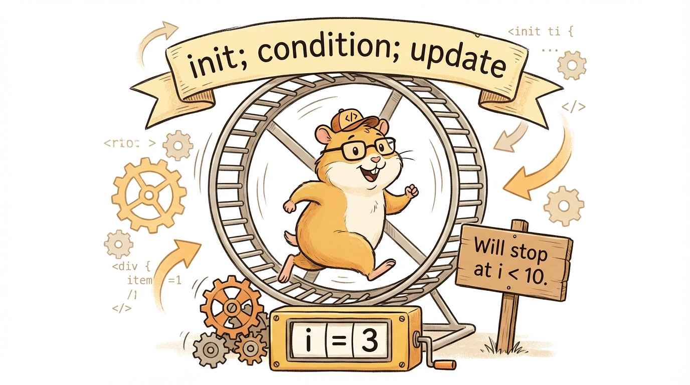

# Module 17: Looping Statements Part 1

> 🏷️ When You're Ready

> 🎯 **Teach:** How to use standard for loops and enhanced for-each loops to repeat code a known number of times or iterate over collections
> **See:** Counting patterns, loop tracing, array iteration, text patterns, and practical algorithms like factorial, Fibonacci, and FizzBuzz
> **Feel:** Comfortable controlling repetition precisely and ready to tackle any loop-based problem on the exam

> 🎙️ Today you unlock one of programming's most powerful ideas, the loop. Loops let you repeat a block of code as many times as you need, whether that is ten times, a million times, or once for every element in an array. You will learn both the standard for loop with its three-part header and the enhanced for-each loop for cleaner array iteration, and you will use them to build everything from multiplication tables to prime number checkers.

> 🎙️ Without loops, if you wanted to print numbers one through a thousand, you would need a thousand println statements. With a for loop, you need three lines. That is the power of iteration -- it lets you write a small amount of code that does a massive amount of work.



## Research: The for Loop

> 🎯 **Teach:** How standard for loops and enhanced for-each loops work, including the three-part header and for-each limitations.
> **See:** A research assignment on iteration concepts, for loop execution order, and when to use for-each vs. standard for.
> **Feel:** Prepared to explain loop mechanics before writing your own loops in practice.

### Overview

- **Topic:** Using Looping Statements — The for Loop and Enhanced for Loop
- **Type:** Written Research Assignment
- **Estimated Time:** 30 minutes
- **Target Length:** Approximately 3/4 page (300-400 words)

### Instructions

Write a short research essay addressing the following:

1. **What is a loop and why do we need them?** Explain the concept of iteration — repeating a block of code multiple times. What kinds of problems are loops designed to solve? What would code look like without loops?

2. **What is a for loop in Java?** Describe the three parts of a for loop header — initialization, condition, and update — and explain the order in which they execute. Walk through a simple example step by step showing when each part runs.

3. **What is an enhanced for loop (for-each)?** Explain how the enhanced for loop differs from the standard for loop in syntax and purpose. When is it the right choice, and what are its limitations (e.g., no access to the index, cannot modify the collection)?

### Requirements

- Your response should be approximately **3/4 of a page** (300-400 words).
- Write in your own words. Do not copy and paste from your sources.
- Include at least **3 references** to third-party sources (articles, documentation, books, etc.). List them at the end of your essay in a "References" section.
- Use proper grammar and complete sentences.

### Submission

Save your completed essay as `Response_01_For_Loop_Research.md` in this folder.

### Grading Criteria

| Criteria | Points |
|----------|--------|
| Explains what loops are and why they are needed | 20 |
| Accurately describes for loop syntax with the three header parts | 35 |
| Explains the enhanced for loop, its use cases, and its limitations | 25 |
| Writing quality and at least 3 properly cited references | 20 |
| **Total** | **100** |

> 🎙️ In your research, really focus on the execution order of the three parts of a for loop header. The initialization runs once, the condition is checked before each iteration including the first one, and the update runs after each iteration. Getting this order wrong leads to off-by-one errors, which are the most common loop bugs.

> 💡 **Remember this one thing:** A for loop's three parts execute in a specific order: initialization runs once, then the condition is checked before each iteration, the body executes, and the update runs after the body. The condition is checked before the first iteration, so a for loop can run zero times.

## Hands-On: The for Loop in Practice

> 🎯 **Teach:** How to write standard for loops and enhanced for-each loops for counting, tracing, array iteration, patterns, and algorithms.
> **See:** Counting loops, exam-style tracing exercises, pattern generators, and classic algorithms like FizzBuzz and Fibonacci.
> **Feel:** Comfortable controlling repetition precisely and ready to tackle any loop-based problem.

> 🎙️ Now you will put for loops to work. You will start with basic counting patterns, trace through tricky exam-style loops, use the enhanced for-each loop on arrays, build visual patterns with nested loops, and implement classic algorithms like FizzBuzz and Fibonacci.

### Overview

- **Topic:** Using Looping Statements — Standard for Loop and Enhanced for Loop
- **Type:** Technical / Hands-On
- **Estimated Time:** 1.5 hours

### Background

#### Standard for loop

```java
for (initialization; condition; update) {
    // body — runs each iteration
}
```

Execution order:
1. **Initialization** runs once at the start
2. **Condition** is checked BEFORE each iteration — if false, loop ends
3. **Body** executes
4. **Update** runs AFTER the body
5. Go back to step 2

```java
for (int i = 0; i < 5; i++) {
    System.out.println(i);  // Prints 0, 1, 2, 3, 4
}
```

#### Enhanced for loop (for-each)

```java
String[] names = {"Alice", "Bob", "Charlie"};
for (String name : names) {
    System.out.println(name);  // Prints each name
}
```

Read as: "for each `name` in `names`." No index variable, no bounds checking — Java handles it.

> 🎙️ Notice how much cleaner the enhanced for loop is compared to the standard version. You do not need an index variable, you do not need to worry about the array length, and you cannot accidentally go out of bounds. Use it whenever you just need to look at every element and do not need to know the index.

---

### Part 1: for Loop Fundamentals

#### Program A: `ForLoopBasics.java`

Write a program that demonstrates the basic forms of for loops:

1. **Count up:** Print numbers 1 through 10
2. **Count down:** Print numbers 10 through 1
3. **Count by twos:** Print even numbers from 2 through 20
4. **Count by fives:** Print multiples of 5 from 5 through 100
5. **Negative range:** Print numbers from -5 to 5
6. **Character loop:** Print all uppercase letters A through Z using a `char` loop variable:
   ```java
   for (char c = 'A'; c <= 'Z'; c++) {
       System.out.print(c + " ");
   }
   ```

For each loop, print a label before the output so it's clear which is which.

> 🎙️ Start simple with these counting loops. The character loop is especially interesting -- you can use a char as your loop variable and increment it just like a number. Java treats characters as numbers under the hood, so A plus one gives you B.

---

### Part 2: Loop Execution Tracing

#### Program B: `ForLoopTracing.java`

Understanding exactly when each part of the for loop executes is critical for the exam. Predict the output FIRST, then run.

1. **Off-by-one exploration:**
   ```java
   // How many times does each loop run?
   for (int i = 0; i < 5; i++)    // a) starts at 0, less than 5
   for (int i = 0; i <= 5; i++)   // b) starts at 0, less than or equal to 5
   for (int i = 1; i < 5; i++)    // c) starts at 1, less than 5
   for (int i = 1; i <= 5; i++)   // d) starts at 1, less than or equal to 5
   ```
   For each, print the iteration count and add a comment with your prediction.

2. **Unusual for loops (exam favorites):**
   ```java
   // Empty body — what does this do?
   int sum = 0;
   for (int i = 1; i <= 10; sum += i, i++) ;
   System.out.println("Sum: " + sum);
   ```

   ```java
   // Multiple variables
   for (int i = 0, j = 10; i < j; i++, j--) {
       System.out.println("i=" + i + " j=" + j);
   }
   ```

   ```java
   // All parts optional — infinite loop (runs 3 times then breaks)
   int count = 0;
   for (;;) {
       if (count >= 3) break;
       System.out.println("Iteration " + count);
       count++;
   }
   ```

3. **Variable scope:** What happens if you try to use the loop variable after the loop?
   ```java
   for (int i = 0; i < 5; i++) {
       System.out.println(i);
   }
   // System.out.println(i);  // Does this compile?
   ```
   Comment out the error line and explain why.

For each tricky example, write your prediction as a comment BEFORE the code, then verify.

> 🎙️ This tracing section is critical for exam preparation. Write your predictions down before running the code -- that mental execution skill is exactly what the exam tests. Pay special attention to the scope rule: the loop variable only exists inside the loop, so trying to use i after the loop ends will not compile.

---

### Part 3: Enhanced for Loop

#### Program C: `EnhancedForLoop.java`

Write a program that demonstrates the enhanced for loop:

1. **Iterate over an int array:**
   ```java
   int[] scores = {88, 92, 76, 95, 83, 91, 87};
   ```
   - Print each score
   - Calculate and print the sum and average

2. **Iterate over a String array:**
   ```java
   String[] languages = {"Java", "Python", "TypeScript", "Flutter", "C++"};
   ```
   - Print each language
   - Print each language with its length: `"Java (4 characters)"`
   - Find and print the longest language name

3. **Iterate over characters in a String** using `toCharArray()`:
   ```java
   String message = "Hello, World!";
   for (char c : message.toCharArray()) {
       // process each character
   }
   ```
   - Count the number of vowels in the string
   - Count the number of uppercase and lowercase letters

4. **Limitation demonstration:** Show that you CANNOT modify array elements with an enhanced for loop:
   ```java
   int[] numbers = {1, 2, 3, 4, 5};
   for (int n : numbers) {
       n = n * 2;  // Does this change the array?
   }
   // Print the array — it's unchanged!
   ```
   Then show how to do it with a standard for loop. Add a comment explaining why.

> 🎙️ The limitation demonstration in item four is one of the most important things to understand about the enhanced for loop. It copies each value into the loop variable, so changing the loop variable does not change the array. This is a common exam trick -- they will show you code that tries to modify an array with a for-each loop and ask if it works. It does not.

---

### Part 4: Loop Patterns

#### Program D: `LoopPatterns.java`

Write a program that uses for loops to generate text-based patterns. These exercises build strong loop-control skills.

1. **Right triangle:**
   ```
   *
   **
   ***
   ****
   *****
   ```

2. **Inverted triangle:**
   ```
   *****
   ****
   ***
   **
   *
   ```

3. **Number triangle:**
   ```
   1
   12
   123
   1234
   12345
   ```

4. **Multiplication table (nested loops):** Print a 10x10 multiplication table:
   ```
        1    2    3    4    5    6    7    8    9   10
    ─────────────────────────────────────────────────
   1|   1    2    3    4    5    6    7    8    9   10
   2|   2    4    6    8   10   12   14   16   18   20
   3|   3    6    9   12   15   18   21   24   27   30
   ...
   ```
   Use `printf` with width specifiers for alignment.

5. **Diamond (challenge):**
   ```
       *
      ***
     *****
    *******
   *********
    *******
     *****
      ***
       *
   ```
   Use a variable for the size so the diamond can be made larger or smaller.

> 🎙️ The pattern exercises are where for loops become genuinely fun. The diamond challenge is hard -- it requires you to think about spaces, stars, and how the counts change for each row. If you get stuck, start with just the top half and get that working before attempting the bottom half.

---

### Part 5: Practical Application

#### Program E: `ForLoopApplications.java`

Write a program with several practical uses of for loops:

1. **Factorial calculator:** Calculate `n!` for a user-provided number. Example: `5! = 120`

2. **Fibonacci sequence:** Print the first 20 Fibonacci numbers:
   ```
   0, 1, 1, 2, 3, 5, 8, 13, 21, 34, 55, ...
   ```

3. **Prime number checker:** Ask for a number and determine if it's prime by checking divisibility from 2 to the square root of the number using `Math.sqrt()`.

4. **FizzBuzz:** Print numbers 1 to 50. For multiples of 3 print "Fizz", for multiples of 5 print "Buzz", for multiples of both print "FizzBuzz":
   ```
   1, 2, Fizz, 4, Buzz, Fizz, 7, 8, Fizz, Buzz, 11, Fizz, 13, 14, FizzBuzz, ...
   ```

5. **Simple bar chart:** Given an array of values, print a horizontal bar chart:
   ```java
   int[] data = {3, 7, 2, 9, 5};
   String[] labels = {"Mon", "Tue", "Wed", "Thu", "Fri"};
   ```
   Output:
   ```
   Mon | ***
   Tue | *******
   Wed | **
   Thu | *********
   Fri | *****
   ```

---

### Part 6: Reflection Questions

Answer these briefly (1-2 sentences each):

1. What are the three parts of a for loop header, and in what order do they execute?
2. When would you choose an enhanced for loop over a standard for loop? When can you NOT use the enhanced version?
3. What is an "off-by-one" error, and how do you avoid it?

---

### Submission

Save all `.java` files in this folder, along with a response file named `Response_02_For_Loop_in_Practice.md` containing:

1. Your predictions vs. actual results from Part 2
2. Your answers to the reflection questions

> 💡 **Remember this one thing:** The enhanced for loop cannot modify array elements because it copies each value into the loop variable. Assigning to the loop variable changes the copy, not the original array element. Use a standard for loop with an index when you need to modify the array.

> 🎙️ You covered a huge amount of ground today -- standard for loops, enhanced for-each loops, tracing, patterns, and classic algorithms. Tomorrow you will learn while and do-while loops, which are better suited for situations where you do not know in advance how many times you need to repeat. Together, the three loop types give you complete control over repetition.

## Grading

> 🎯 **Teach:** How your research and hands-on work will be evaluated for the for loop module.
> **See:** Rubrics for the research essay and the five hands-on programs including loop patterns and applications.
> **Feel:** Clear on what a complete submission looks like so you can self-assess before turning in your work.

> 🔄 **Where this fits:** Day 17 introduces the for loop, the first of three looping structures tested on the 1Z0-811 exam, and builds the repetition skills you will extend with while and do-while loops over the next two days.

### Research Grading

| Criteria | Points |
|----------|--------|
| Explains what loops are and why they are needed | 20 |
| Accurately describes for loop syntax with the three header parts | 35 |
| Explains the enhanced for loop, its use cases, and its limitations | 25 |
| Writing quality and at least 3 properly cited references | 20 |
| **Total** | **100** |

### Hands-On Grading

| Criteria | Points |
|----------|--------|
| `ForLoopBasics.java`: All 6 counting patterns correct | 10 |
| `ForLoopTracing.java`: All tricky loops with predictions and explanations | 15 |
| `EnhancedForLoop.java`: All 4 demonstrations including limitation | 15 |
| `LoopPatterns.java`: All 5 patterns rendered correctly | 20 |
| `ForLoopApplications.java`: All 5 practical applications working | 25 |
| Reflection questions answered accurately | 5 |
| All programs compile and run without errors | 10 |
| **Total** | **100** |
