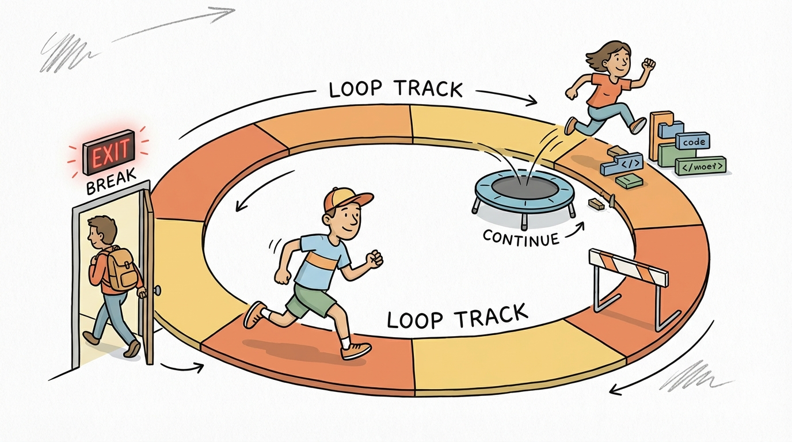
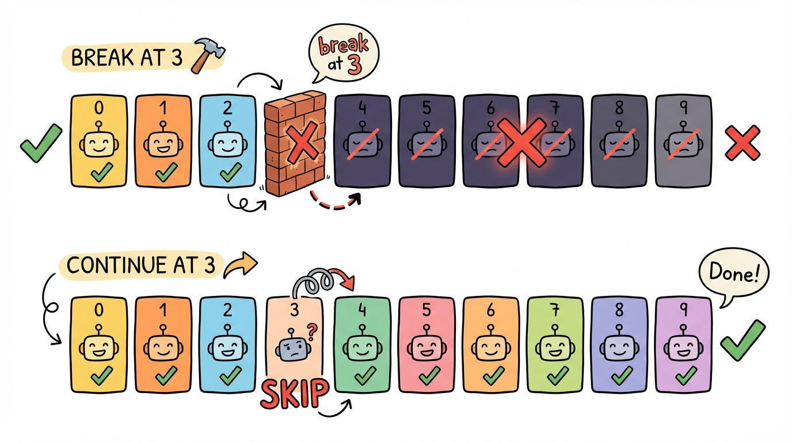
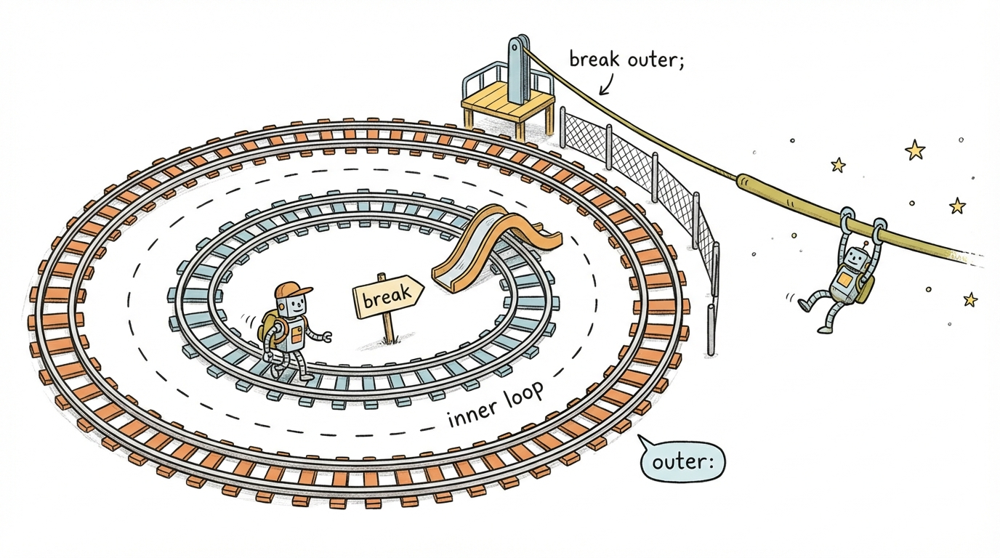
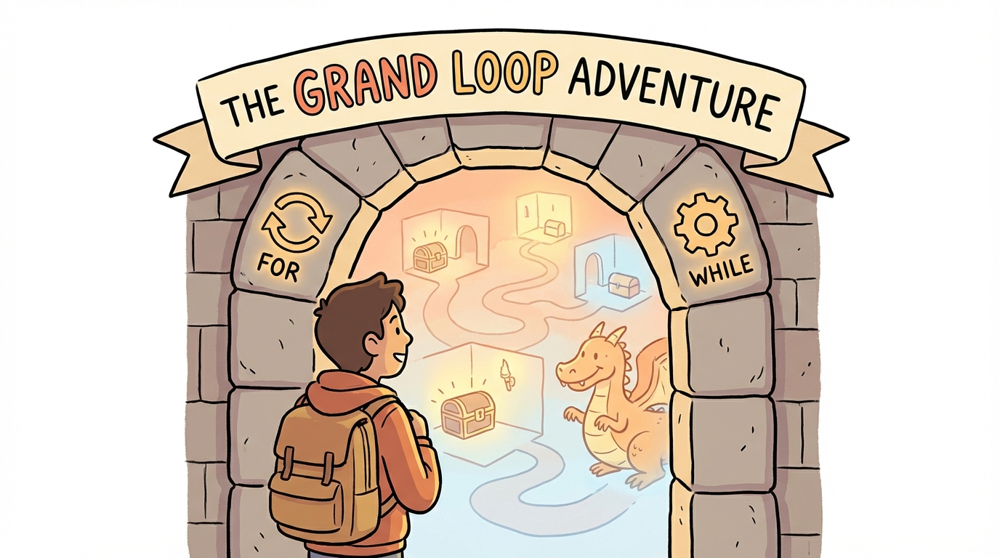

# Module 19: Looping Statements Part 3

> 🏷️ When You're Ready

> 🎯 **Teach:** How break and continue control loop flow, how labeled loops work for nested loop control, and how to choose the right loop type for any problem
> **See:** Break and continue in all three loop types, labeled break/continue in nested loops, loop equivalence comparisons, and a text adventure game capstone
> **Feel:** Complete mastery over Java's looping toolkit, ready to handle any loop question on the exam and build complex interactive programs

> 🎙️ Today is the capstone for looping statements. You will learn break and continue, two keywords that give you fine-grained control over loop execution. Break exits a loop early, continue skips the rest of the current iteration. You will also see how labeled loops let you control nested loops, compare all three loop types side by side, and build a text adventure game that uses every loop concept from the past three days.

> 🎙️ Sometimes you need to exit a loop early because you found what you were searching for, or you need to skip one iteration because the current value is invalid. That is what break and continue give you -- fine-grained control over the flow inside a loop. These two keywords are small but they appear on the exam constantly.



## Research: Comparing Loops, break, and continue

> 🎯 **Teach:** How break exits a loop early, how continue skips an iteration, how labeled loops control nested loops, and how for/while/do-while compare.
> **See:** A research assignment on loop comparison, break and continue behavior in for vs. while, and labeled loop syntax.
> **Feel:** Confident you can explain every loop control mechanism before using them in code.

### Overview

- **Topic:** Using Looping Statements — Comparing for/while/do-while, break, and continue
- **Type:** Written Research Assignment
- **Estimated Time:** 30 minutes
- **Target Length:** Approximately 3/4 page (300-400 words)

### Instructions

Write a short research essay addressing the following:

1. **How do for, while, and do-while compare?** Create a comparison that covers: when to use each, where the condition is evaluated (before or after the body), whether zero iterations are possible, and which parts of the loop header exist. When are they interchangeable, and when is one clearly the better choice?

2. **What do `break` and `continue` do inside a loop?** Explain how `break` immediately exits the loop and how `continue` skips the rest of the current iteration and jumps to the next one. How does each behave differently in for loops versus while loops (specifically, does `continue` in a for loop still execute the update expression)?

3. **What are labeled loops?** Explain how Java allows labeling an outer loop and using `break label` or `continue label` to control nested loops. When is this useful, and why is it considered a rarely needed feature?

### Requirements

- Your response should be approximately **3/4 of a page** (300-400 words).
- Write in your own words. Do not copy and paste from your sources.
- Include at least **3 references** to third-party sources (articles, documentation, books, etc.). List them at the end of your essay in a "References" section.
- Use proper grammar and complete sentences.

### Submission

Save your completed essay as `Response_01_Loop_Comparison_Research.md` in this folder.

### Grading Criteria

| Criteria | Points |
|----------|--------|
| Thorough comparison of for, while, and do-while with use cases | 30 |
| Accurately explains break and continue with for vs. while difference | 35 |
| Explains labeled loops with appropriate caveats | 15 |
| Writing quality and at least 3 properly cited references | 20 |
| **Total** | **100** |

> 🎙️ Here is the tricky part that trips up most students -- continue behaves differently in for loops versus while loops. In a for loop, the update expression still runs after continue. In a while loop, if your update is after the continue, it gets skipped and you can end up in an infinite loop. Make sure you understand this distinction in your research.

> 💡 **Remember this one thing:** In a for loop, continue still executes the update expression before checking the condition again. In a while loop, if the update is after the continue, it gets skipped, which can cause an infinite loop. This behavioral difference is a favorite exam topic.

## Hands-On: break, continue, and Looping Statements Capstone

> 🎯 **Teach:** How to use break, continue, and labeled loops in practice, prove loop type equivalence, and combine all loop skills in a capstone game.
> **See:** Break/continue demos, nested loop control with labels, loop equivalence proofs, exam-style tracing, and a text adventure game.
> **Feel:** Complete mastery over Java's looping toolkit, ready for any loop question on the exam.

> 🎙️ Now you will use break and continue in every loop type, control nested loops with labels, prove that all three loop types are interchangeable, tackle exam-style tracing questions, and build a text adventure game as the grand finale for the looping section.

### Overview

- **Topic:** Using Looping Statements — break, continue, Nested Loops, and Comprehensive Capstone
- **Type:** Technical / Hands-On
- **Estimated Time:** 1.5 hours

### Background

#### break

Exits the **innermost** loop immediately:

```java
for (int i = 0; i < 100; i++) {
    if (i == 5) {
        break;  // Stops the loop entirely
    }
    System.out.println(i);  // Prints 0, 1, 2, 3, 4
}
System.out.println("Loop ended");
```

#### continue

Skips the rest of the current iteration and jumps to the **next iteration**:

```java
for (int i = 0; i < 5; i++) {
    if (i == 2) {
        continue;  // Skips printing 2
    }
    System.out.println(i);  // Prints 0, 1, 3, 4
}
```

**Important for the exam:** In a `for` loop, `continue` still executes the update expression (`i++`). In a `while` loop, if the update is after `continue`, it gets skipped — potentially causing an infinite loop.

> 🎙️ Think of break as an emergency exit and continue as a skip button. Break says I am done with this loop entirely. Continue says I am done with this iteration, move on to the next one. Both only affect the innermost loop unless you use labels.

#### Labeled break and continue

```java
outer:
for (int i = 0; i < 5; i++) {
    for (int j = 0; j < 5; j++) {
        if (j == 3) {
            break outer;  // Exits BOTH loops
        }
    }
}
```

---

### Part 1: break and continue Fundamentals

#### Program A: `BreakContinueBasics.java`

Write a program that demonstrates break and continue in all three loop types:

1. **break in a for loop:** Search an array of integers for the value `42`. Print each element as you check it, and stop as soon as you find 42:
   ```java
   int[] data = {10, 25, 7, 42, 88, 3, 56};
   ```
   ```
   Checking 10... not it
   Checking 25... not it
   Checking 7... not it
   Checking 42... FOUND at index 3!
   ```

2. **break in a while loop:** Read user input until they type "exit":
   ```
   > hello
   You said: hello
   > how are you
   You said: how are you
   > exit
   Goodbye!
   ```

3. **continue in a for loop:** Print numbers 1 through 20, but skip multiples of 3:
   ```
   1 2 4 5 7 8 10 11 13 14 16 17 19 20
   ```

4. **continue in a while loop — the danger:** Demonstrate how continue can cause an infinite loop if you're not careful:
   ```java
   int i = 0;
   while (i < 10) {
       if (i == 5) {
           // i++;  // Without this, infinite loop!
           continue;
       }
       System.out.println(i);
       i++;
   }
   ```
   Write the BROKEN version (commented out to prevent hanging) and the FIXED version. Add a comment explaining why this pitfall doesn't exist in for loops.

5. **break vs. continue side by side:** Run the same loop twice, once with break and once with continue at `i == 3`, and print both outputs to show the difference:
   ```
   With break:    0 1 2
   With continue: 0 1 2 4 5 6 7 8 9
   ```



> 🎙️ The danger case in item four is essential to see firsthand. When continue skips the increment in a while loop, the variable never changes, and the loop runs forever. This is a real bug that happens in production code. Always make sure your loop variable gets updated regardless of whether continue fires.

---

### Part 2: Nested Loops with break and continue



#### Program B: `NestedLoopControl.java`

Write a program that demonstrates how break and continue behave in nested loops:

1. **break in inner loop only:** Print a grid, but stop each row at column 5:
   ```
   Row 0: 0 1 2 3 4
   Row 1: 0 1 2 3 4
   Row 2: 0 1 2 3 4
   ```
   The outer loop still runs — only the inner loop breaks.

2. **Labeled break — exit both loops:** Search a 2D array for a target value. Stop completely when found:
   ```java
   int[][] grid = {
       {1, 2, 3},
       {4, 5, 6},
       {7, 8, 9}
   };
   ```
   Search for `5` — print "Found 5 at row 1, col 1" and stop all iteration.

3. **continue in inner loop:** Print a grid but skip the diagonal (where row == col):
   ```
   Row 0: _ 1 2 3 4
   Row 1: 0 _ 2 3 4
   Row 2: 0 1 _ 3 4
   Row 3: 0 1 2 _ 4
   Row 4: 0 1 2 3 _
   ```

4. **Labeled continue — skip to next outer iteration:** Print row/column pairs, but skip the entire row if any column value equals 2:
   ```java
   outer:
   for (int row = 0; row < 4; row++) {
       for (int col = 0; col < 4; col++) {
           if (col == 2) {
               continue outer;  // Skips the rest of THIS row
           }
           System.out.printf("(%d,%d) ", row, col);
       }
       System.out.println();
   }
   ```
   Predict the output before running. How many pairs print per row?

> 🎙️ Labeled break is the tool you use when a regular break would only exit the inner loop but you need to exit both. The exam tests whether you know the difference between break, which exits the innermost loop, and break with a label, which exits the labeled outer loop. These questions are straightforward once you have seen them.

---

### Part 3: Loop Comparison Challenge

#### Program C: `LoopEquivalents.java`

For each of the following, write the SAME logic using all three loop types (for, while, do-while) to prove they're interchangeable — then add a comment saying which version is most natural for the problem:

1. **Print numbers 1 through 10**
   - for version
   - while version
   - do-while version
   - Comment: which is cleanest?

2. **Sum all numbers from 1 to n (user provides n)**
   - for version
   - while version
   - do-while version
   - Comment: which is cleanest?

3. **Validate input (must be between 1 and 100)**
   - for version (hint: awkward, but possible)
   - while version
   - do-while version
   - Comment: which is cleanest?

4. **Process items in an array**
   - for version
   - enhanced for version
   - while version
   - Comment: which is cleanest?

> 🎙️ This equivalence exercise proves that all three loop types can do the same job -- the question is which one does it most naturally. For counting, use for. For conditions, use while. For guaranteed first execution, use do-while. Writing the same logic three ways locks this understanding into your brain.

---

### Part 4: Exam-Style Loop Questions

#### Program D: `LoopExamPrep.java`

These patterns appear on the 1Z0-811 exam. For each one, **predict the output** as a comment, then run to verify:

1. **What prints?**
   ```java
   for (int i = 0; i < 10; i++) {
       if (i % 3 == 0) continue;
       if (i > 7) break;
       System.out.print(i + " ");
   }
   ```

2. **What prints?**
   ```java
   int x = 0;
   while (x < 10) {
       x += 3;
       if (x > 7) break;
       System.out.print(x + " ");
   }
   System.out.println("x = " + x);
   ```

3. **What prints?**
   ```java
   int count = 0;
   for (int i = 1; i <= 5; i++) {
       for (int j = 1; j <= 5; j++) {
           if (i == j) continue;
           count++;
       }
   }
   System.out.println("count = " + count);
   ```

4. **What prints?**
   ```java
   int sum = 0;
   do {
       sum += sum + 1;
   } while (sum < 10);
   System.out.println("sum = " + sum);
   ```
   Trace through this step by step — it's trickier than it looks.

5. **Does this compile? If so, what prints?**
   ```java
   for (int i = 0; i < 3; i++) {
       for (int j = 0; j < 3; j++) {
           if (i == 1) break;
           System.out.print(i + "" + j + " ");
       }
   }
   ```
   Does `break` exit the inner loop or both loops?

6. **Write your own** exam-style question that combines a loop with `break`, `continue`, and an increment operator. Include the predicted output and a step-by-step trace.

> 🎙️ Question four is deceptively tricky -- trace through it step by step on paper. The expression sum plus equals sum plus one does not just add one each time. It adds the current sum plus one, which means the value grows much faster than you might expect. This is exactly the kind of thing the exam tests.

---

### Part 5: Looping Statements Capstone



#### Program E: `TextAdventureGame.java`

Build a text-based adventure game that serves as the capstone for the entire Looping Statements section (Days 17-19). The game should use every loop type and loop control statement.

**Game concept:** The player explores a series of rooms, collects items, and tries to find the exit.

Requirements:

1. **Game loop (do-while):** The main game loop runs until the player escapes or runs out of health.

2. **Room navigation (switch inside the game loop):** Each turn, the player chooses a direction:
   ```
   === Room: Dark Hallway ===
   Health: 80 | Items: [Key, Torch]
   Exits: North, East, South
   >
   ```

3. **Room descriptions (for loop):** Use at least 5 rooms stored in arrays (room names, descriptions). Use a for loop to search for the current room's data.

4. **Item collection (while loop with break):** When the player enters a room with an item, use a while loop to search their inventory. If they don't have it, add it. Use `break` once the search is resolved.

5. **Combat encounters (while loop):** Some rooms have enemies. Simulate turn-based combat:
   - Each turn, both player and enemy deal random damage (use `Random`)
   - Use `continue` to skip the player's attack if they choose to defend
   - Use `break` to end combat when someone's health reaches 0

6. **Inventory display (enhanced for loop):** Print all collected items using an enhanced for loop.

7. **Win/lose conditions:**
   - Win: reach the exit room with the required key item
   - Lose: health reaches 0
   - Use `break` to exit the main game loop on win or lose

8. **Input validation (do-while):** Validate all user input using do-while loops.

9. **Use `printf`** for all formatted output (health bars, room displays, combat messages).

10. **Use String methods** for input processing (`trim()`, `toLowerCase()`, `equalsIgnoreCase()`).

The game doesn't need to be elaborate — 5 rooms, 3-4 items, and 1-2 combat encounters is sufficient. The focus is on demonstrating every loop type and control statement.

> 🎙️ The text adventure game is the most ambitious program in the course so far. Do not be intimidated -- build it one piece at a time. Start with the main game loop and room navigation, then add items, then add combat. Each piece uses a loop concept you have already practiced individually.

---

### Part 6: Reflection Questions

Answer these briefly (1-2 sentences each):

1. What is the difference between `break` and `continue`? Can you think of a real-world analogy for each?
2. Why can `continue` in a while loop cause an infinite loop but not in a for loop?
3. When would you use a labeled break? Is it generally encouraged or discouraged?
4. Looking back at Days 17, 18, and 19 — which loop type do you think you'll use most in real programs? Why?

---

### Submission

Save all `.java` files in this folder, along with a response file named `Response_02_Break_Continue_and_Loops_Capstone.md` containing:

1. Your predictions and step-by-step traces from Part 4
2. Your loop comparison notes from Part 3
3. Your answers to the reflection questions

> 💡 **Remember this one thing:** Break exits the innermost loop entirely, while continue skips only the current iteration and moves to the next one. In nested loops, both affect only the innermost loop unless you use a label to target an outer loop.

> 🎙️ You have now completed the entire looping section -- for loops, enhanced for-each, while, do-while, break, continue, and labeled loops. Combined with the decision statements from Days 14 through 16, you have all the control flow tools tested on the 1Z0-811 exam. Tomorrow you shift gears to debugging and exceptions, which teaches you how to find and fix problems in your code.

## Grading

> 🎯 **Teach:** How your research and hands-on work will be evaluated for the break, continue, and looping capstone module.
> **See:** Rubrics for the research essay and the five hands-on programs including the text adventure game.
> **Feel:** Clear on expectations so you can verify your capstone project is complete before submitting.

> 🔄 **Where this fits:** Day 19 completes the looping statements section by adding break, continue, and loop comparison skills, giving you every iteration tool tested on the 1Z0-811 exam before moving to debugging and exceptions.

### Research Grading

| Criteria | Points |
|----------|--------|
| Thorough comparison of for, while, and do-while with use cases | 30 |
| Accurately explains break and continue with for vs. while difference | 35 |
| Explains labeled loops with appropriate caveats | 15 |
| Writing quality and at least 3 properly cited references | 20 |
| **Total** | **100** |

### Hands-On Grading

| Criteria | Points |
|----------|--------|
| `BreakContinueBasics.java`: All 5 demonstrations with danger case explained | 15 |
| `NestedLoopControl.java`: All 4 nested scenarios with labeled break/continue | 15 |
| `LoopEquivalents.java`: All 4 problems in 3 loop types with comparison notes | 10 |
| `LoopExamPrep.java`: All 6 questions with correct predictions and traces | 15 |
| `TextAdventureGame.java`: Full game using all loop types and control statements | 25 |
| Reflection questions answered accurately | 10 |
| All programs compile and run without errors | 10 |
| **Total** | **100** |
