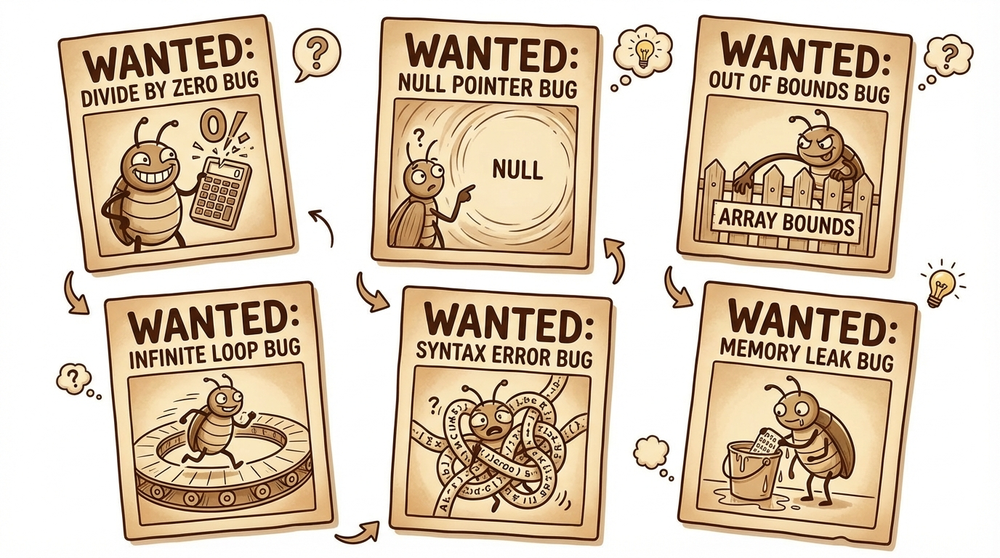
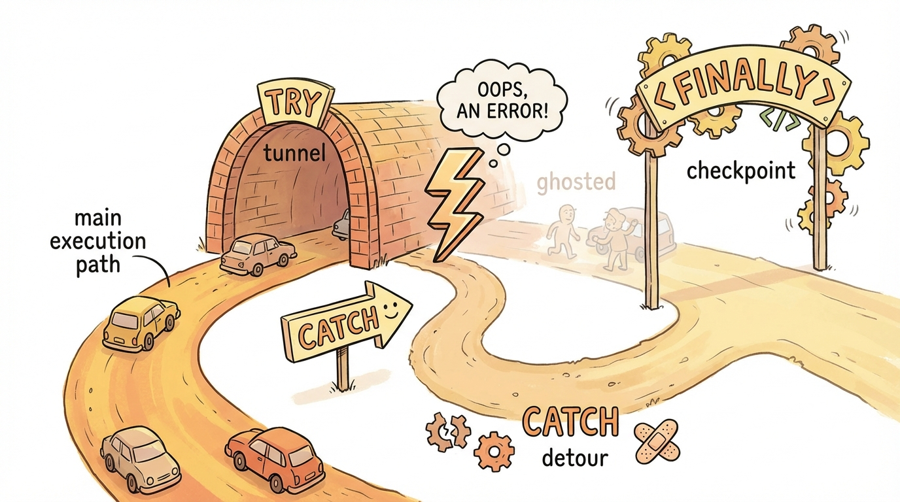

# Module 21: Debugging and Exceptions Part 2

> 🏷️ When You're Ready

> 🎯 **Teach:** How to use try-catch-finally blocks to handle exceptions gracefully, and how to recognize the six most common exceptions on the 1Z0-811 exam
> **See:** Programs that intentionally trigger, catch, and recover from every common exception type
> **Feel:** Confident that you can write crash-proof programs that handle bad input and unexpected errors

> 🎙️ Today we dive into exception handling, one of the most practical skills in Java. When something goes wrong at runtime, like dividing by zero or accessing a null reference, Java throws an exception. Instead of letting your program crash, you can catch those exceptions and respond gracefully. By the end of today, you will know how to use try-catch-finally blocks and you will recognize every common exception the certification exam tests.

> 🎙️ Exception handling is one of the most tested topics on the 1Z0-811 exam. The exam loves to give you code with a try-catch block and ask what prints -- or whether the program compiles at all. Pay close attention to the flow of execution today, because those questions will feel easy once you understand how Java jumps from the try block to the catch block.


## Research: Exception Handling in Java

> 🎯 **Teach:** What exceptions are, how try-catch-finally controls the flow of execution, and which six common exceptions appear on the 1Z0-811 exam.
> **See:** A structured research assignment that asks you to explain exception types, try-catch syntax, and provide triggering code for each common exception.
> **Feel:** Prepared to articulate how exception handling works before diving into hands-on coding.

### Overview

- **Topic:** Debugging and Exception Handling — try, catch, and Common Exceptions
- **Type:** Written Research Assignment
- **Estimated Time:** 30 minutes
- **Target Length:** Approximately 3/4 page (300-400 words)

### Instructions

Write a short research essay addressing the following:

1. **What is an exception in Java?** Explain what an exception is, how it differs from a regular error message, and what happens when an exception is "thrown" but not caught. What does it mean for a program to "crash"?

2. **How do try and catch blocks work?** Explain the syntax of try-catch, the flow of execution when an exception occurs, and what happens to the code after the catch block. Can you have multiple catch blocks for different exception types? What is the `finally` block and when does it run?

3. **What are the most common exceptions on the 1Z0-811 exam?** Describe each of these and give a one-line code example that would trigger each:
   - `ArithmeticException`
   - `NullPointerException`
   - `ArrayIndexOutOfBoundsException`
   - `StringIndexOutOfBoundsException`
   - `NumberFormatException`
   - `ClassCastException`

### Requirements

- Your response should be approximately **3/4 of a page** (300-400 words).
- Write in your own words. Do not copy and paste from your sources.
- Include at least **3 references** to third-party sources (articles, documentation, books, etc.). List them at the end of your essay in a "References" section.
- Use proper grammar and complete sentences.

### Submission

Save your completed essay as `Response_01_Exception_Handling_Research.md` in this folder.

> 💡 **Remember this one thing:** When an exception is thrown and not caught, the program crashes immediately. The try-catch block is your safety net: code in the try block is monitored, and if an exception occurs, execution jumps directly to the matching catch block, skipping the rest of the try block.

> 🎙️ That key insight about skipping the rest of the try block is worth repeating. Once an exception fires, Java does not go back and finish the remaining lines in the try block. It jumps straight to the catch. This means any code you put after the risky line inside the try will never run if something goes wrong.

## Hands-On: Exception Handling in Practice

> 🎯 **Teach:** How to use try-catch-finally blocks to handle errors gracefully instead of letting programs crash.
> **See:** Programs that catch arithmetic, input, and array exceptions with meaningful error messages.
> **Feel:** Relief that you can write Java programs that handle unexpected situations without breaking.

> 🎙️ Now that you understand the theory behind exceptions, it is time to write programs that intentionally trigger every common exception, catch them, and build applications that are truly crash-proof.

### Overview

- **Topic:** Debugging and Exception Handling — try, catch, finally, and Common Exceptions
- **Type:** Technical / Hands-On
- **Estimated Time:** 1.5 hours

### Background

#### try-catch syntax

```java
try {
    // Code that might throw an exception
    int result = 10 / 0;
} catch (ArithmeticException e) {
    // Code that runs if the exception occurs
    System.out.println("Error: " + e.getMessage());
}
// Execution continues here after the catch
```

#### Multiple catch blocks

```java
try {
    // risky code
} catch (ArithmeticException e) {
    System.out.println("Math error: " + e.getMessage());
} catch (ArrayIndexOutOfBoundsException e) {
    System.out.println("Array error: " + e.getMessage());
} catch (Exception e) {
    System.out.println("Some other error: " + e.getMessage());
}
```

**Order matters:** Catch more specific exceptions FIRST. The general `Exception` catch must be last — the compiler enforces this.

> 🎙️ That ordering rule trips people up on the exam. Think of it this way -- Java checks catch blocks from top to bottom and stops at the first match. If you put the general Exception catch first, it matches everything, and the specific catches below it become unreachable. The compiler will not let you write dead code like that.

#### finally block

```java
try {
    // risky code
} catch (Exception e) {
    // handle error
} finally {
    // ALWAYS runs — whether or not an exception occurred
    // Used for cleanup (closing files, releasing resources)
}
```

#### Common exam exceptions

| Exception | Cause |
|-----------|-------|
| `ArithmeticException` | Division by zero (integers only) |
| `NullPointerException` | Calling a method on `null` |
| `ArrayIndexOutOfBoundsException` | Accessing an invalid array index |
| `StringIndexOutOfBoundsException` | Invalid `charAt()` or `substring()` index |
| `NumberFormatException` | `Integer.parseInt("abc")` |
| `ClassCastException` | Invalid type cast on objects |

> 🎙️ Memorize that table. The exam will show you a line of code and ask which exception it throws. The most common ones to watch for are NullPointerException and ArrayIndexOutOfBoundsException -- you will see them constantly in real-world Java code, not just on the exam.



---

### Part 1: Triggering and Catching Every Common Exception

#### Program A: `ExceptionCatalog.java`

Write a program that **intentionally triggers** each of the 6 common exceptions, catches them, and prints useful information. For each one:

1. Print a header: `"=== ArithmeticException ==="`
2. Write the triggering code inside a try block
3. Catch the specific exception type
4. Print:
   - The exception class name: `e.getClass().getSimpleName()`
   - The message: `e.getMessage()`
   - A plain-English explanation of what went wrong
5. Continue to the next exception

Structure:
```
=== ArithmeticException ===
Trigger: 10 / 0
Exception: ArithmeticException
Message: / by zero
Explanation: Cannot divide an integer by zero.

=== NullPointerException ===
Trigger: null.length()
Exception: NullPointerException
Message: ...
Explanation: Tried to call a method on a null reference.

...and so on for all 6...
```

After all 6, print: `"Program completed — all exceptions were handled!"` to prove the program didn't crash.

> 🎙️ This program is your exception reference sheet. After you build it, you will have working examples of every common exception in one place. When you are studying for the exam, come back to this file and read through the messages to refresh your memory.

---

### Part 2: try-catch Flow of Execution



#### Program B: `FlowOfExecution.java`

Understanding what runs and what gets skipped is critical for the exam. For each scenario, **predict the output** before running:

1. **Exception in try — catch handles it:**
   ```java
   System.out.println("Before try");
   try {
       System.out.println("In try — before error");
       int x = 10 / 0;
       System.out.println("In try — after error");  // Does this print?
   } catch (ArithmeticException e) {
       System.out.println("In catch");
   }
   System.out.println("After try-catch");
   ```

2. **No exception — catch is skipped:**
   ```java
   try {
       System.out.println("In try — no error here");
       int x = 10 / 2;
       System.out.println("Result: " + x);
   } catch (ArithmeticException e) {
       System.out.println("In catch");  // Does this print?
   }
   System.out.println("After try-catch");
   ```

3. **finally always runs — with exception:**
   ```java
   try {
       System.out.println("In try");
       int[] arr = new int[3];
       arr[5] = 10;
       System.out.println("After error");
   } catch (ArrayIndexOutOfBoundsException e) {
       System.out.println("In catch");
   } finally {
       System.out.println("In finally");  // Always prints
   }
   System.out.println("After everything");
   ```

4. **finally always runs — without exception:**
   ```java
   try {
       System.out.println("In try — no error");
   } catch (Exception e) {
       System.out.println("In catch");
   } finally {
       System.out.println("In finally");
   }
   ```

5. **Wrong exception type — not caught:**
   ```java
   try {
       int[] arr = new int[3];
       arr[5] = 10;  // ArrayIndexOutOfBoundsException
   } catch (ArithmeticException e) {  // Wrong type!
       System.out.println("Caught it");
   }
   System.out.println("After try-catch");  // Does this print?
   ```
   Wrap this entire block in ANOTHER try-catch to prevent the program from crashing.

6. **Multiple catch blocks — which one runs?**
   ```java
   try {
       String s = null;
       s.length();
   } catch (ArithmeticException e) {
       System.out.println("ArithmeticException");
   } catch (NullPointerException e) {
       System.out.println("NullPointerException");
   } catch (Exception e) {
       System.out.println("Generic Exception");
   }
   ```

For each scenario, write your prediction as a comment BEFORE the code.

> 🎙️ Writing your prediction before running the code is the single best way to study for the exam. The exam gives you code and asks what the output is -- so practicing predictions trains exactly the skill you need. If your prediction is wrong, stop and figure out why before moving on.

---

### Part 3: Multiple Catch Blocks

#### Program C: `MultiCatchDemo.java`

Write a program that demonstrates handling different exceptions differently:

1. **Calculator with error handling:** Use Scanner to read two numbers and an operator. Handle each possible error:
   ```java
   try {
       System.out.print("Enter first number: ");
       int a = Integer.parseInt(scanner.nextLine());  // Could throw NumberFormatException

       System.out.print("Enter operator (+,-,*,/): ");
       String op = scanner.nextLine();

       System.out.print("Enter second number: ");
       int b = Integer.parseInt(scanner.nextLine());  // Could throw NumberFormatException

       int result;
       switch (op) {
           case "/":
               result = a / b;  // Could throw ArithmeticException
               break;
           // ... other cases
       }
       System.out.println("Result: " + result);
   } catch (NumberFormatException e) {
       System.out.println("Error: Please enter valid numbers.");
   } catch (ArithmeticException e) {
       System.out.println("Error: Cannot divide by zero.");
   }
   ```

2. **Array processor with multiple risks:** Write code that:
   - Reads an index from the user
   - Accesses an array at that index
   - Converts the element to a String and parses it
   Handle `ArrayIndexOutOfBoundsException`, `NumberFormatException`, and `NullPointerException` separately with helpful messages.

3. **Catch ordering test:** Try putting `catch (Exception e)` BEFORE a more specific catch. What does the compiler say? Comment out the broken version and add a comment explaining the rule.

> 🎙️ The calculator exercise in Part 3 is a great example of how exception handling works in real applications. Every time you take user input and parse it or do math with it, multiple things can go wrong. The try-catch block lets you handle each failure differently with a clear message instead of a cryptic crash.

---

### Part 4: Practical Application

#### Program D: `RobustInputReader.java`

Write a utility program that demonstrates how exception handling makes programs **robust** — they handle bad input gracefully instead of crashing.

Build methods that safely read different types of input:

1. **`readInt(Scanner, String prompt)`:** Keep asking until the user enters a valid integer:
   ```
   Enter your age: abc
   Invalid — please enter a whole number.
   Enter your age: 12.5
   Invalid — please enter a whole number.
   Enter your age: 25
   ```
   Use a while loop with try-catch inside.

2. **`readDouble(Scanner, String prompt)`:** Same pattern for doubles.

3. **`readIntInRange(Scanner, String prompt, int min, int max)`:** Read an integer that must be within a range:
   ```
   Enter month (1-12): 0
   Must be between 1 and 12.
   Enter month (1-12): abc
   Invalid — please enter a whole number.
   Enter month (1-12): 7
   ```

4. **Use these methods** to build a profile builder that collects:
   - Name (String — no parsing needed, but validate not empty)
   - Age (int, between 1 and 120)
   - GPA (double, between 0.0 and 4.0)
   - Graduation year (int, between 2020 and 2035)

   Print a formatted profile at the end. The program should be **impossible to crash** with bad input.

> 🎙️ The readInt and readIntInRange methods you just built are patterns you will use in almost every interactive Java program. Notice how the while loop and try-catch work together -- the loop keeps asking until the input is valid, and the try-catch prevents a crash if the user types letters instead of numbers. This combination is the key to crash-proof input.

---

### Part 5: Debugging and Exception Handling Capstone

#### Program E: `SafeGradebook.java`

Build a gradebook application that combines debugging skills from Day 20 with exception handling from Day 21. The program should be completely crash-proof.

Requirements:

1. **Student data entry with full validation:**
   - Number of students (int, 1-30) — handle non-numeric input
   - For each student: name and 3 exam scores (0-100)
   - Handle every possible bad input with try-catch and loops

2. **Calculations with error prevention:**
   - Calculate each student's average
   - Calculate the class average
   - Find the highest and lowest averages
   - Handle edge cases (what if all scores are 0? what if there's only 1 student?)

3. **Report generation with formatted output:**
   ```
   ╔════════════════════════════════════════════════════════╗
   ║                   CLASS GRADEBOOK                     ║
   ╠════════════════════════════════════════════════════════╣
   ║  Student         Exam1  Exam2  Exam3   Avg   Grade   ║
   ║  ────────────────────────────────────────────────────  ║
   ║  Alice             88     92     85   88.3   B       ║
   ║  Bob               95     91     97   94.3   A       ║
   ║  Charlie           72     68     75   71.7   C       ║
   ╠════════════════════════════════════════════════════════╣
   ║  Class Average: 84.8                                  ║
   ║  Highest: Bob (94.3)                                  ║
   ║  Lowest: Charlie (71.7)                               ║
   ╚════════════════════════════════════════════════════════╝
   ```

4. **Use these specific constructs:**
   - `try-catch` with `NumberFormatException` for all numeric input
   - `try-catch` with `ArrayIndexOutOfBoundsException` as a safety net
   - `finally` block for printing a footer message ("Report generated successfully" or "Report generated with errors")
   - Multiple catch blocks in at least one location
   - Input validation loops (do-while with try-catch inside)

5. **Intentionally handle these edge cases:**
   - User enters "abc" for a score → re-prompt
   - User enters -5 for a score → re-prompt (not an exception, but a validation check)
   - User enters 150 for a score → re-prompt
   - Empty string for a name → re-prompt

---

### Part 6: Reflection Questions

Answer these briefly (1-2 sentences each):

1. What is the difference between **preventing** an error (e.g., checking `if (x != 0)` before dividing) and **handling** an error (e.g., catching `ArithmeticException`)? When should you use each approach?
2. Why must more specific catch blocks come before more general ones?
3. When does the `finally` block run? Can you think of a situation where `finally` is essential?
4. Looking at Days 20 and 21 together — how does exception handling change the way you think about writing code?

---

### Submission

Save all `.java` files in this folder, along with a response file named `Response_02_Exception_Handling_in_Practice.md` containing:

1. Your flow-of-execution predictions from Part 2
2. Your catch ordering findings from Part 3
3. Your answers to the reflection questions

> 💡 **Remember this one thing:** The finally block always runs, whether an exception occurred or not. This makes it the perfect place for cleanup code like closing files or releasing resources, because you can guarantee it will execute no matter what happens in the try or catch blocks.

## Grading

> 🎯 **Teach:** How your research and hands-on work are evaluated across exception handling concepts.
> **See:** Rubrics for the research essay, all five Java programs, and the reflection questions.
> **Feel:** Clear about what constitutes a complete, high-quality submission for this module.

> 🔄 **Where this fits:** Day 21 completes the debugging and exception handling section, giving you the tools to write robust, crash-proof programs -- a critical skill tested on the 1Z0-811 exam and essential for every real-world Java application.

> 🎙️ You have now covered all of exception handling -- from basic try-catch to multiple catch blocks to finally to building completely crash-proof applications. Tomorrow you start arrays, which is a whole new chapter. But the exception handling skills you built today will follow you through every program you write from here on out. Well done.

### Research Grading

| Criteria | Points |
|----------|--------|
| Clearly explains what exceptions are and unhandled exception behavior | 25 |
| Accurately describes try-catch-finally flow of execution | 30 |
| Describes all 6 common exceptions with triggering examples | 25 |
| Writing quality and at least 3 properly cited references | 20 |
| **Total** | **100** |

### Hands-On Grading

| Criteria | Points |
|----------|--------|
| `ExceptionCatalog.java`: All 6 exceptions triggered, caught, and explained | 15 |
| `FlowOfExecution.java`: All 6 scenarios with correct predictions | 15 |
| `MultiCatchDemo.java`: Calculator, array processor, and ordering test | 15 |
| `RobustInputReader.java`: All 3 methods plus crash-proof profile builder | 20 |
| `SafeGradebook.java`: Full capstone — crash-proof with formatted output | 20 |
| Reflection questions answered accurately | 5 |
| All programs compile and run without errors | 10 |
| **Total** | **100** |
