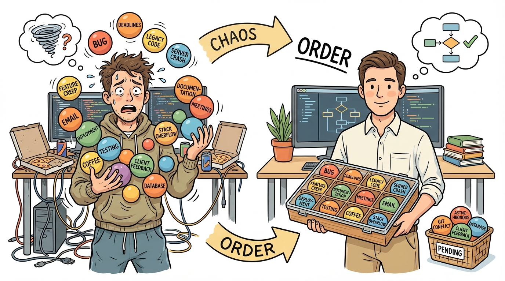
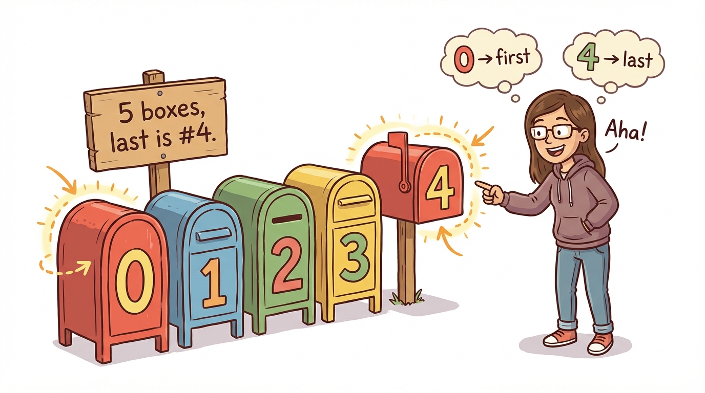
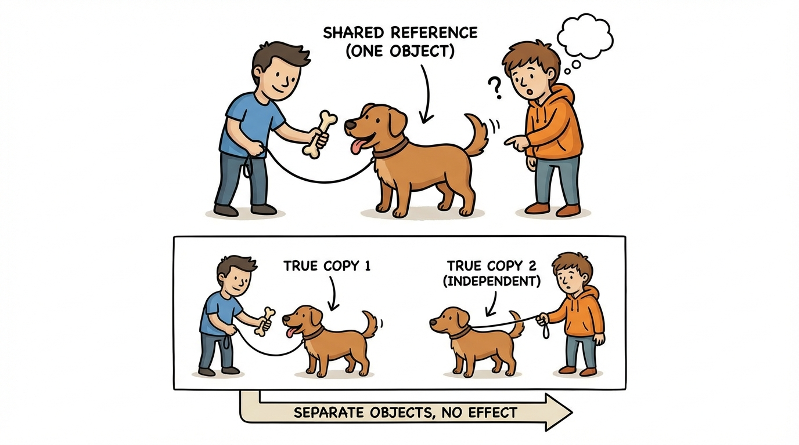
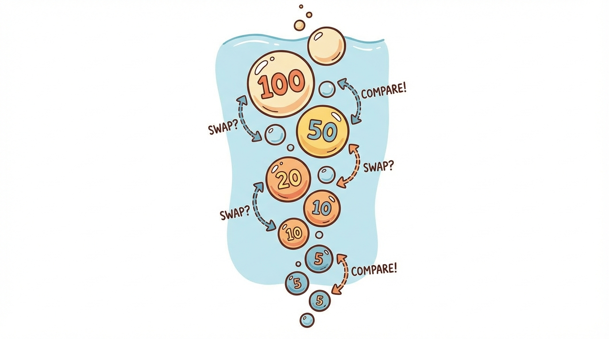

# Module 22: Arrays and ArrayLists Part 1

> 🏷️ When You're Ready

> 🎯 **Teach:** How to declare, create, initialize, and process one-dimensional arrays in Java, including indexing, iteration, and common array operations
> **See:** Programs that create arrays, find sums and averages, search for values, sort elements, and build visual grade distributions
> **Feel:** Comfortable working with collections of data stored in arrays, understanding that arrays are the foundation for managing groups of related values

> 🎙️ Up to now, every piece of data you have worked with has been stored in its own individual variable. But what happens when you need to store fifty exam scores, or a hundred names? That is where arrays come in. An array lets you store multiple values of the same type in a single variable, and today you will learn how to create them, access their elements, and process them with loops.

> 🎙️ Arrays are a turning point in the course. Before today, every variable held a single value. After today, you will be able to store and process entire collections of data. This is also the start of the exam's data structures section, so the patterns you learn here will show up on multiple certification questions.



## Research: Arrays in Java

> 🎯 **Teach:** What arrays are, how to declare and initialize them, and how zero-based indexing and the length property work.
> **See:** A research assignment exploring array creation syntax, default values, and ArrayIndexOutOfBoundsException.
> **Feel:** Ready to explain arrays in your own words before writing code that uses them.

### Overview

- **Topic:** Arrays and ArrayLists — One-Dimensional Arrays
- **Type:** Written Research Assignment
- **Estimated Time:** 30 minutes
- **Target Length:** Approximately 3/4 page (300-400 words)

### Instructions

Write a short research essay addressing the following:

1. **What is an array in Java?** Explain what an array is, why arrays are useful, and what it means that arrays are fixed-size. How does an array differ from individual variables — what problem does it solve? What does it mean that arrays are objects in Java?

2. **How do you declare, create, and initialize an array?** Describe the different ways to create arrays:
   - Declaration: `int[] numbers;`
   - Creation with `new`: `numbers = new int[5];`
   - Combined: `int[] numbers = new int[5];`
   - Literal initialization: `int[] numbers = {10, 20, 30};`

   What are the default values for each element type (int, double, boolean, String/objects)?

3. **How do you access and modify array elements?** Explain zero-based indexing, the `length` property (not a method — no parentheses), and what happens when you access an invalid index. Why is `ArrayIndexOutOfBoundsException` one of the most common runtime errors?

### Requirements

- Your response should be approximately **3/4 of a page** (300-400 words).
- Write in your own words. Do not copy and paste from your sources.
- Include at least **3 references** to third-party sources (articles, documentation, books, etc.). List them at the end of your essay in a "References" section.
- Use proper grammar and complete sentences.

### Submission

Save your completed essay as `Response_01_Arrays_Research.md` in this folder.

> 💡 **Remember this one thing:** Arrays in Java are fixed-size -- once you create an array with `new int[5]`, it will always hold exactly 5 elements. You cannot add or remove elements. The `length` property (no parentheses) tells you the size, and indexing starts at 0, so the last valid index is always `length - 1`.

## Hands-On: Arrays in Practice

> 🎯 **Teach:** How to create, access, iterate, and process arrays using standard and enhanced for loops.
> **See:** Programs that find sums, averages, maximums, sort with bubble sort, and display visual grade distributions.
> **Feel:** Capable of storing and manipulating collections of data instead of juggling individual variables.

> 🎙️ Now it is time to get your hands on arrays. You will create them, fill them, process them with loops, and build some genuinely useful programs including a grade distribution chart and a sorting algorithm.

### Overview

- **Topic:** Arrays and ArrayLists — Creating, Accessing, and Processing One-Dimensional Arrays
- **Type:** Technical / Hands-On
- **Estimated Time:** 1.5 hours

### Background

#### Creating arrays

```java
// Declare and create with default values
int[] scores = new int[5];         // [0, 0, 0, 0, 0]
String[] names = new String[3];    // [null, null, null]
boolean[] flags = new boolean[4];  // [false, false, false, false]
double[] prices = new double[2];   // [0.0, 0.0]

// Declare and initialize with values
int[] scores = {88, 92, 76, 95, 83};
String[] names = {"Alice", "Bob", "Charlie"};
```



#### Accessing and modifying

```java
scores[0] = 100;                    // Set first element
int first = scores[0];               // Get first element
int last = scores[scores.length - 1]; // Get last element
int size = scores.length;            // Number of elements (property, not method!)
```

#### Iterating

```java
// Standard for loop — use when you need the index
for (int i = 0; i < scores.length; i++) {
    System.out.println("Index " + i + ": " + scores[i]);
}

// Enhanced for loop — use when you just need the values
for (int score : scores) {
    System.out.println(score);
}
```

> 🎙️ Notice the two loop styles. The standard for loop gives you the index variable i, which you need when you want to know the position or modify elements. The enhanced for loop is cleaner when you just need to read each value. The exam tests both, so get comfortable with both syntaxes.

---

### Part 1: Array Fundamentals

#### Program A: `ArrayBasics.java`

Write a program that demonstrates the fundamentals of arrays:

1. **Default values:** Create arrays of each type WITHOUT initializing the elements, then print every element to show the defaults:
   ```java
   int[] ints = new int[3];
   double[] doubles = new double[3];
   boolean[] bools = new boolean[3];
   String[] strings = new String[3];
   char[] chars = new char[3];
   ```
   Print each array and label the default value for each type.

2. **Literal initialization:** Create and print arrays using literal syntax:
   ```java
   int[] primes = {2, 3, 5, 7, 11, 13, 17, 19};
   String[] days = {"Mon", "Tue", "Wed", "Thu", "Fri", "Sat", "Sun"};
   ```

3. **Accessing elements:** Using the `primes` array:
   - Print the first element, last element, and middle element
   - Print the length
   - Modify the third element and print the array again

4. **Out of bounds:** Wrap these in try-catch to demonstrate the error:
   ```java
   int[] arr = {10, 20, 30};
   System.out.println(arr[3]);   // Out of bounds
   System.out.println(arr[-1]);  // Also out of bounds
   ```

> 🎙️ Pay special attention to default values in Part 1. The exam will show you an array created with new but never assigned values, and ask what the elements contain. Integers default to zero, booleans to false, and objects like String to null. Getting this wrong is a common exam mistake.

---

### Part 2: Array Processing Patterns

#### Program B: `ArrayProcessing.java`

Write a program that demonstrates the most common array processing patterns:

1. **Sum and average:**
   ```java
   int[] scores = {88, 92, 76, 95, 83, 91, 87, 79};
   ```
   Calculate and print the sum and average.

2. **Find maximum and minimum:** Find and print the highest and lowest values AND their indices:
   ```
   Max: 95 at index 3
   Min: 76 at index 2
   ```

3. **Count occurrences:** Given `int[] data = {3, 7, 3, 2, 7, 3, 8, 3, 2, 7}`, count how many times each unique value appears:
   ```
   3 appears 4 times
   7 appears 3 times
   2 appears 2 times
   8 appears 1 time
   ```

4. **Search for a value:** Write a linear search — loop through the array looking for a target value. Print whether it was found and at which index.

5. **Reverse an array:** Given `{1, 2, 3, 4, 5}`, produce `{5, 4, 3, 2, 1}`. Do this TWO ways:
   - Create a new reversed array
   - Reverse in place by swapping elements

6. **Copy an array:** Demonstrate three ways to copy:
   - Manual loop copy
   - `Arrays.copyOf()` (import `java.util.Arrays`)
   - Assigning one array variable to another — show that this does NOT copy (both variables point to the same array). Modify one and show the other changes too.



> 🎙️ The processing patterns in Part 2 -- sum, max, min, search, reverse -- are the bread and butter of array programming. You will use these patterns over and over again, so take the time to write them yourself without copying. Once you can write a max-finding loop from memory, you are in great shape for the exam.

---

### Part 3: Arrays and Methods

#### Program C: `ArrayMethods.java`

Write a program that passes arrays to methods and returns arrays from methods:

1. **`printArray(int[] arr)`** — prints an array in bracket format: `[88, 92, 76, 95]`

2. **`sumArray(int[] arr)`** — returns the sum of all elements

3. **`averageArray(int[] arr)`** — returns the average as a double

4. **`findMax(int[] arr)`** — returns the maximum value

5. **`contains(int[] arr, int target)`** — returns true if the target is in the array

6. **`countAbove(int[] arr, int threshold)`** — returns how many elements are above the threshold

7. **`createRange(int start, int end)`** — returns a NEW array containing all integers from start to end:
   ```java
   int[] range = createRange(3, 8);  // returns {3, 4, 5, 6, 7, 8}
   ```

Demonstrate all methods in `main` with test data and print the results.

> 🎙️ Here is a critical concept that catches many students off guard. When you pass an array to a method, you are passing a reference to the same array, not a copy of it. That means if the method modifies the array elements, the changes show up in the original. This is different from passing a primitive like an int, where the method gets its own separate copy.

**Key concept:** When you pass an array to a method, you pass a reference — changes inside the method affect the original array. Demonstrate this:
```java
public static void doubleAll(int[] arr) {
    for (int i = 0; i < arr.length; i++) {
        arr[i] *= 2;
    }
}
// After calling doubleAll, the original array is modified!
```

> 🎙️ Now you are going to build some real applications with arrays. The grade distribution program is especially satisfying because it produces a visual bar chart in the terminal. This is the kind of program that makes you feel like a real developer -- taking raw data and turning it into something useful and visual.

---

### Part 4: Practical Application

#### Program D: `GradeDistribution.java`

Write a program that analyzes exam grades and produces a distribution report:

1. Use Scanner to read grades from the user (use a sentinel value of `-1` to stop), storing them in an array. Start with a large array (e.g., size 100) and track how many elements are actually used with a counter.

2. Calculate and display:
   - Number of grades entered
   - Average grade
   - Highest and lowest grades
   - Standard deviation (optional challenge): `sqrt(sum of (each value - average)² / count)`

3. Build a grade distribution:
   ```
   A (90-100): ████████░░░░░░░░░░░░  5 students (25.0%)
   B (80-89):  ████████████░░░░░░░░  7 students (35.0%)
   C (70-79):  ████████░░░░░░░░░░░░  4 students (20.0%)
   D (60-69):  ████░░░░░░░░░░░░░░░░  2 students (10.0%)
   F (0-59):   ████░░░░░░░░░░░░░░░░  2 students (10.0%)
   ```
   Use a loop to generate the bar (each █ represents one student or a percentage — your choice).

4. Use `printf` for all formatted output.

#### Program E: `ArraySorter.java`



Write a program that implements **bubble sort** — a simple sorting algorithm:

1. Start with an unsorted array: `{64, 34, 25, 12, 22, 11, 90}`
2. Print the array before sorting
3. Implement bubble sort:
   ```
   Compare adjacent elements. If they're in the wrong order, swap them.
   Repeat until no swaps are needed.
   ```
4. Print the array after each complete pass so Campbell can see the sort happening:
   ```
   Original: [64, 34, 25, 12, 22, 11, 90]
   Pass 1:   [34, 25, 12, 22, 11, 64, 90]
   Pass 2:   [25, 12, 22, 11, 34, 64, 90]
   Pass 3:   [12, 22, 11, 25, 34, 64, 90]
   Pass 4:   [12, 11, 22, 25, 34, 64, 90]
   Pass 5:   [11, 12, 22, 25, 34, 64, 90]
   Sorted:   [11, 12, 22, 25, 34, 64, 90]
   ```
5. Count and print the total number of swaps performed.
6. After your manual sort, also sort a copy using `Arrays.sort()` and confirm they match.

> 🎙️ Bubble sort is not the fastest sorting algorithm, but it is the easiest to understand and implement. By printing each pass, you can actually watch the largest values bubble up to the end of the array one at a time. Understanding how sorting works under the hood will help you appreciate what Arrays.sort does for you automatically.

---

### Part 5: Reflection Questions

Answer these briefly (1-2 sentences each):

1. What happens if you try to add more elements than an array can hold? What is the limitation this creates?
2. Why does `length` have no parentheses for arrays (`arr.length`) but does for Strings (`str.length()`)? What is the difference?
3. When you assign one array variable to another (`int[] b = a;`), why doesn't this create a copy?

---

### Submission

Save all `.java` files in this folder, along with a response file named `Response_02_Arrays_in_Practice.md` containing:

1. Your default value findings from Part 1
2. Your array copy demonstration results from Part 2
3. Your answers to the reflection questions

> 💡 **Remember this one thing:** When you pass an array to a method or assign it to another variable, you are copying the reference, not the data. Both variables point to the same array in memory, so changes through one variable are visible through the other. Use `Arrays.copyOf()` when you need an independent copy.

## Grading

> 🎯 **Teach:** How your research and hands-on work are evaluated across array fundamentals.
> **See:** Rubrics for the research essay, all five Java programs, and the reflection questions.
> **Feel:** Clear about what constitutes a complete, high-quality submission for this module.

> 🔄 **Where this fits:** Day 22 introduces arrays, the first data structure in the course, teaching you how to store and process collections of values -- a fundamental skill for the 1Z0-811 exam and the foundation for understanding ArrayLists in the next two days.

> 🎙️ Great work getting through your first day with arrays. Tomorrow you will meet ArrayList, which solves the biggest limitation of arrays -- the fixed size. But everything you learned today about indexing, iteration, and processing patterns carries over directly. Arrays are the foundation, and you just built it.

### Research Grading

| Criteria | Points |
|----------|--------|
| Clearly explains what arrays are and the fixed-size constraint | 25 |
| Describes all declaration/creation methods and default values | 30 |
| Explains indexing, the length property, and out-of-bounds errors | 25 |
| Writing quality and at least 3 properly cited references | 20 |
| **Total** | **100** |

### Hands-On Grading

| Criteria | Points |
|----------|--------|
| `ArrayBasics.java`: Default values, literal init, access, and bounds errors | 10 |
| `ArrayProcessing.java`: All 6 processing patterns correct | 20 |
| `ArrayMethods.java`: All 7 methods working, reference behavior demonstrated | 20 |
| `GradeDistribution.java`: Input, calculations, and visual distribution | 20 |
| `ArraySorter.java`: Bubble sort with pass-by-pass output | 15 |
| Reflection questions answered accurately | 5 |
| All programs compile and run without errors | 10 |
| **Total** | **100** |
