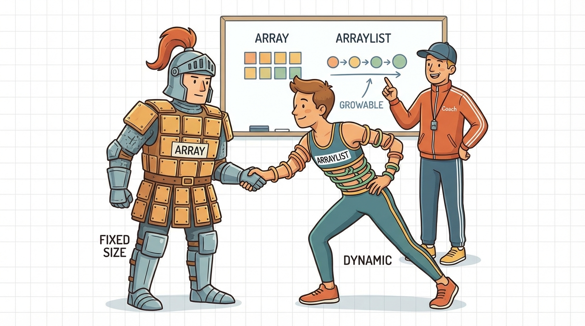
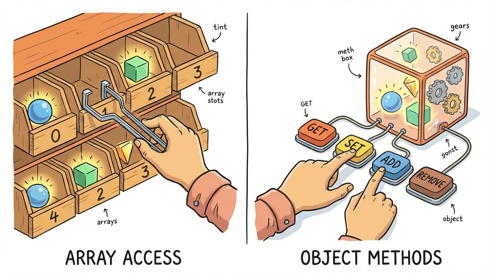
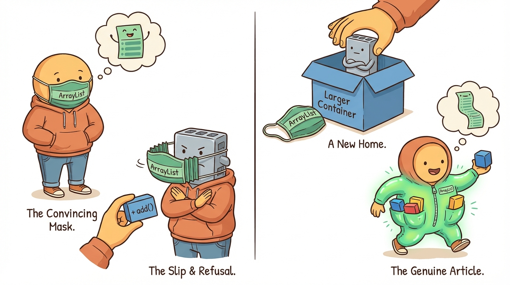
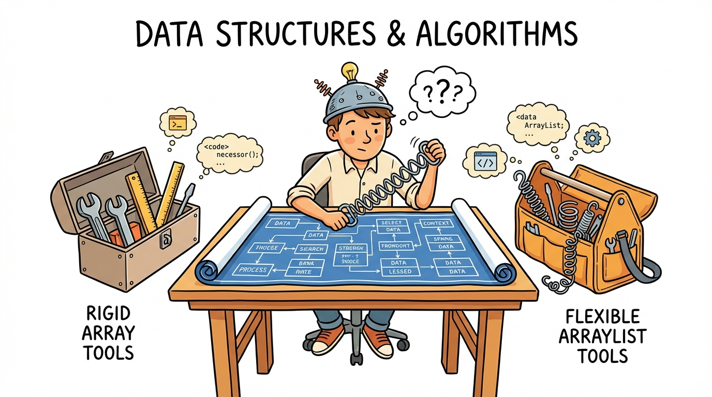

# Module 24: Arrays and ArrayLists Part 3

> 🏷️ When You're Ready

> 🎯 **Teach:** How to compare arrays and ArrayLists side by side, convert between them, and choose the right collection for each situation
> **See:** Programs that perform identical operations with both data structures, demonstrate conversion patterns, and a full contact manager capstone application
> **Feel:** Confident in choosing between arrays and ArrayLists for any given task, and proud of building a substantial, multi-feature application

> 🎙️ Over the past two days you have learned arrays and ArrayLists separately. Today you bring them together. You will compare them side by side, learn how to convert between them, and tackle exam-style questions about their behavior. Then you will build a full contact manager application that uses both, choosing the right tool for each job.

> 🎙️ Today is about making the right choice. The exam will not always tell you whether to use an array or an ArrayList -- sometimes it just gives you a scenario and asks what code works. If you understand the trade-offs between the two, those questions become straightforward.



## Research: Comparing Arrays and ArrayLists

> 🎯 **Teach:** How arrays and ArrayLists compare in size, syntax, performance, and built-in features, and how to convert between them.
> **See:** A research assignment that builds a side-by-side comparison and a decision guide for choosing the right collection type.
> **Feel:** Prepared to articulate the trade-offs so you can make the right choice in any coding scenario.

### Overview

- **Topic:** Arrays and ArrayLists — Comparing the Two and Choosing the Right One
- **Type:** Written Research Assignment
- **Estimated Time:** 30 minutes
- **Target Length:** Approximately 3/4 page (300-400 words)

### Instructions

Write a short research essay addressing the following:

1. **How do arrays and ArrayLists compare?** Build a side-by-side comparison covering:
   - Size: fixed vs. dynamic
   - Type: primitives and objects vs. objects only
   - Syntax: bracket notation vs. method calls
   - Performance: which is faster and why
   - Built-in features: what methods does each provide out of the box
   - Length/size: `arr.length` (property) vs. `list.size()` (method)

2. **How do you convert between arrays and ArrayLists?** Explain how to:
   - Convert an array to an ArrayList
   - Convert an ArrayList to an array
   - Why might you need to convert between them in real programs?

3. **How do you choose between them?** Provide a decision guide: when is an array the right choice (fixed-size data, primitives, performance-critical code) and when is ArrayList better (unknown size, frequent additions/removals, need for built-in search and sort)?

### Requirements

- Your response should be approximately **3/4 of a page** (300-400 words).
- Write in your own words. Do not copy and paste from your sources.
- Include at least **3 references** to third-party sources (articles, documentation, books, etc.). List them at the end of your essay in a "References" section.
- Use proper grammar and complete sentences.

### Submission

Save your completed essay as `Response_01_Array_vs_ArrayList_Research.md` in this folder.

> 💡 **Remember this one thing:** Use arrays when the size is known and fixed, especially for primitives and performance-critical code. Use ArrayList when you need dynamic resizing, built-in methods like `contains()` and `remove()`, or when the number of elements will change during the program's execution.

## Hands-On: Arrays and ArrayLists Capstone

> 🎯 **Teach:** How to perform the same operations with arrays and ArrayLists side by side, convert between them, and build a full contact manager application.
> **See:** Programs that compare syntax differences, demonstrate the Arrays.asList trap, and a nine-feature interactive contact manager.
> **Feel:** Confident choosing between arrays and ArrayLists for any task, and proud of building a substantial multi-feature application.

> 🎙️ This is where everything from the past three days comes together. You will build programs that use arrays and ArrayLists side by side, master the conversion patterns, and then tackle a full capstone project that puts it all to work.

### Overview

- **Topic:** Arrays and ArrayLists — Comparison, Conversion, and Comprehensive Capstone
- **Type:** Technical / Hands-On
- **Estimated Time:** 1.5 hours

### Background

#### Converting between arrays and ArrayLists

```java
import java.util.ArrayList;
import java.util.Arrays;
import java.util.Collections;

// Array → ArrayList
String[] arr = {"Apple", "Banana", "Cherry"};
ArrayList<String> list = new ArrayList<>(Arrays.asList(arr));

// ArrayList → Array
String[] backToArray = list.toArray(new String[0]);

// For primitive arrays, manual conversion is needed:
int[] intArr = {1, 2, 3, 4, 5};
ArrayList<Integer> intList = new ArrayList<>();
for (int val : intArr) {
    intList.add(val);  // autoboxing
}
```

#### Useful utility methods

> 🎙️ The conversion patterns between arrays and ArrayLists are exam favorites. Notice that converting a String array is easy with Arrays.asList, but converting an int array requires a manual loop because autoboxing does not work on entire arrays at once. Make sure you can write both conversions from memory.

```java
// Sorting
Arrays.sort(arr);                    // Sort an array
Collections.sort(list);             // Sort an ArrayList

// Searching (array must be sorted first)
int index = Arrays.binarySearch(arr, "Banana");

// Filling
Arrays.fill(arr, "Default");        // Set all elements

// Converting to String
System.out.println(Arrays.toString(arr));  // [Apple, Banana, Cherry]
```

---

### Part 1: Side-by-Side Comparison



#### Program A: `ArrayVsArrayList.java`

Write a program that performs the same operations with BOTH an array and an ArrayList, side by side, highlighting the differences:

1. **Creation:**
   ```java
   // Array
   String[] arrColors = new String[5];
   // ArrayList
   ArrayList<String> listColors = new ArrayList<>();
   ```

2. **Adding elements:**
   ```java
   // Array — must use index
   arrColors[0] = "Red";
   arrColors[1] = "Blue";
   // ArrayList — can just add
   listColors.add("Red");
   listColors.add("Blue");
   ```

3. **Getting the size:**
   ```java
   arrColors.length     // property, no parentheses
   listColors.size()    // method, with parentheses
   ```

4. **Accessing elements:**
   ```java
   arrColors[0]         // bracket notation
   listColors.get(0)    // method call
   ```

5. **Modifying elements:**
   ```java
   arrColors[0] = "Green";
   listColors.set(0, "Green");
   ```

6. **Inserting in the middle:** Show that arrays can't do this without manual shifting, while ArrayList handles it with `add(index, element)`.

7. **Removing an element:** Show that arrays can't truly remove (only set to null/0), while ArrayList handles it with `remove()`.

8. **Printing:** Show `Arrays.toString(arr)` vs. just `list.toString()`.

Print the result of each operation for both, with clear labels.

> 🎙️ The side-by-side comparison in Part 1 is your cheat sheet for the exam. When you see array length versus ArrayList size, or bracket notation versus get and set, you will know exactly which is which. The exam loves to put a length() with parentheses on an array or a .length on an ArrayList to see if you catch the mistake.

---

### Part 2: Converting Between Them

#### Program B: `ConversionDemo.java`

Write a program that demonstrates all conversion patterns:

1. **String array → ArrayList:**
   ```java
   String[] fruits = {"Apple", "Banana", "Cherry", "Date"};
   ArrayList<String> fruitList = new ArrayList<>(Arrays.asList(fruits));
   ```
   Modify the ArrayList (add, remove) and show the original array is unchanged.

2. **ArrayList → String array:**
   ```java
   ArrayList<String> names = new ArrayList<>();
   names.add("Alice"); names.add("Bob"); names.add("Charlie");
   String[] nameArray = names.toArray(new String[0]);
   ```

3. **int array → ArrayList\<Integer\> (manual):**
   ```java
   int[] numbers = {10, 20, 30, 40, 50};
   ArrayList<Integer> numList = new ArrayList<>();
   for (int n : numbers) {
       numList.add(n);
   }
   ```

4. **ArrayList\<Integer\> → int array (manual):**
   ```java
   int[] backToArray = new int[numList.size()];
   for (int i = 0; i < numList.size(); i++) {
       backToArray[i] = numList.get(i);  // unboxing
   }
   ```

5. **The `Arrays.asList()` trap:** Show that `Arrays.asList()` returns a fixed-size list — you can modify elements but cannot add or remove:
   ```java
   List<String> fixedList = Arrays.asList("A", "B", "C");
   fixedList.set(0, "Z");     // Works
   // fixedList.add("D");     // Throws UnsupportedOperationException!
   ```
   Wrap in try-catch and explain. Show how wrapping in `new ArrayList<>()` solves this.



> 🎙️ Do not skip the Arrays.asList trap in Part 2. The list it returns looks like an ArrayList but it is not -- you cannot add or remove from it. This is a sneaky exam question where code that looks perfectly fine throws an UnsupportedOperationException at runtime. The fix is simple -- wrap it in new ArrayList -- but you need to know it exists.

---

### Part 3: Exam-Style Questions

#### Program C: `CollectionExamPrep.java`

These patterns appear on the 1Z0-811 exam. Predict the output BEFORE running:

1. **ArrayList printing:**
   ```java
   ArrayList<String> list = new ArrayList<>();
   list.add("A");
   list.add("B");
   list.add("C");
   list.add(1, "D");
   System.out.println(list);
   ```

2. **Remove by index vs. value:**
   ```java
   ArrayList<Integer> nums = new ArrayList<>();
   nums.add(1); nums.add(2); nums.add(3);
   nums.remove(1);  // Index or value?
   System.out.println(nums);
   ```

3. **Size changes:**
   ```java
   ArrayList<String> items = new ArrayList<>();
   items.add("X");
   items.add("Y");
   items.add("Z");
   items.remove(0);
   items.add(0, "W");
   items.set(1, "V");
   System.out.println(items + " size=" + items.size());
   ```

4. **Enhanced for loop with ArrayList:**
   ```java
   ArrayList<Integer> vals = new ArrayList<>();
   vals.add(10); vals.add(20); vals.add(30);
   int sum = 0;
   for (int v : vals) {
       sum += v;
   }
   System.out.println("Sum: " + sum);
   ```

5. **Array length vs. ArrayList size:**
   ```java
   int[] arr = new int[10];
   ArrayList<Integer> list = new ArrayList<>();
   list.add(1); list.add(2); list.add(3);
   System.out.println("Array length: " + arr.length);
   System.out.println("List size: " + list.size());
   ```
   What is the difference between length/capacity and actual elements used?

6. **Write your own** exam question involving an ArrayList with `add`, `remove`, and `set` in sequence. Include the prediction and the actual output.

> 🎙️ Predicting output is the core skill for the exam. These questions look simple, but the details matter -- does remove take an index or a value, does add shift everything right, does set replace or insert? Work through each one on paper before you run it.

---

### Part 4: Arrays and ArrayLists Capstone



#### Program D: `ContactManager.java`

Build a contact manager application that serves as the capstone for the entire Arrays and ArrayLists section (Days 22-24). This application uses BOTH arrays and ArrayLists, choosing the right one for each task.

Requirements:

1. **Data storage — use ArrayList for contacts:**
   Each contact has: name, phone, email, and category (friend/family/work). Store each field in a **parallel ArrayList** (one ArrayList for names, one for phones, etc.) OR store contacts as formatted strings in a single ArrayList — your choice, but justify it in a comment.

2. **Category options — use an array:**
   ```java
   final String[] CATEGORIES = {"Friend", "Family", "Work", "Other"};
   ```
   Display categories from the array when adding a contact. Use an array because the categories are fixed.

3. **Menu system with do-while:**
   ```
   ╔══════════════════════════════════╗
   ║       CONTACT MANAGER           ║
   ╠══════════════════════════════════╣
   ║  1. Add Contact                 ║
   ║  2. Remove Contact              ║
   ║  3. Search Contacts             ║
   ║  4. View All Contacts           ║
   ║  5. View by Category            ║
   ║  6. Sort Contacts               ║
   ║  7. Contact Statistics          ║
   ║  8. Export to Array              ║
   ║  9. Exit                        ║
   ╚══════════════════════════════════╝
   ```

4. **Add Contact:**
   - Validate name (not empty, trim whitespace)
   - Validate phone (not empty)
   - Validate email (must contain "@" — use `contains()`)
   - Select category from the array using a numbered menu
   - Check for duplicates by name (case-insensitive)
   - Use try-catch for all input

5. **Remove Contact:**
   - Search by name (case-insensitive, partial match with `toLowerCase().contains()`)
   - If multiple matches, display all and let the user choose
   - Confirm before removing

6. **Search Contacts:**
   - Search by name, phone, email, or category
   - Display all matches using `printf` formatting
   - Use String methods (`contains()`, `equalsIgnoreCase()`, `startsWith()`)

7. **View All Contacts:**
   ```
   ══════════════════════════════════════════════════════════
   #   Name               Phone          Email                Category
   ──────────────────────────────────────────────────────────
   1   Alice Johnson      555-0101       alice@email.com      Friend
   2   Bob Smith          555-0202       bob@work.com         Work
   3   Mom                555-0303       mom@email.com        Family
   ══════════════════════════════════════════════════════════
   Total: 3 contacts
   ```

8. **View by Category:**
   - Loop through the categories array
   - For each category, filter the ArrayList and display matching contacts
   - Show a count for each category

9. **Sort Contacts:**
   - Sort by name alphabetically using `Collections.sort()` (if using a single list) or implement a parallel sort (if using parallel lists)
   - Display the sorted list

10. **Contact Statistics:**
    - Total number of contacts
    - Count per category (use the categories array and loop through the ArrayList)
    - Most common category
    - Formatted with `printf`

11. **Export to Array:**
    - Convert the ArrayList of contacts to an array using `toArray()`
    - Print the array using `Arrays.toString()`
    - Demonstrate that the array is a snapshot — add a new contact to the ArrayList and show the array is unchanged

12. **Use exception handling** throughout — the program should be impossible to crash.

> 🎙️ The Contact Manager is the biggest program you have built so far, and it uses both arrays and ArrayLists together. Notice how the categories array makes sense because the categories are fixed, while the contacts ArrayList makes sense because contacts are added and removed dynamically. This kind of decision-making is exactly what the exam and real-world Java expect from you.

---

### Part 5: Reflection Questions

Answer these briefly (1-2 sentences each):

1. After building programs with both arrays and ArrayLists, in what situations would you choose an array? In what situations would you choose an ArrayList?
2. What is the most surprising difference between arrays and ArrayLists that you discovered?
3. Why does `Arrays.asList()` return a fixed-size list instead of a regular ArrayList? What problem could this cause if you're not aware of it?
4. Looking at Days 22, 23, and 24 — what is the single most important thing you learned about working with collections of data?

---

### Submission

Save all `.java` files in this folder, along with a response file named `Response_02_Arrays_and_ArrayLists_Capstone.md` containing:

1. Your predictions from Part 3
2. Your justification for the data storage choice in Part 4
3. Your answers to the reflection questions

> 💡 **Remember this one thing:** `Arrays.asList()` returns a fixed-size list backed by the original array -- you can modify elements with `set()`, but you cannot `add()` or `remove()`. To get a fully modifiable ArrayList, always wrap it: `new ArrayList<>(Arrays.asList(arr))`.

## Grading

> 🎯 **Teach:** How your research and hands-on work are evaluated across the arrays and ArrayLists capstone.
> **See:** Rubrics for the research essay, all four Java programs, and the reflection questions.
> **Feel:** Clear about what constitutes a complete, high-quality submission for this module.

> 🔄 **Where this fits:** Day 24 completes the arrays and ArrayLists section by teaching you to compare, convert, and choose between the two primary collection types in Java -- a decision you will face on nearly every 1Z0-811 exam question involving data storage.

> 🎙️ You have now completed the entire arrays and ArrayLists section. You can create, iterate, process, convert, and choose between the two most important data structures in Java. Starting tomorrow, you move into classes and constructors -- the heart of object-oriented programming. Everything you have learned about arrays and ArrayLists will be used inside those classes, so this foundation matters.

### Research Grading

| Criteria | Points |
|----------|--------|
| Thorough side-by-side comparison covering all listed aspects | 30 |
| Accurately explains conversions between arrays and ArrayLists | 30 |
| Provides a clear decision guide for choosing between them | 20 |
| Writing quality and at least 3 properly cited references | 20 |
| **Total** | **100** |

### Hands-On Grading

| Criteria | Points |
|----------|--------|
| `ArrayVsArrayList.java`: All 8 side-by-side comparisons | 10 |
| `ConversionDemo.java`: All 5 conversion patterns with asList trap | 15 |
| `CollectionExamPrep.java`: All 6 questions with correct predictions | 15 |
| `ContactManager.java`: Full application with all 9 menu options working | 40 |
| Reflection questions answered accurately | 10 |
| All programs compile and run without errors | 10 |
| **Total** | **100** |
