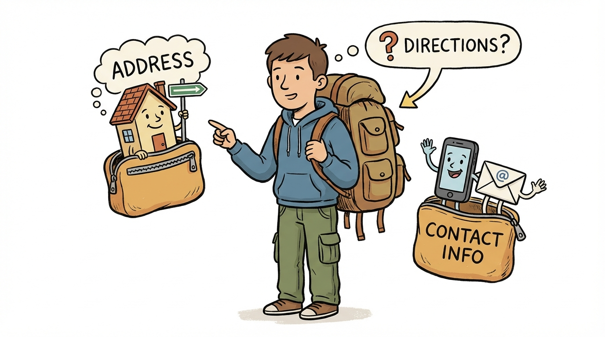
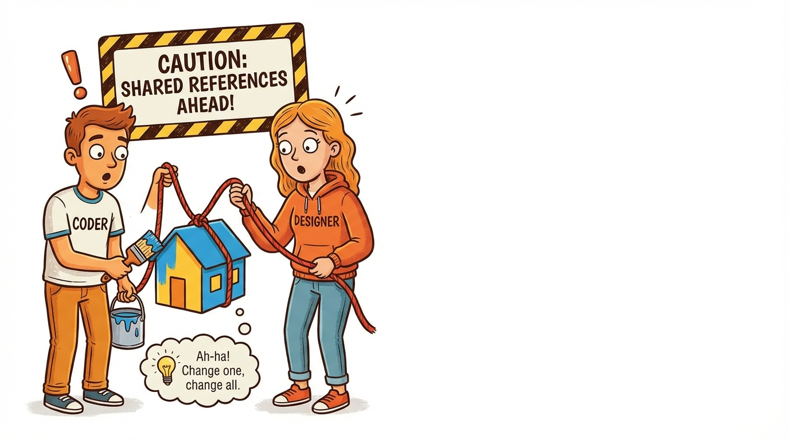

# Module 27: Classes and Constructors Part 3

> 🏷️ Advanced

> 🎯 **Teach:** How objects can contain other objects through composition, how to design well-structured classes, and how to override `toString()` for meaningful output
> **See:** Programs that build Person objects containing Address and ContactInfo objects, a Playlist containing MusicTracks, and a full Library catalog system with five interconnected classes
> **Feel:** Capable of designing multi-class systems where objects collaborate, and confident that all the OOP concepts from the course fit together into a coherent whole

> 🎙️ Today is the capstone for classes and constructors. You have learned how to create classes, add private fields, and write constructors. Now you will see how objects can contain other objects, a concept called composition or the "has-a" relationship. A Person has an Address. A Playlist has MusicTracks. This is how real software is built -- small, well-designed classes working together. By the end of today, you will build a complete library catalog system that uses everything from the past three days.

> 🎙️ Composition is how professional software is built. Instead of one massive class that tries to do everything, you create small focused classes that work together. This is the design principle the exam tests when it asks about object relationships, and it is the approach you will use in every real Java project.


## Research: Object Relationships and Putting It All Together

> 🎯 **Teach:** How composition (the "has-a" relationship) lets objects contain other objects, and what makes a well-designed class.
> **See:** A research assignment exploring object-member relationships, class design principles, and how all OOP concepts fit together.
> **Feel:** Able to articulate why small, focused classes working together are better than one massive class.

### Overview

- **Topic:** Classes and Constructors — Objects as Members, Class Design, and Review
- **Type:** Written Research Assignment
- **Estimated Time:** 30 minutes
- **Target Length:** Approximately 3/4 page (300-400 words)

### Instructions

Write a short research essay addressing the following:

1. **How do objects relate to their members?** Explain the relationship between an object and its fields and methods. What does it mean that an object "has" fields and "can do" methods? How does the dot operator (`.`) work to access members? What happens when one object contains another object as a field (composition / "has-a" relationship)?

2. **What makes a well-designed class?** Summarize the principles of good class design:
   - Private fields with public getters and setters (encapsulation)
   - Constructors that initialize objects to a valid state
   - Methods that provide meaningful behavior
   - Validation in setters and constructors to protect data integrity
   - Meaningful `toString()` or display methods

3. **How do all the OOP concepts from this course fit together?** Reflect on how classes, objects, fields, methods, constructors, access modifiers, and variable scope work together to build well-structured programs. Why is OOP the dominant approach in modern software development?

### Requirements

- Your response should be approximately **3/4 of a page** (300-400 words).
- Write in your own words. Do not copy and paste from your sources.
- Include at least **3 references** to third-party sources (articles, documentation, books, etc.). List them at the end of your essay in a "References" section.
- Use proper grammar and complete sentences.

### Submission

Save your completed essay as `Response_01_Object_Relationships_Research.md` in this folder.

> 🎙️ Take a moment to think about the difference between the "has-a" relationship and just putting all the fields in one class. You could put street, city, state, and zip directly inside Person instead of creating a separate Address class. But then you could not reuse Address for businesses, or pass it around independently, or change its format without touching Person. Composition keeps each class focused on one thing.

> 💡 **Remember this one thing:** Composition (the "has-a" relationship) is how you build complex systems from simple parts. A Person has an Address, a Playlist has MusicTracks, a Library has Books and Members. Each class stays small and focused, and the composed objects handle their own behavior -- this is the essence of good object-oriented design.

## Hands-On: Classes and Constructors Capstone

> 🎯 **Teach:** How to build systems where objects contain other objects, override toString(), and design a complete multi-class application.
> **See:** Person objects composed of Address and ContactInfo, a Playlist of MusicTracks, and a five-class Library catalog system.
> **Feel:** Capable of designing real multi-class systems and proud of building the largest OOP project in the course so far.

> 🎙️ This is the big one. You will build systems where objects contain other objects, design a complete music library, and then tackle the capstone: a full library catalog with five interconnected classes that uses every concept from the past three days.

### Overview

- **Topic:** Classes and Constructors — Composition, Full Class Design, and Comprehensive Capstone
- **Type:** Technical / Hands-On
- **Estimated Time:** 1.5 hours

### Background

#### Composition — objects inside objects

A class can have fields that are other objects, creating a "has-a" relationship:

```java
public class Address {
    private String street;
    private String city;
    private String state;
    private String zip;
    // constructor, getters, toString...
}

public class Person {
    private String name;
    private Address homeAddress;  // Person "has an" Address

    public Person(String name, Address homeAddress) {
        this.name = name;
        this.homeAddress = homeAddress;
    }
}

// Usage:
Address addr = new Address("123 Main St", "Denver", "CO", "80202");
Person p = new Person("Campbell", addr);
```

> 🎙️ Look at how the Person class has an Address field. The Person does not know how addresses work internally -- it just delegates to the Address object's methods. This separation of concerns is what makes code maintainable. If the address format changes, you only update the Address class, and every Person automatically gets the new format.

#### Overriding toString()

Every class can override `toString()` so `System.out.println(object)` prints something useful:

```java
@Override
public String toString() {
    return name + " (Age: " + age + ")";
}
```

---

### Part 1: Composition — Objects Inside Objects

#### Create the following files: `Address.java`, `ContactInfo.java`, `Person.java`, `CompositionMain.java`

**`Address.java`**

Private fields:
- `String street`
- `String city`
- `String state`
- `String zipCode`

Constructors:
- Full constructor (all four fields)
- Two-arg constructor (city, state) — defaults street to "Unknown" and zip to "00000"

Methods:
- Getters and setters for all fields
- `getFullAddress()` — returns formatted string: `"123 Main St, Denver, CO 80202"`
- `toString()` — returns the same as `getFullAddress()`

**`ContactInfo.java`**

Private fields:
- `String phone`
- `String email`

Constructors:
- Full constructor (both fields with validation — phone not empty, email must contain "@")
- One-arg constructor (phone only) — defaults email to "not provided"

Methods:
- Getters and setters with validation
- `toString()` — returns formatted contact info

**`Person.java`**

Private fields:
- `String name`
- `int age`
- `Address homeAddress`   ← composition
- `ContactInfo contact`   ← composition

Constructors:
- Full constructor (all four fields)
- Three-arg constructor (name, age, address) — creates default ContactInfo
- Two-arg constructor (name, age) — creates default Address and ContactInfo

Methods:
- Getters and setters
- `displayFullProfile()` — prints name, age, full address, and contact info using the composed objects' methods
- `toString()` — summary line



**`CompositionMain.java`**

1. Create Address and ContactInfo objects separately
2. Pass them to Person constructors
3. Create Persons using each constructor overload
4. Call `displayFullProfile()` on each
5. Modify a Person's address through the getter: `person.getAddress().setCity("Seattle")` — show that changes propagate
6. Demonstrate that two Persons can share the same Address object (roommates) — change the address and show both are affected. Then discuss in a comment whether this is desirable.



> 🎙️ That shared reference demonstration is important. When two Person objects point to the same Address, changing the address through one Person changes it for both. This can be a feature -- roommates share an address -- or a bug if you did not intend it. Understanding shared references is essential for avoiding subtle bugs in object-oriented programs.

---

### Part 2: Full Class Design from Scratch

#### Create `MusicTrack.java` and `Playlist.java` and `MusicMain.java`

**`MusicTrack.java`**

Design a complete, well-encapsulated class from scratch. Private fields:
- `String title`
- `String artist`
- `String album`
- `int durationSeconds`
- `int playCount`
- `double rating` (0.0 to 5.0)

Constructors:
- Full constructor (title, artist, album, duration, rating) — validates all fields
- Three-arg constructor (title, artist, duration) — defaults album to "Single", rating to 0.0
- No-arg constructor — defaults to placeholder values

Methods:
- Getters for all fields
- Setters with validation for rating (0.0-5.0) and duration (> 0)
- `play()` — increments playCount by 1 and prints "Now playing: [title] by [artist]"
- `getDurationFormatted()` — returns duration as "M:SS" format (e.g., 215 seconds → "3:35")
- `isPopular()` — returns true if playCount > 100 or rating >= 4.0
- `toString()` — returns a formatted summary

**`Playlist.java`**

A class that CONTAINS MusicTracks — composition with a collection:

Private fields:
- `String name`
- `ArrayList<MusicTrack> tracks`
- `static int totalPlaylists = 0`

Constructors:
- Constructor with name — initializes an empty ArrayList
- Constructor with name and initial track array

Methods:
- `addTrack(MusicTrack track)` — adds if not already present (check by title and artist)
- `removeTrack(String title)` — searches and removes by title
- `getTrack(int index)` — returns the track at the index (with bounds checking)
- `getTotalDuration()` — sums all track durations and returns formatted string
- `getAverageRating()` — average rating across all tracks
- `getMostPlayed()` — returns the track with the highest play count
- `displayPlaylist()` — prints a formatted playlist:
   ```
   ╔══════════════════════════════════════════════════════════╗
   ║  Playlist: My Favorites (5 tracks)                      ║
   ╠══════════════════════════════════════════════════════════╣
   ║  #  Title                Artist          Duration  ★    ║
   ║  ─────────────────────────────────────────────────────  ║
   ║  1  Shape of You        Ed Sheeran       3:53    4.5   ║
   ║  2  Blinding Lights     The Weeknd       3:20    4.8   ║
   ║  ...                                                    ║
   ╠══════════════════════════════════════════════════════════╣
   ║  Total Duration: 18:45  |  Avg Rating: 4.3             ║
   ╚══════════════════════════════════════════════════════════╝
   ```
- `sortByRating()` — sorts tracks by rating (highest first). Implement a simple sort since MusicTrack doesn't implement Comparable.

**`MusicMain.java`**

1. Create at least 8 MusicTrack objects using different constructors
2. Simulate plays on several tracks (call `play()` multiple times)
3. Rate some tracks
4. Create two Playlists and add different tracks to each
5. Display both playlists
6. Find and display the most played track across all tracks
7. Show the total playlists created using the static counter

> 🎙️ The Playlist class is composition with a collection -- it contains an ArrayList of MusicTrack objects. This is the most common composition pattern in real Java applications. Think about it -- a ShoppingCart has Items, a Classroom has Students, an Inbox has Emails. Once you see this pattern, you will recognize it everywhere.

---

### Part 3: Classes and Constructors Capstone


#### Create a multi-file application: `LibraryCatalog`

Build a library catalog system that is the capstone for the entire Classes and Constructors section (Days 25-27). This project uses EVERY concept from these three days.

**Create the following files:**

**`Author.java`**
- Private fields: `String name`, `String nationality`, `int birthYear`
- Two constructors: full and name-only
- Getters, `toString()`

**`LibraryBook.java`**
- Private fields: `String title`, `Author author` (composition), `String isbn`, `int yearPublished`, `int totalCopies`, `int availableCopies`, `String genre`
- Private static field: `static int totalBooksInSystem = 0`
- Three constructors with chaining:
  - Full constructor (all fields, validates ISBN is 13 characters)
  - Without available copies (defaults to totalCopies)
  - Title, author, and genre only (defaults for other fields)
- Methods:
  - `checkOut()` — decreases availableCopies (validates > 0)
  - `returnBook()` — increases availableCopies (validates not exceeding total)
  - `isAvailable()` — returns true if copies available
  - `getAvailabilityStatus()` — returns "Available (3 of 5)" or "All Checked Out"
  - Getters, `toString()`, `displayInfo()`

**`LibraryMember.java`**
- Private fields: `String name`, `int memberId` (auto-assigned from static counter), `ArrayList<LibraryBook> checkedOutBooks`, `int maxBooks` (default 5)
- Constructors: full constructor and name-only
- Methods:
  - `checkOutBook(LibraryBook book)` — validates member hasn't exceeded max, book is available
  - `returnBook(LibraryBook book)` — removes from member's list, updates book
  - `getCheckedOutCount()` — returns number of books currently checked out
  - `displayMemberInfo()` — formatted member card with checked-out book list

**`Library.java`**
- Private fields: `String name`, `ArrayList<LibraryBook> catalog`, `ArrayList<LibraryMember> members`
- Constructor: name only, initializes empty lists
- Methods:
  - `addBook(LibraryBook book)` — adds to catalog
  - `registerMember(LibraryMember member)` — adds to members
  - `searchByTitle(String keyword)` — returns ArrayList of matches
  - `searchByAuthor(String authorName)` — returns ArrayList of matches
  - `searchByGenre(String genre)` — returns ArrayList of matches
  - `displayCatalog()` — formatted table of all books with availability
  - `displayMembers()` — formatted table of all members
  - `getStatistics()` — prints total books, total members, most popular genre, books checked out vs. available

**`LibraryMain.java`**

1. Create the Library
2. Create at least 4 Authors
3. Create at least 10 LibraryBooks using different constructors
4. Add all books to the library
5. Create at least 3 LibraryMembers
6. Register all members
7. Simulate a series of checkouts and returns
8. Search by title, author, and genre
9. Display the full catalog
10. Display member info for each member
11. Print library statistics
12. Demonstrate error handling (try to check out an unavailable book, try to exceed member's max)

> 🎙️ The Library Catalog is a five-class system, which is the largest project in the course so far. Do not try to build it all at once. Start with Author, then LibraryBook, then LibraryMember, then Library, and finally LibraryMain. Test each class as you go. Building and testing incrementally is how professional developers work.

All output should be formatted with `printf`. All input validation should prevent crashes. Use every concept from Days 25-27:
- Private fields with getters/setters (Day 25)
- Instance, class, and local variables (Day 25)
- Multiple overloaded constructors with chaining (Day 26)
- `this` keyword (Day 26)
- Constructor validation (Day 26)
- Composition — objects containing objects (Day 27)
- Static fields for counters and totals (Days 25-26)
- ArrayList for collections of objects (Day 24 callback)

---

### Part 4: Reflection Questions

Answer these briefly (1-2 sentences each):

1. What is composition (the "has-a" relationship)? Give an example from your capstone project.
2. Why is it important for constructors to initialize objects to a valid state?
3. What happens if two objects share a reference to the same composed object? Is this always a problem?
4. Looking at Days 25, 26, and 27 — how has your understanding of classes and OOP changed since Day 3?

---

### Submission

Save all `.java` files in this folder, along with a response file named `Response_02_Classes_and_Constructors_Capstone.md` containing:

1. Your design decisions for the library catalog (why you organized the classes the way you did)
2. Your answers to the reflection questions

> 💡 **Remember this one thing:** When two objects share a reference to the same composed object, changes through one are visible through the other. This is called shared state, and whether it is a feature or a bug depends on your design intent. Always think carefully about whether composed objects should be shared or independently owned.

## Grading

> 🎯 **Teach:** How your research and hands-on work are evaluated across the classes and constructors capstone.
> **See:** Rubrics for the research essay, the composition demo, the music system, the library capstone, and the reflection questions.
> **Feel:** Clear about what constitutes a complete, high-quality submission for this module.

> 🔄 **Where this fits:** Day 27 completes the classes and constructors section with composition and full-system design, bringing together encapsulation, constructors, and object relationships -- the OOP foundation you need for the 1Z0-811 exam and for building real Java applications.

> 🎙️ You have completed the entire classes and constructors section. You can now create classes with private fields, write constructors with validation and chaining, and compose objects that contain other objects. Starting tomorrow you move into methods, which give your objects their behavior. The OOP foundation you built over these three days is the backbone of everything that follows.

### Research Grading

| Criteria | Points |
|----------|--------|
| Explains object-member relationships and composition | 30 |
| Describes well-designed class principles | 30 |
| Reflects on how OOP concepts work together | 20 |
| Writing quality and at least 3 properly cited references | 20 |
| **Total** | **100** |

### Hands-On Grading

| Criteria | Points |
|----------|--------|
| Composition demo: Address, ContactInfo, Person working together | 10 |
| MusicTrack and Playlist: Full design with formatting and sorting | 20 |
| LibraryCatalog capstone: All 5 classes working together | 40 |
| Capstone uses all required concepts (private, constructors, chaining, composition, static, ArrayList) | 15 |
| Reflection questions answered accurately | 5 |
| All programs compile and run without errors | 10 |
| **Total** | **100** |
